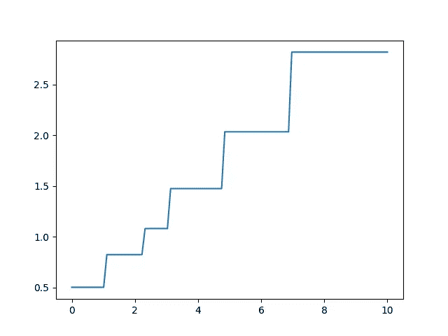

# XGBoost:基数，总是被忽视的关键超参数

> 原文：<https://towardsdatascience.com/xgboost-cardinality-the-crucial-hyperparameter-that-is-always-under-considered-31973126bc43>

照片由[帕特里斯·布沙尔](https://unsplash.com/@patriceb?utm_source=medium&utm_medium=referral)在 [Unsplash](https://unsplash.com?utm_source=medium&utm_medium=referral) 拍摄

> **更新**:发现我关于渐变提升的新书，[实用渐变提升](https://www.amazon.fr/dp/B0BJ82S916)。这是用 python 中的许多例子对渐变增强的深入探究。

<https://www.amazon.com/dp/B0BJ82S916>  

在处理超参数调整时，大多数注意力都集中在过度拟合和使用正确的正则化参数上，以确保模型不会过度学习。

然而，还有一个非常重要的问题要问:预测空间的基数是多少？换句话说，XGBoost 和更一般的决策树可以预测多少不同的值？

# XGBoost 和 boosted 树是离散模型

当使用 XGBoost、CatBoost 或 LightGBM 时，记住所有这些库都依赖决策树是绝对重要的，决策树的叶子只包含常量值(除非您已经为 LightGBM 启用了线性树。参见我关于主题的另一篇文章[。)](https://medium.com/p/197864013e88)

简单地说，这意味着给定的模型只能预测离散数量的值。其他模型，例如高斯过程或基本线性模型，可以预测无限数量的值。

下面的代码和图表说明了:

显示梯度增强树的离散性质。作者代码。

梯度推进树的离散性质是明确的，如上面代码生成的图所示:

梯度增强树的离散性质。剧情作者。

梯度推进树只能预测一组有限的离散值。

# 为什么要关心基数？

基数很重要，原因有二:

*   它与你的预测集的基数直接相关。比方说，你需要预测`n`种工作和`m`个国家的收入。如果你的模型预测小于`n*m`值，你的模型很可能无法正确预测收入。可能的预测集不够大，不足以捕捉现实的复杂性。
*   这是过度拟合的一个很好的指标。如果您的模型基数比您的预测集的基数高得多，那么您的模型可能会过度拟合。

# 计算梯度提升树的基数

计算梯度增强树模型可以生成的预测基数并不容易。这取决于每棵树的结构，以及每个决策节点做出的决策。

在只有一个估计器的简单树集合的情况下，计算是简单的。有多少树叶，就有多少种可能的预测。如果树是完整的，即如果每个分支都达到了最大深度，则叶子的数量等于`2^max_depth`。

当有`n`个估计器时，理论上讲，第一棵树的每个可能的预测可以被第二棵树带来的任何校正更新，第二棵树又可以被第三棵树带来的任何校正更新，等等。因此，从理论上讲，梯度助推器树可以产生高达

作者的公式

实际上，这个值是一个上限，因为对于一组特征来说，每棵树相对于其他树都不是独立的。

实际上，考虑第一棵树的一片叶子，特征区间的笛卡儿积允许到达这些叶子。因此，当特征在这些间隔中变化时，第一个树的响应总是相同的值。

当在这些范围内改变特征时，可以到达其他树的每片叶子的几率很低。这解释了为什么上面的公式显然是一个最大值，因为只有叶子的子集是可达的。

# 驱动梯度提高了树基数

为了控制模型基数而调整的超参数与导致过度拟合的参数相同。基于上一节的解释，我们看到基本的`n_estimators`和`max_depth`可以用于引导基数。

`gamma`和`lamda`，因为它们控制节点分裂也可以使用。如果您使用的是 LightGBM，那就更简单了，因为有一个参数`num_leaves`，它定义了给定估计器的最大叶子数，而不管深度如何。

# 结论

基数是基于梯度提升树的模型的基本特征，必须根据要预测的值的基数进行分析。

这是梯度增强树的离散性质的直接结果。

重要的是要确保生成的模型有足够的自由度来为预测过程中考虑的每个不同情况生成不同的值。