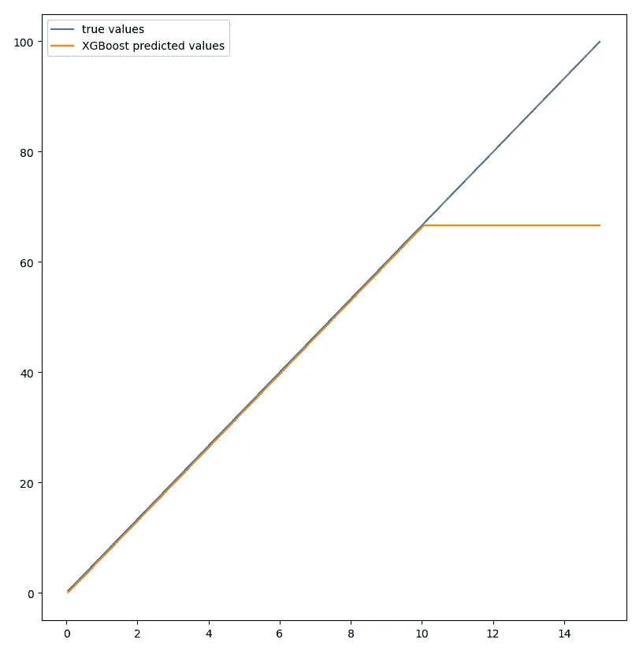
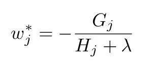
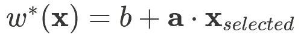
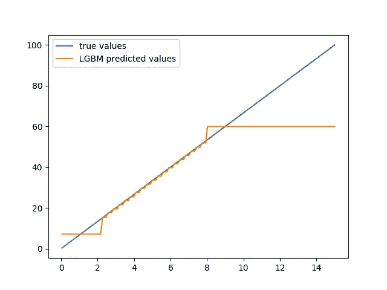
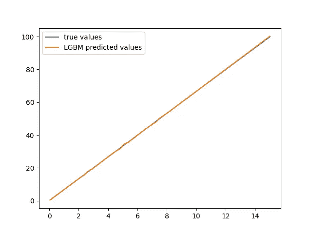

# XGBoost for time series: lightGBM 是更大的船！

> 原文：<https://towardsdatascience.com/xgboost-for-timeseries-lightgbm-is-a-bigger-boat-197864013e88>

# XGBoost for time series: lightGBM 是更大的船！

威廉·戴尼奥在 [Unsplash](https://unsplash.com?utm_source=medium&utm_medium=referral) 上拍摄的照片

> **更新**:发现我关于渐变提升的新书，[实用渐变提升](https://amzn.to/3gaBn4R)。这是用 python 中的许多例子对渐变增强的深入探究。

 [## 实用的渐变增强:深入探究 Python 中的渐变增强

### 这本书的梯度推进方法是为学生，学者，工程师和数据科学家谁希望…](https://amzn.to/3gaBn4R) 

在处理时间序列时，能够处理外推是至关重要的。没有外推法，处理趋势是不可能的。

从数学上讲，这意味着基础模型必须在其公式中至少集成一个线性部分。

在上一篇文章中，我展示了 XGBoost 的一个最重要的限制是它不能根据构造进行推断。

 [## XGBoost for Time Series:你需要一艘更大的船

### XGBoost 是一个非常强大和通用的模型。它的应用范围很广，并已得到应用

towardsdatascience.com](/xgboost-for-time-series-youre-gonna-need-a-bigger-boat-9d329efa6814) 

这是相当严格的，因为在许多 ML 情况下，你需要能够推断。在处理时间序列时尤其如此，因为你通常想要预测未来，而没有外推，你就被困在了过去。XGBoost 所做的所有预测都是历史值的集合。

在某种程度上，XGBoost 无法预测历史上没有的东西。

# 问题

为了具体说明这个问题，让我们以我在上一篇文章中使用的代码为例:

试着用 XGBoost 建模一个简单的线性函数。作者代码。

我们面对的是一个简单的线性时间序列，它与时间严格成比例，可以用一个基本的线性方程来建模。

正如我们在前面的脚本生成的图中看到的，XGBoost 没有抓住趋势:

XGBoost 预测与实际值。作者的情节。

# 解决方案

然而，XGBoost 和更一般的使用梯度推进方法训练的决策树的集成仍然是非常强大的工具，尽管有这种限制，但在时间序列上表现相对较好。

如果我们能保持这种树状的方法，并在模型中集成一些关于特征的比例关系，那将是完美的。

我最近看到了这篇不错的论文，[用分段线性回归树进行梯度提升](https://arxiv.org/pdf/1802.05640.pdf)，它准确地提出了一种使用更复杂的基础学习器的方法:分段线性函数而不是分段常数函数。

在本文中，他们表明，使用这种更复杂的学习器不仅提高了精度，而且加快了收敛速度。

从数学上讲，这意味着标准梯度的恒定权重提升了决策树，用以下公式计算:

最佳叶重。作者的公式

其中，G_j 是应用于叶中剩余数据的目标函数的梯度，H_j 是目标函数的 hessian，将被更复杂的估计器代替:

使用所选要素计算的线性权重。作者的公式。

对于树的每个叶子，标准梯度增强方法必须适合于识别 a 参数的最佳值，而且选择要使用的相关特征

在他们的论文中，作者解释了如何做这件事。

非常好的消息是，它已经在 XGBoost 最重要和最著名的竞争对手之一:LightGBM 中实现了！

# LigthGBM

在深入讨论这个主题之前，先简单介绍一下 LightGBM。这是一个实现梯度推进方法来训练决策树集合的库。

根据 GitHub stars 的评价，它不如 XGBoost 有名，但它仍然是 XGBoost 的一个非常受欢迎和重要的替代产品。

它主要由微软开发。允许使用线性函数作为基础预测值的选项是`linear_tree.`

# 在数学上，我们相信

让我们检查一下之前的例子，当使用这种基础学习者的 LightGBM 时，我们得到了预期的结果。

首先，为了让我们相信选项`linear_tree`确实能够解决我们的问题，我们将运行没有该选项的第一个脚本:

尝试在没有 linear_tree 选项的情况下捕捉数据的线性行为。作者代码。

正如这个脚本生成的图所显示的，在没有选项`linear_tree`的情况下，LighGBM 的性能并不比 XGBoost 好:

没有线性树，LightGBM 无法推断。图片由作者提供。

现在让我们运行完全相同的代码，除了选项`linear_tree:`之外，使用 LighGBM 默认参数

用 LighGBM 和线性树捕捉数据的线性本质。作者代码。

答对了。正如理论预测的那样(这是个好消息，否则我会白写这篇文章:)，LightGBM 抓住了数据的线性本质:

LightGBM 外推完美！作者的情节。

## 更深刻的理解

看看 lightGBM 选择的参数会非常有趣。

我们知道，我们非常基本的时间序列只是与时间成比例，其系数值为 6.66。

理想情况下，lightGBM 应该将这个值确定为其线性模型的最佳值。

这很容易检查。我们将生成最简单的模型，以便于阅读模型定义。

我们将使用`save_model`函数来导出模型。下面是代码:

代码基本上和以前一样，除了我们调整参数得到最简单的一个:深度减少到 1，估计器的数量是 2。

查看模型定义，我们得到:

LightGBM 导出的模型定义。内容由作者提供。

两条重要的线是:

> leaf _ features = 0 0
> leaf _ coeff = 0 . 7019912661967

这意味着所使用的特征是第一个特征，即时间。因为深度等于 1，所以有两片叶子。一个重量为 0.701，另一个重量为 6.659。这不完全是 6.66，但已经很接近了。

# 结论

在处理数据科学问题时，理解要素之间以及要素与时间之间的关联方式至关重要。基于这种理解，有必要将这种关系转化为数学公式。

了解这些公式，掌握可用机器学习算法的底层数学基础的数据科学家将能够选择正确的算法并建立相关的模型。

我们在本文中已经看到，为了进行外推，我们至少需要在我们的模型中集成一些线性。知道 LightGBM 支持这种基础学习者有助于我们高效优雅地解决我们的问题。