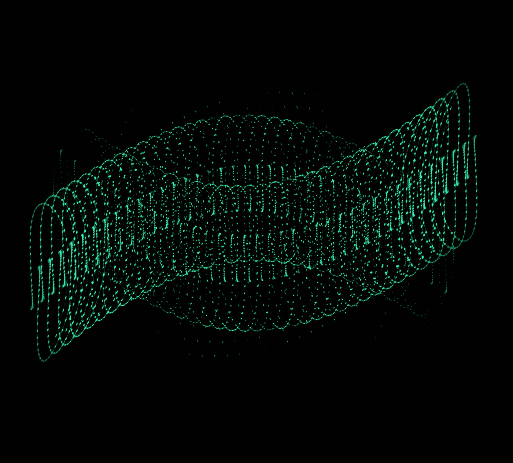
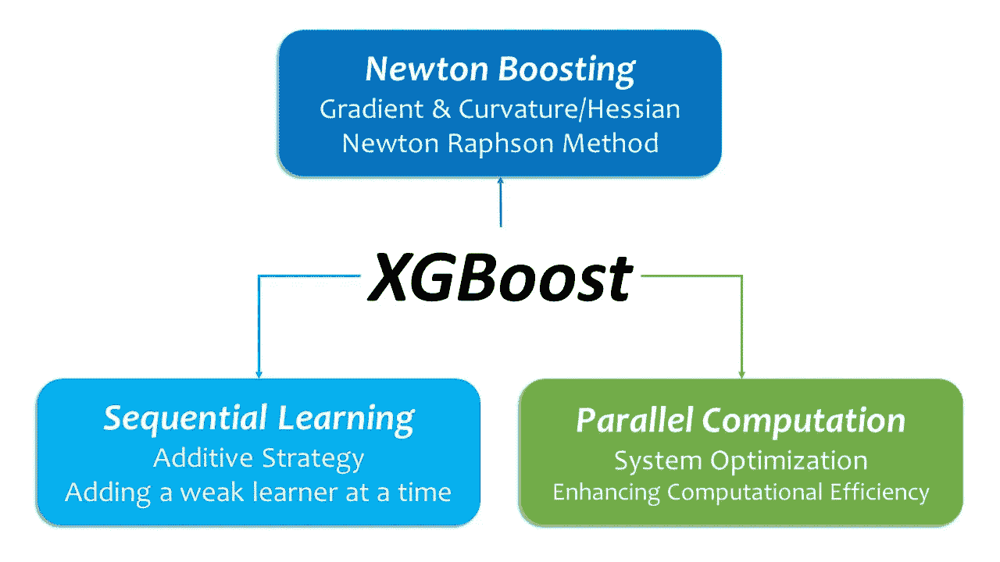

# XGBoost:它的谱系、建筑特色和创新

> 原文：<https://towardsdatascience.com/xgboost-its-genealogy-its-architectural-features-and-its-innovation-bf32b15b45d2>

## 顺序和并行架构合二为一

照片由[玛丽奥拉·格罗贝尔斯卡](https://unsplash.com/@mariolagr?utm_source=medium&utm_medium=referral)在 [Unsplash](https://unsplash.com?utm_source=medium&utm_medium=referral) 上拍摄

# 介绍

***XGBoost*** (极限梯度提升)是一种强大的学习算法，在过去的许多比赛中胜过了许多传统的机器学习算法。

简而言之，XGBoost 集顺序和并行架构于一身:虽然它是一种顺序学习算法([加法策略](https://xgboost.readthedocs.io/en/latest/tutorials/model.html#additive-training))，但它将并行计算融入其架构中，以提高系统效率。

制作人:杉尾道夫

这篇文章是针对初学者的 XGBoost 的介绍性概述，是一篇一站式的文章，它将向您提供关于 XGBoost 的整体情况(如果不是细节的话)——它的谱系、架构特性和创新特性。在文章的最后，我还会给出一个简短的补充资源列表，这样读者就可以更详细地了解文章中涉及的主题。

现在，我们开始吧。

为了理解 XGBoost 的特性，我们可以从快速概述它的系谱开始。

# 讨论

# A.XGBoost 系谱

从自上而下的角度来看，XGBoost 是 ***监督机器学习*** 的子类。而且顾名思义，XGBoost 是 ***Boosting 机*** 的高级变种，是 ***基于树的系综*** 算法的子类，像随机森林。

然而，Boosting Machine 在操作学习过程的方式上与 Random Forest 有着根本的不同。

## ***助推机***

随机森林并行运行多个独立的决策树，并通过平均所有结果来组合它们的结果。这种方法使用随机引导抽样，通常被称为 bagging。从这个意义上说，随机森林是一种并行学习算法。

相反，Boosting Machine 使用[一个加法策略](https://xgboost.readthedocs.io/en/latest/tutorials/model.html#additive-training):即“*一次增加一棵新树*”([xgboost developers，2022](https://xgboost.readthedocs.io/en/latest/tutorials/model.html#additive-training) )。Boosting 机器依次运行名为 ***的单个弱/简单决策树，基学习器*** 。简单来说，概念上的 Boosting Machine 是建立在顺序学习架构上的。

从这个意义上说，Boosting Machine 是顺序学习的，而 Random Forest 是并行学习的。

作为增压机的参考，这里有一个麻省理工学院关于增压的讲座:[https://www.youtube.com/watch?v=UHBmv7qCey4](https://www.youtube.com/watch?v=UHBmv7qCey4)

也就是说，为了避免混淆，我应该从 ***系统优化*** 的角度在这里做一个脚注。XGBoost 还设计用于运行并行计算，以提高计算资源的使用效率( [xgboost developers，n.d.](https://xgboost.readthedocs.io/en/stable/) )。总的来说，XGBoost 虽然继承了 Boosting Machine 的顺序学习架构，但却通过并行计算来优化系统。

## ***渐变助推机***

顾名思义，XGBoost(极限梯度推进)是梯度推进机(GBM)的高级变种，是推进机家族成员。

作为其 ***加法策略*的一部分，**梯度推进机(GBM)使用梯度下降进行优化。为了减少计算量，GBM 利用泰勒展开式的一阶项逼近目标函数，并忽略高阶项进行学习优化。换句话说，它使用目标函数(损失函数)的一阶导数( ***梯度*** )来确定下一个弱学习器预测器。通过这种方式，梯度提升在保留现有弱预测器的同时，在它们之上添加新的预测器以减少当前误差，从而逐步提高性能。(弗里德曼，2000 年)

# **b .****XGBoost**的算法特点

## ***牛顿助推机***

XGBoost 扩展了梯度增强的思想，除了它的一阶导数(梯度)之外，它还使用目标函数的二阶导数(***Hessian:Curvature***)来进一步优化它的学习过程。这个方法叫做 ***牛顿拉夫逊法*** 。而采用牛顿拉夫逊法的增压机叫做 [***牛顿增压***](https://arxiv.org/abs/1808.03064) 。关于梯度下降和牛顿提升之间的差异的进一步讨论，您可以阅读由 [Fabio Sigrist](https://arxiv.org/search/stat?searchtype=author&query=Sigrist%2C+F) 撰写的论文[Gradient and Newton Boosting for class ification and Regression](https://arxiv.org/abs/1808.03064)。

由于加法策略的特定结构，二阶近似产生多个有益的数学特性，以简化算法，进一步提高计算效率。(Guestrin 和陈，2016 年)

## ***规则化:解决方差-偏差权衡***

[Jerome Friedman](https://jerryfriedman.su.domains/) ，梯度推进机的设计者( [Friedman，2000](https://www.jstor.org/stable/2699986) )阐述了正则化对于解决 ***偏差-方差权衡*** 、欠拟合-过拟合权衡问题的重要性，特别推荐用户调整梯度推进机的三个元参数:迭代次数、学习速率和终端节点/叶子数。([弗里德曼，2000 年，第 1203、1214–1215 页](https://www.researchgate.net/publication/2424824_Greedy_Function_Approximation_A_Gradient_Boosting_Machine))

在这种背景下，XGBoost 继承了梯度推进机的正则化重点，并对其进行了进一步扩展。

*   首先，XGBoost 使用户能够调整各种超参数来约束树:例如，树的数量、单个树的深度、分区的实例权重的最小和、提升轮的最大数量以及节点/叶的数量。
*   第二，它允许用户在学习过程中应用学习速率，收缩率。( [Guestrin &陈 2016 第 3 页](https://doi.org/10.48550/arXiv.1603.02754))
*   第三，它使用户能够使用随机采样技术，如列子采样。( [Guestrin &陈 2016 第 3 页](https://doi.org/10.48550/arXiv.1603.02754)
*   第四，它使用户能够调整 L1 和 L2 正则项。

# C.创新:

## 稀疏感知算法和加权分位数草图

更重要的是，XGBoost 引入了两项创新:稀疏感知算法和加权分位数草图。([陈&guest rin 2016 p10](https://doi.org/10.48550/arXiv.1603.02754)

首先，XGBoost 有一个内置的特性叫做 ***默认方向。*** 该功能捕获稀疏数据结构的模式，并根据该模式确定每个节点的分割方向。Guestrin & Chen 提出了稀疏性的三个典型原因:

> “1)数据中存在缺失值；2)统计中经常出现零条目；以及 3)特征工程的人工制品，例如一键编码( [Guestrin &陈 2016](https://arxiv.org/abs/1603.02754)

原则上，这个特性使得 XGBoost ***稀疏感知算法*** 能够处理缺失数据:用户不需要估算缺失数据。

默认方向决定了分割的方向， ***加权分位数草图*** 提出候选分割点。下面节选自[陈和 Guestrin 的论文](https://arxiv.org/abs/1603.02754)总结了它是什么。

> “一种新的分布式加权分位数草图算法……能够以可证明的理论保证处理加权数据。总体思路是提出一种支持合并和剪枝操作的数据结构，每个操作都被证明能保持一定的精度水平。”( [Guestrin &陈 2016](https://arxiv.org/abs/1603.02754)

## 系统优化:效率和可扩展性

到目前为止，我们从学习算法架构的角度看到了 XGBoost 的框架。现在，我们可以从系统优化的角度来看待。

[原生的 XGBoost API](https://xgboost.readthedocs.io/en/latest/index.html) 在追求计算效率，或者说系统优化方面也是创新的。该 API 被称为 eXtreme (X ),因为 XGBoost 旨在通过在给定的计算资源(处理器(CPU、GPU)、内存和核外(磁盘空间):缓存访问、块数据压缩和分片)之间有效地分配计算任务，使用户能够利用给定系统计算能力的极限。( [databricks，2017](https://github.com/databricks/xgboost-linux64/blob/master/doc/model.md)

关于原生 XGBoost API 的更多创新方面，这里有一个由 XGBoost 的发明者(Chen & Guestrin)， *XGBoost:一个可扩展的树提升系统* 概述的伟大作品。

# ***结论***

这个对 XGBoost 的快速概述回顾了它的系谱、架构特性和创新，但没有深入细节。

简而言之，XGBoost 具有顺序-并行混合体系结构，从某种意义上说，它继承了 Boosting 机器谱系中的顺序学习体系结构，同时将并行计算融入其体系结构中，以提高系统效率。

由于 Boosting Machine 有过度拟合的倾向，所以原生的 XGBoost API 非常注重解决偏差-方差权衡问题，并通过超参数调整方便用户应用各种正则化技术。

如果您对原生 XGBoost API 的实现示例感兴趣，可以阅读我的另一篇文章， [**用原生 XGBoost API**](https://medium.com/p/2f40a2e382fa/edit?source=your_stories_page-------------------------------------) **进行成对超参数调优。**

感谢你阅读这篇文章。

## 建议的外部资源

对于那些想探索 XGBoost 更多细节的人来说，这里有一个我最喜欢的关于该算法的参考资料的简短列表:

*   为了快速概述 XGBoost，[*Jason Brownlee 对机器学习的梯度推进算法* g](https://machinelearningmastery.com/gentle-introduction-gradient-boosting-algorithm-machine-learning/) 的简要介绍非常简洁地捕捉到了 XGBoost 的谱系和主要特性:
*   对于 XGBoost 的数学解释， [*TreeBoosting-03:为什么每次机器学习比赛 XGBoost 都会赢？*](https://datasciblog.github.io/2020/02/26/tree-boosting-03/) by 哈阮给了我一个很好的补充资源。
*   XGBoost 的创新方面，[*XGBoost:XGBoost 的发明人陈& Guestrin 的一个可扩展的树提升系统*](https://arxiv.org/abs/1603.02754) 给大家做一个简单的总结。
*   官方原生 XGBoost API 的在线文档给你一个官方的 [*XGBoost 教程*](https://xgboost.readthedocs.io/en/latest/tutorials/index.html) 。它是创新算法的重要基础资源。
*   如果你有时间和灵魂去读一篇负荷很重的论文，你应该读一读杰罗姆·h·弗里德曼的论文《关于梯度推进机》， [*贪婪函数逼近:一台梯度推进机*](https://jerryfriedman.su.domains/ftp/trebst.pdf) :

# 确认

我要感谢 TDS 的编辑团队，特别是[凯瑟琳·普雷里](https://www.linkedin.com/in/ACoAAArEpWwBHvFKeyTA3JKk6gApzplqwM2hjKY)，感谢他们在编辑阶段提供的宝贵意见。

# 参考

*   Brownlee，J. [*对机器学习的梯度推进算法的温和介绍*](https://machinelearningmastery.com/gentle-introduction-gradient-boosting-algorithm-machine-learning/) *。* (2016)。检索自机器学习掌握:[https://Machine Learning Mastery . com/gentle-introduction-gradient-boosting-algorithm-Machine-Learning/](https://machinelearningmastery.com/gentle-introduction-gradient-boosting-algorithm-machine-learning/)
*   数据砖。[*xgboost-Linux 64*](https://github.com/databricks/xgboost-linux64/blob/master/doc/model.md)。 (2017)。从 github 检索:[https://github . com/databricks/xgboost-Linux 64/blob/master/doc/model . MD](https://github.com/databricks/xgboost-linux64/blob/master/doc/model.md)
*   j . Friedman*[*贪婪函数逼近:一台梯度助推机*](https://www.researchgate.net/publication/2424824_Greedy_Function_Approximation_A_Gradient_Boosting_Machine) 。(2000).*统计年鉴，29* (5)，1189–1232。doi:10.1214/aos/1013203451*
*   *Guestrin，c .，& Chen，T. *XGBoost:* [*一个可扩展的树提升系统*](https://doi.org/10.48550/arXiv.1603.02754) *。* (2016)。https://doi.org/10.48550/arXiv.1603.02754*
*   *Nguyen，H. [*TreeBoosting-03:为什么 XGBoost 每次机器学习比赛都赢？*](https://datasciblog.github.io/2020/02/26/tree-boosting-03) (未注明)。检索自数据科学博客:[https://datasciblog.github.io/2020/02/26/tree-boosting-03](https://datasciblog.github.io/2020/02/26/tree-boosting-03)*
*   *xgboost 开发人员。 [*XGBoost 文档*](https://xgboost.readthedocs.io/: https://xgboost.readthedocs.io/en/stable/) *。*(未注明)。检索自[https://xgboost.readthedocs.io/:](https://xgboost.readthedocs.io/:)https://xgboost.readthedocs.io/en/stable/*