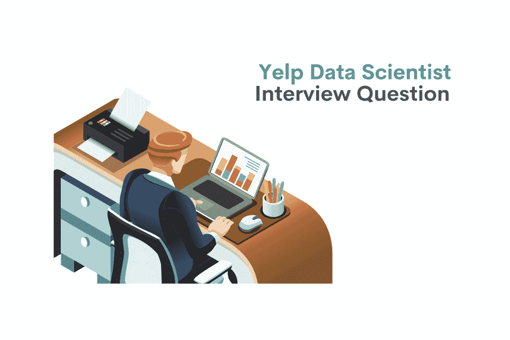
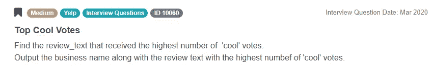
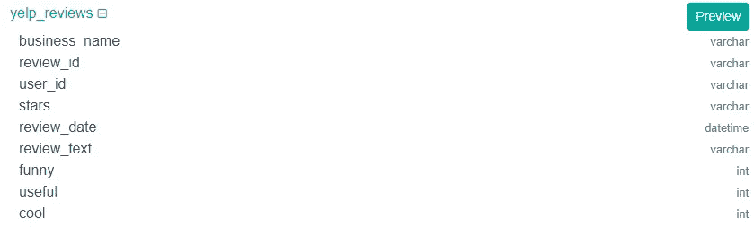
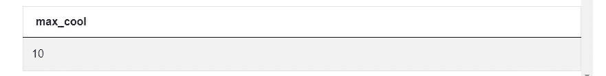
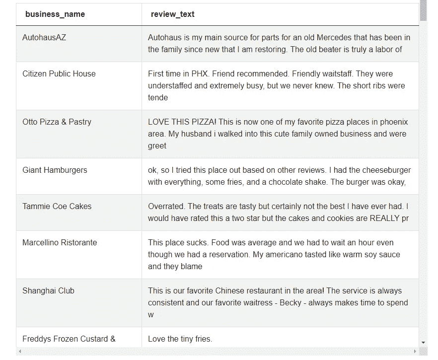
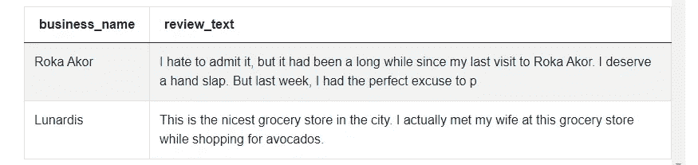

# Yelp 数据科学家面试问题演练

> 原文：<https://towardsdatascience.com/yelp-data-scientist-interview-question-walkthrough-dee5e5ba39b2>

## *帮你解决 Yelp SQL 面试问题*



作者在 [Canva](https://canva.com/) 上创建的图像

如果你曾经去过一个新城镇，想找一家好餐馆，你可能知道 Yelp。作为一家企业，Yelp 专注于创建和维护总结大量信息的产品，以帮助客户做出明智的决策。它追踪世界各地成千上万不同企业的公众形象。

组织所有这些数据并不是一件容易的事情，因此 Yelp 一直在寻找有前途的数据科学家加入其行列。

Yelp 的数据科学家必须编写不同难度的查询。为了在工作中取得成功，数据科学家候选人必须具备扎实的基本和中级 SQL 概念的基础知识。我们来看看回答技术面试问题你应该知道的具体概念。

# 面试中测试基本到中级概念

最佳候选人用最少的代码行编写回答问题的查询。如果没有对 SQL 概念、语句和子句的深入了解，这通常是不可能的。

扎实的基础知识可以帮助你获得一份工作。更重要的是，一旦你有了工作，掌握实用和理论上的 SQL 可以帮助你保住工作。雇主希望有人写防呆代码。Yelp 也不例外。要编写这样的查询，您需要对 SQL 有深刻的理解。


作者在 [Canva](https://canva.com/) 上创建的图片

以下是回答这类数据科学面试问题时你应该知道的概念:

**选择/从**

当您开始学习 SQL 时，SELECT 和 FROM 语句通常是您学习的最初几个概念。我们使用 FROM 语句来指定我们将使用的表。我们使用 SELECT 语句来查看表中的特定列。

这两种说法很容易掌握。不管有多难，SELECT 和 FROM 对于编写任何 SQL 查询都是必不可少的。因此，如果您没有 SQL 的工作知识，这两条语句是一个很好的起点。

**哪里**

Yelp 的用户通常希望看到最受欢迎的商家。过滤这些数据是 Yelp 数据科学家工作的一大部分。

WHERE 语句允许您设置条件。编写 SQL 查询时，其主要目的是确保只返回满足指定条件的记录。WHERE 语句中可以使用许多运算符。具体可以用:equals(=)，not equals(！=)、大于(>)、小于(<)以及比较运算符的其他变体。对数值使用比较运算符很容易。

您还应该知道如何比较非数值(使用=或！=比较运算符)。要编写条件，必须使用正确的语法规则。例如，要将列值与文本值进行比较，需要单引号“”。要编写条件，必须使用正确的语法规则。例如，要将列值与文本值进行比较，需要单引号“”。此外，您应该知道如何使用字母和不同的运算符按照字母顺序进行排序。

例如，您可能需要删除以字母 A、B 或 c 开头的值，SQL 中的 WHERE 语句非常通用，可以应用于许多不同的任务。

**最小值/最大值()**

这些问题以及类似的问题通常会测试您对中级 SQL 概念的了解，例如 SQL 中的 MIN()和 MAX()聚合函数。在我们的例子中，候选人必须找到拥有最多“酷”选票的企业。在这种任务中，MAX()聚合函数会很有用。它返回指定列中具有最大值的行。MIN()返回最低值。

对于数值，使用这些聚合函数是很直观的。此外，了解 MIN()和 MAX()在应用于非数值时的工作方式也很有用。例如，MIN()函数可用于查找一列中最早的日期或以 A 开头的单词或字母表中其他较早的字母。MAX()可以做相反的事情。阅读本文“ [*基础 SQL 面试问题*](https://www.stratascratch.com/blog/basic-sql-interview-questions/?utm_source=blog&utm_medium=click&utm_campaign=medium) ”了解更多关于聚合函数的知识。

**排序依据**

通常会遇到 [SQL 面试问题](https://www.stratascratch.com/blog/sql-interview-questions-you-must-prepare-the-ultimate-guide/?utm_source=blog&utm_medium=click&utm_campaign=medium)，要求您找出特定列中具有最高值的行。理解这一概念对于回答今天[数据科学访谈](https://www.stratascratch.com/blog/data-science-interview-guide-questions-from-80-different-companies/?utm_source=blog&utm_medium=click&utm_campaign=medium)中提出的大多数 SQL 问题至关重要。ORDER BY 允许您指定行排列的标准。该子句通常与另外两个关键字一起使用:DESC 和 ASC。这些关键字帮助您指定是希望结果按升序还是降序排列。

在处理数字时，ORDER BY 子句的默认行为很容易预测:它将从最小的数字到最大的数字对值进行排序。数据科学家职位的优秀候选人还应该知道如何对字母和日期值使用 ORDER BY。

**内部连接**

连接是 SQL 中不可或缺的概念。任何有抱负的数据科学家都应该在进入更高级的概念之前掌握[连接](https://www.stratascratch.com/blog/sql-join-interview-questions/?utm_source=blog&utm_medium=click&utm_campaign=medium)。由于其实用性，内部连接可用于回答各种各样的 SQL 问题。

首先，考生应该理解编写 SQL 查询的语法。例如，您可以从组合表中选择列，而不仅仅是 from 语句后面的列。此外，如有必要，他们应该能够演示如何从一个表中选择列。

具有编写 SQL 查询实际知识的数据科学家也应该理解编写别名的重要性。他们还应该熟悉用 SQL 编写别名的语法，并理解它们在提高 SQL 查询可读性方面的作用。

编写内部连接的另一个重要方面是 ON 语句。熟练的数据科学家应该了解它的用途，并能够正确地将值从一个表映射到另一个表。选择正确的连接键来获得期望的结果也很重要。

考生应该能够解释多种联接类型之间的区别。当两个表中的记录没有任何公共值时会发生什么？INNER JOIN 是做什么的？根据资历级别，候选人应该能够区分内部和外部连接，并选择正确的类型来解决手头的问题。

在本文中，我们将回顾一个问题，并使用内部连接的关键特性来得出答案。

# Yelp 数据科学家面试问题演练

在本文中，我们将重点关注 Yelp 数据科学家职位候选人的问题。

**顶级酷票**

这个问题目前在 StrataScratch 平台上被标记为‘中等’难度。条件相当简单明了。候选人必须编写一个查询来查找具有最高“酷”票数的记录，并以特定的格式返回。



截图来自 [StrataScratch](https://platform.stratascratch.com/coding/10060-top-cool-votes?python=&utm_source=blog&utm_medium=click&utm_campaign=medium)

链接:[https://platform . stratascratch . com/coding/10060-top-cool-votes](https://platform.stratascratch.com/coding/10060-top-cool-votes?python=&utm_source=blog&utm_medium=click&utm_campaign=medium)

在这个问题中，候选人必须使用一个有 9 列的表格。他们必须编写 SQL 查询来查找在 **cool** 列中具有最高整数值的记录。然后，受访者必须输出两列各自的值， **business_name** 和 **review_text** 。

这项任务很简单，有很多方法可以得到想要的结果。因此，您的重点应该是编写一个优化的 SQL 查询。只要您理解了本文中概述的原则和陈述，您应该能够找到一个运行良好且不过分冗长的解决方案。

**可用数据集**



截图来自 [StrataScratch](https://platform.stratascratch.com/coding/10060-top-cool-votes?python=&utm_source=blog&utm_medium=click&utm_campaign=medium)

## 数据假设

解决任何 SQL 问题的第一步，也可能是最重要的一步是研究可用数据。

首先要做的是扫描列名及其对应的数据类型。你可以利用这个机会形成第一印象，进入思维空间解决问题。如果有些事情不清楚，你可以提问来检查你的假设。

只要有可能，也试着从表中查看实际记录。看到实际的数据可以帮助你更好地理解你将使用什么样的价值观。除了实际数据之外，注意列名和数据类型将为您制定计划提供足够的信息。

如果你已经分析了数据，但事情仍然不清楚，不要害怕要求澄清一些观点。你可以通过问一些具体的、指示性的问题来获得更多的信息。

根据问题的表述，您应该准备好对值进行造型、格式化或以任何其他方式操作数据。一旦完成了对表的分析，您还应该清楚哪些列是重要的，哪些列可以安全地忽略。

让我们来看看 **yelp_reviews** 表的列:

*   这个问题的最终解决方案应该返回 **business_name** 列中的值。我们将使用 **SELECT** 语句来查看该列。
*   我们的问题没有提到识别每个评论，所以我们可以忽略 **review_id** 列。
*   这个问题不要求我们识别用户，所以我们可以忽略 **user_id** 列
*   我们不必用‘星星’的数量作为判断标准，所以**星星**列可以忽略。
*   由于时间顺序对解决方案并不重要，我们可以忽略 **review_date** 列
*   最终输出必须包括来自 **review_text** 列的值，因此我们将需要它。
*   该问题要求我们确定拥有最多“酷”投票的企业，因此我们需要使用**酷**列。另外两个栏目——**搞笑**和**有用**可以忽略。

这个具体问题可以用许多不同的方法来解决。如果你只能选择一个解决方案，但无法在几个好的选项中做出选择，你应该问问面试官。有时候面试官可能更喜欢标准 SQL 而不是它的许多方言。

## 解决方案逻辑

一旦您理解了问题和包含所有数据的表，您就可以轻松地回答像这样的复杂的 SQL 问题。首先，我们必须制定回答这个问题的方法:

*   根据问题描述，我们需要输出两列— **business_name** 和 **review_text** 。首先，我们必须使用 SELECT 语句来查看它们。
*   然后，我们必须编写 SELECT 语句，但这次是为了查看具有最高票数的记录。我们可以使用 MAX()聚合函数找到这个记录。
*   最后，我们编写 ON 语句来过滤掉所有没有最高“酷”票数的企业。

要回答 Yelp 数据科学家的采访问题，您必须具备良好的基本和中级 SQL 概念的工作知识。在第一步中，我们需要使用 SELECT 和 FROM 语句的组合。这是任何 SQL 查询的最基本的构建块，因此您应该轻松地完成这一步。

在下一步中，我们使用 MAX()聚合函数来查找 **cool** 列中的最大数值。函数的名称是自我描述的:它返回列中的最大值。

请注意，在执行任何类型的连接时，为表提供别名总是一个好主意。这样，您不必每次都键入表名。可以在每个表名后分配别名。您留下一个空格，并为该表编写别名。

看着这个问题，有人可能会想:如果两个或更多的企业分享最高数量的“酷”票会怎么样？在我们的解决方案中，我们使用内部连接来保留拥有最高票数的企业，并过滤掉其余的企业。如果有三家企业获得了最高票数，我们的最终结果将包括这三家企业。

## 常见错误解决方案

正如我们之前提到的，知识渊博的数据科学家可以找到多种方法来解决问题。最常见的错误之一是使用 ORDER BY 和 LIMIT 语句。使用这种方法，我们编写一个查询，以降序对“cool”列中的值进行排序，并使用 LIMIT 语句显示第一个值。

这种方法的问题是，最有可能的是，将有多个企业拥有最高数量的“酷”票。根据问题，我们需要退回所有这些业务，而不仅仅是一个。如果我们不知道有多少企业共享最高票数，极限陈述实际上是没有用的。

```
SELECT business_name,
       review_text
FROM yelp_reviews
ORDER BY cool DESC
LIMIT 1
```

## 正确的解决方案

**编写子查询来查找最高数量的“酷”票**

首先，我们必须编写一个子查询，它将返回“cool”列中的最大值。我们使用 AS 语句，所以我们可以将这个值称为' max_cool '。

```
SELECT max(cool) AS max_cool
FROM yelp_reviews
```

运行此代码将返回以下输出:



截图来自 [StrataScratch](https://platform.stratascratch.com/coding/10060-top-cool-votes?python=&utm_source=blog&utm_medium=click&utm_campaign=medium)

这一步帮助我们解决了一个难题——我们知道在 **yelp_reviews** 表格中，企业获得“酷”投票的最高可能数量。

**抓取感兴趣的栏目**

首先，我们必须选择最终输出中包含的两个字段。我们应该返回来自 **yelp_reviews** 表中两列的值，这两列是 **business_name** 和 **review_text** 列。完成后，SQL 代码将如下所示:

```
SELECT business_name,
       review_text
FROM yelp_reviews
```

该查询将返回具有相应 **review_text** 值的所有企业。让我们来看看:



截图来自 [StrataScratch](https://platform.stratascratch.com/coding/10060-top-cool-votes?python=&utm_source=blog&utm_medium=click&utm_campaign=medium)

**使用内部连接过滤掉业务**

在最后一步，我们使用内部连接过滤掉没有达到最大“酷”票数的企业。
为了实现这一点，我们将使用之前创建的子查询内部连接 **yelp_reviews** 表。

我们将给出每个表的别名，以使查询更具可读性。“yr”用于 **yelp_reviews** 表，而“mc”用于子查询。

```
SELECT business_name,
       review_text
FROM yelp_reviews yr
INNER JOIN (
    SELECT
        max(cool) as max_cool
    FROM yelp_reviews) mc
ON yr.cool = mc.max_cool
```

最后，我们必须选择连接键并编写 on 语句的条件。我们必须参考 **yelp_reviews** 表中的 **cool** 列，并将其设置为最大值。

这是最终答案。如果我们运行代码，输出将如下所示:



截图来自 [StrataScratch](https://platform.stratascratch.com/coding/10060-top-cool-votes?python=&utm_source=blog&utm_medium=click&utm_campaign=medium)

这两家公司都拥有最高的“酷”票数。

**另一个正确的解决方案**

使用内部连接过滤掉投票数低于最大值的企业非常简单，但是还有一个更简单的解决方案。

逻辑大致相同:我们选择想要查看的列，并有条件地返回具有最高“酷”投票数的记录。就像使用 INNER JOIN 的解决方案一样，我们使用 max()聚合函数来查找最高票数。主要区别在于，使用这种方法，我们使用 WHERE 语句来过滤企业。

该解决方案回答了 Yelp 数据科学家的采访问题，并处理了边缘案例。运行该查询将返回任意数量的具有最高票数的企业。有人可能会说，由于这种解决方案只需要编写较少的代码，因此是一种更优化的解决方案。

```
SELECT business_name,
       review_text
FROM yelp_reviews
WHERE cool =
    (SELECT max(cool)
     FROM yelp_reviews)
```

## 最后的话

像 Yelp 这样的公司正在寻找编写简单而有效的 SQL 查询的数据科学家。[为面试](https://www.stratascratch.com/blog/5-tips-to-prepare-for-a-data-science-interview/?utm_source=blog&utm_medium=click&utm_campaign=medium)做好充分准备可以显著增加你[获得数据科学工作](https://www.stratascratch.com/blog/how-to-get-a-data-science-job-the-ultimate-guide/?utm_source=blog&utm_medium=click&utm_campaign=medium)的机会。如果你想知道如何构建你的代码，特别是在性能和可读性方面，我们推荐我们的帖子“ [*编写 SQL 查询的最佳实践*](https://www.stratascratch.com/blog/best-practices-to-write-sql-queries-how-to-structure-your-code/?utm_source=blog&utm_medium=click&utm_campaign=medium) ”。

在这篇文章中，我们回答了一个有趣的问题，这个问题是问参加 Yelp 数据科学家职位面试的候选人的。这不是最容易解决的问题，但面试官用它来衡量候选人的 SQL 知识的深度。

*最初发表于*[*https://www.stratascratch.com*](https://www.stratascratch.com/blog/yelp-data-scientist-interview-question-walkthrough/?utm_source=blog&utm_medium=click&utm_campaign=medium)*。*