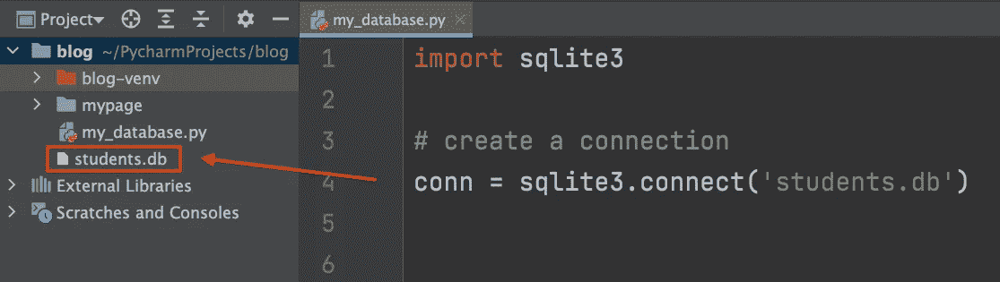
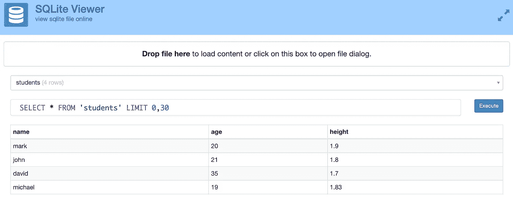
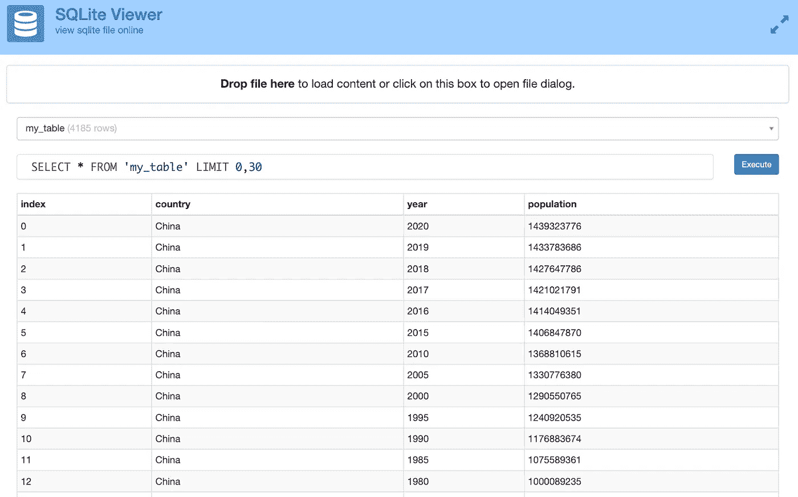

# 是的，Python 有一个内置的数据库。以下是使用方法。

> 原文：<https://towardsdatascience.com/yes-python-has-a-built-in-database-heres-how-to-use-it-b3c033f172d3>

## Python 中 SQLite 的简单指南。


图片来自 Shutterstock，授权给 Frank Andrade

信不信由你，在你的电脑上安装 Python 的那一刻，你也安装了其他奇妙的工具。其中之一就是 SQLite。

SQLite 是一个嵌入式的、基于文件的关系数据库管理系统(RDBMS ),可以在我们的 Python 应用程序中使用，而无需安装任何额外的软件。相反，我们只需要导入内置的 Python 库`sqlite3`就可以使用这个数据库。

在本指南中，我们将了解如何连接到数据库，创建表，将数据插入表中，以及如何将其与 Pandas 集成。

*如果你不想看，可以看我的 YouTube 视频！*

> **请务必点击** [**订阅此处**](https://frankandrade.ck.page/f2fbbdc6db) **获取我在所有教程中使用的 SQL 备忘单(免费 PDF)**

## 创建到数据库的连接

我们要做的第一件事是创建一个到数据库的连接。为此，我们只需要导入 sqlite3 并使用`.connect`方法。在括号内，我们写下我们想要创建的数据库的名称。在我的例子中，我将其命名为“students.db”

```
**import** sqlite3

# create a connection
conn = sqlite3.connect('students.db')
```

如果您运行上面的代码，将在您的工作目录中创建一个名为“students.db”的新文件。



作者图片

现在我们可以创建一个表并将数据放入其中。

## 创建表格

在创建表之前，我们需要创建一个游标。游标是一种用于建立执行 SQL 查询的连接的对象。我们将使用光标来创建表格、插入数据等等。

要创建一个光标，我们只需要使用我们已经创建的连接和`.cursor`方法。

```
c = conn.cursor()
```

之后，我们使用`.execute`方法在数据库中创建一个新表。在引号内，我们编写了用于在大多数 RDBMS 中创建表的普通 SQL 语法。在这种情况下，我们使用`CREATE TABLE`语句。

```
c.**execute**("""**CREATE TABLE** students (
            name **TEXT**,
            age **INTEGER**,
            height **REAL**
    )""")
```

如您所见，在创建表的列时，我们需要定义数据类型。与大多数拥有数十种数据类型的 RDBMS 不同，SQLite 只有 5 种数据类型:

*   Null:缺少值
*   整数:没有小数点的数字(例如 1、2、3、4)
*   实数:带小数点的数字(如 6.2、7.6、11.2)
*   文本:任何字符数据
*   Blob:作为值存储在数据库中的二进制数据的集合。它允许我们在数据库中存储文档、图像和其他多媒体文件。

最后，我们必须提交并关闭连接。以下是目前为止的代码。

太好了！我们已经创建了第一个表，但是它是空的，所以让我们将一些数据放入其中。

## 将数据插入表格

让我们从向“学生”表添加一行开始。为此，我们再次使用`.execute`，但是现在我们使用`INSERT INTO`语句。

下面我补充一个学生“马克”的数据，他今年 20 岁，身高 1.9 米。

```
c.**execute**("**INSERT INTO** students **VALUES** ('mark', 20, 1.9)")
```

注意，在运行上面的代码之前，您需要注释掉`CREATE TABLE`语句，因为该表已经存在。

我们也可以插入多行，但是在这种情况下，我们使用`.executemany` 方法。除此之外，我们使用`?`作为占位符。这有助于我们从名为`all_students`的列表中添加数据。

```
all_students = [
    ('john', 21, 1.8),
    ('david', 35, 1.7),
    ('michael', 19, 1.83),
]
c.**executemany**("**INSERT INTO** students **VALUES** (?, ?, ?)", all_students)
```

## 从表 a 中选择数据显示数据

到目前为止，我们已经创建了一个表并将数据放入其中，但是我们还没有看到我们的表。要查看我们的数据，我们首先需要用`SELECT`语句从我们的表中选择数据，然后用`.fetchall`显示它。

```
c.execute("**SELECT** * **FROM** students")
**print**(c**.fetchall()**)
```

打印的输出应该是:

```
[(‘mark’, 20, 1.9), (‘john’, 21, 1.8), (‘david’, 35, 1.7), (‘michael’, 19, 1.83)]
```

如果您不想在每次想要查看表格中的数据时都重复这些步骤，您可以使用 [SQLiteViewer](https://inloop.github.io/sqlite-viewer/) 。在那里你只需要拖动你的。db 文件来查看其内容。



作者图片

这是我们到目前为止所做的一切

这是 Python 中 SQLite 的基础。在 SQLite 中，更新行、删除行、排序数据和删除表也是可能的。您只需要使用您的 SQL 知识来执行它们。

## 使用 Pandas 和 SQLite

SQLite 可以与 Pandas 中的 dataframes 集成。例如，我们将使用一个名为`population_total.csv`的 CSV 文件，您可以在这里下载[。](https://github.com/ifrankandrade/python-course-for-excel-users/tree/main/4.Data%20Visualization)

```
**import** pandas **as** pd
df = pd.read_csv("population_total.csv")
```

以下是数据帧的外观:

```
>>> df country year    population0             China  2020.0  1.439324e+09
1             China  2019.0  1.433784e+09
2             China  2018.0  1.427648e+09
3             China  2017.0  1.421022e+09
4             China  2016.0  1.414049e+09
...             ...     ...           ...
4180  United States  1965.0  1.997337e+08
4181  United States  1960.0  1.867206e+08
4182  United States  1955.0  1.716853e+08
4183          India  1960.0  4.505477e+08
4184          India  1955.0  4.098806e+08
```

现在让我们创建一个内存中的 SQLite 数据库。为此，首先，我们需要安装 sqlalchemy: `pip install sqlalchemy`

然后我们需要创造一个引擎。

```
**from** sqlalchemy **import** create_engine
engine = create_engine('sqlite://', echo=**False**)
```

现在让我们将数据帧附加到数据库中的一个表中(这个表不需要预先创建)。在本例中，我将把`df`附加到一个我命名为“population”的表中。

```
df.**to_sql**("population", con=engine)
```

要查看我们的表，我们运行下面的代码。

```
engine.**execute**("**SELECT** * **FROM** population").fetchall()
```

注意:如果您想要创建一个 sqlite 文件(而不是内存中的数据库)，您应该创建一个带有文件数据库的引擎。

让我们创建一个`mydb.db`文件，然后将`df`数据帧附加到一个“人口”表。

```
**from** sqlalchemy **import** create_engine
engine = create_engine("sqlite:///mydb.db")df.to_sql("population", engine)
```

同样，您可以使用`.fetchall`来查看表格或使用 SQLite Viewer。



恭喜你！现在您知道如何在 Python 中使用 SQLite，甚至将它与 Pandas 中的 dataframes 集成。

学习 SQL —数据专业人员最需要的技能。 [**加入我的 20k+人电子邮件列表，获取我的免费 SQL 备忘单。**](https://frankandrade.ck.page/f2fbbdc6db)

如果你喜欢阅读这样的故事，并想支持我成为一名作家，可以考虑报名成为一名媒体成员。每月 5 美元，让您可以无限制地访问数以千计的 Python 指南和数据科学文章。如果你用[我的链接](https://frank-andrade.medium.com/membership)注册，我会赚一小笔佣金，不需要你额外付费。

[](https://frank-andrade.medium.com/membership) 