# YOLOv6:下一代物体探测—回顾与比较

> 原文：<https://towardsdatascience.com/yolov6-next-generation-object-detection-review-and-comparison-c02e515dc45f>

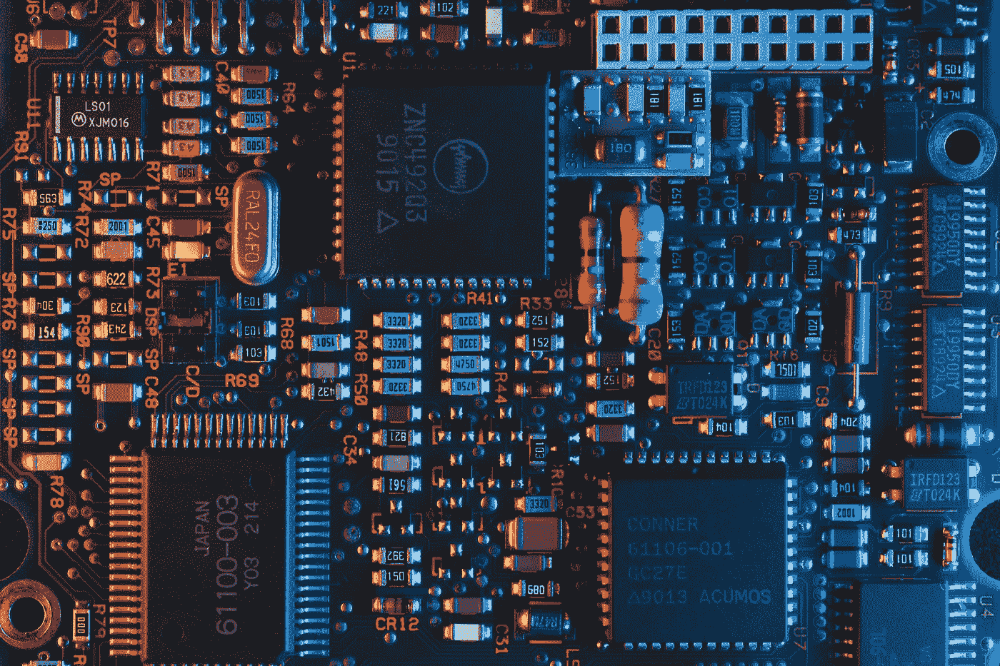

图片来自 [Unsplash](https://unsplash.com/photos/jXd2FSvcRr8)

近年来，计算机视觉领域发展迅速，并取得了几年前看起来像科幻小说一样的成果。从[分析 x 光图像](https://dagshub.com/nirbarazida/pneumonia-Classification)和诊断病人到(半)自动驾驶汽车，我们正在见证一场革命。这些突破有很多原因——构建更好、更易访问的计算资源，但事实上它们是我们最接近[开源数据科学](https://dagshub.com/blog/a-case-for-open-source-data-science/) (OSDS)的东西。向社区公开源代码可以释放“群众的智慧”,实现大规模创新和解决问题。

计算机视觉领域最受欢迎的操作系统项目之一是 YOLO(你只需看一次)。YOLO 是一种高效的实时对象检测算法，由 Joseph Redmon 等人在 2015 年的开创性论文[中首次描述。YOLO 将图像划分为一个网格系统，每个网格检测自身内部的对象。它可以用于实时推理，并且需要很少的计算资源。](https://arxiv.org/abs/1506.02640)

今天，在第一版 YOLO 发布 7 年后，美团的研究小组发布了新的 YOLOv6 型号——它是来踢一脚的！

# YOLO 的历史

# YOLO 之前的目标检测

在 YOLO 之前，两阶段对象检测架构主导了该领域。它使用基于区域的分类器来定位区域，然后将它们传递给更健壮的分类器。虽然这种方法给出了具有高平均精度(mAP)的精确结果，但是它是非常资源密集的，在其操作中需要多次迭代。

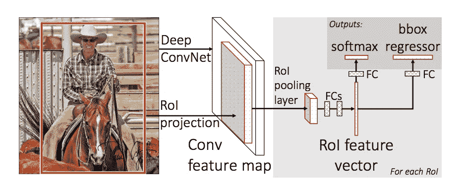

两阶段对象检测，来自纸张的图像

# YOLO 是如何工作的？

YOLO 提出了一种不同的方法，其中两个阶段都在同一个神经网络中进行。首先，图像被分成单元，每个单元具有 SxS 的等维区域。然后，每个单元用边界框坐标(相对于其坐标)和对象标签以及该事物出现在单元中的概率来检测和定位它所包含的对象。

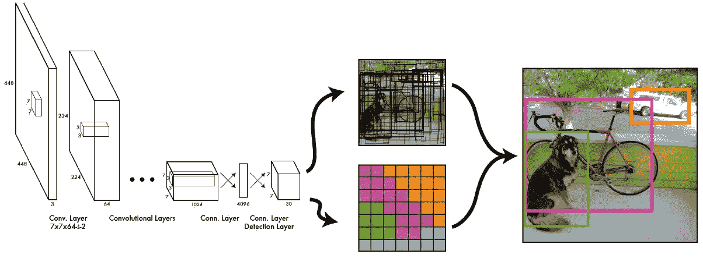

YOLOv1，图像来自原纸

因为每个单元“独立工作”，所以它可以同时处理网格，减少了训练和推断所需的计算能力和时间。事实上，YOLO 实现了最先进的结果，击败了其他实时对象检测算法。

# YOLO 有哪些版本？

*   yolov 1(2015 年 6 月):[你只看一次:统一的、实时的物体检测](https://arxiv.org/abs/1506.02640)
*   yolo v2(2016 年 12 月): [YOLO9000:更好、更快、更强](https://arxiv.org/abs/1612.08242v1)
*   yolo v3(2018 年 4 月): [YOLOv3:增量改进](https://arxiv.org/abs/1804.02767v1)
*   yolov 4(2020 年 4 月): [YOLOv4:物体检测的最佳速度和精度](https://arxiv.org/abs/2004.10934v1)
*   yolov 5(2020 年 5 月): [Github repo](https://github.com/ultralytics/yolov5) (尚未发布论文)

# YOLOv6 是来踢**和取名字的

MT-YOLOv6 的灵感来自最初的一级 YOLO 建筑，因此[被其作者(勇敢地)命名为](https://github.com/meituan/YOLOv6/blob/main/docs/About_naming_yolov6.md) YOLOv6。虽然它提供了出色的结果，但值得注意的是 MT-YOLOv6 不是官方 YOLO 系列的一部分。

YOLOv6 是一个专用于工业应用的单级对象检测框架，具有硬件友好的高效设计和高性能。它在检测准确性和推理速度方面优于 YOLOv5，是生产应用中 YOLO 架构的最佳 OS 版本。

# YOLOv6 成就

*   yolov 6-nano-在 COCO val2017 数据集上实现 35.0 地图，在 T4 上使用 TensorRT FP16 进行 bs32 推理，每秒 1242 帧
*   yolov 6-s-在 COCO val2017 数据集上实现 43.1 地图，在 T4 上使用 TensorRT FP16 进行 bs32 推理，每秒 520 帧。

# 单一图像推理

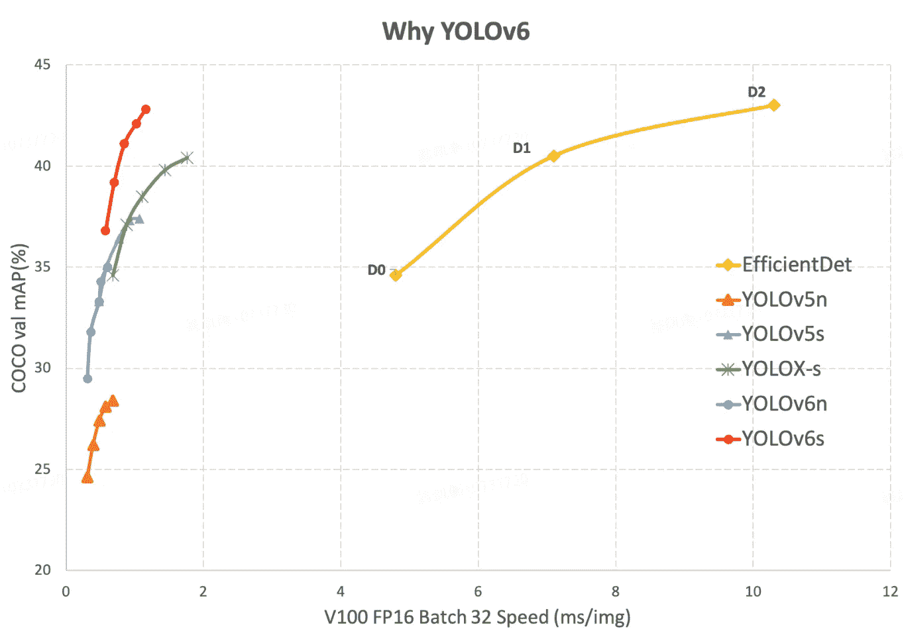

来自 YOLOv6 存储库的图像

YOLOv6s (red)提供了比所有以前版本的 YOLOv5 更好的平均精度(mAP ),推理时间大约快 2 倍。我们还可以看到基于 YOLO 的架构和基于两阶段对象检测的 EfficientDet 之间的巨大性能差距。

# 视频推理

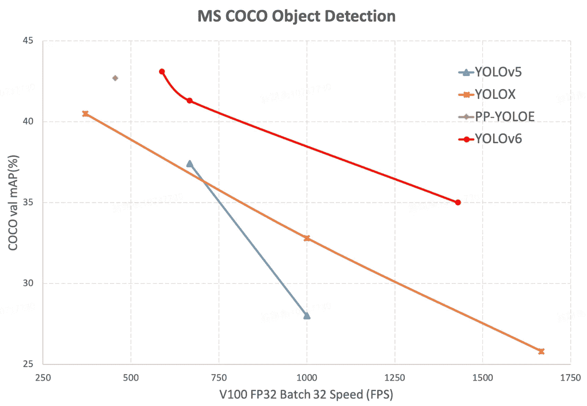

来自 YOLOv6 存储库的图像

与单个图像推断相同，YOLOv6 在所有 FPS 频谱上为视频提供了更好的结果。有趣的是注意到了大约 550–620 FPS 的曲线变化。我想知道这是否与硬件性能有关，以及维护人员在进行实验时是否减少了硬件的偏差。

# 基准

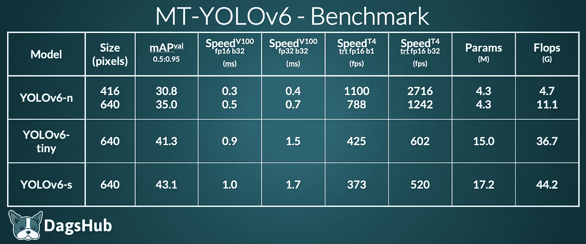

作者图片

*   在 [COCO val2017](https://cocodataset.org/#download) 数据集上测试了不同物体探测器的地图和速度的比较。
*   其他方法的速度结果在维护者的环境中使用官方代码库和模型进行了测试，如果在相应的官方版本中没有找到的话。

免责声明:上述评论是基于作者的说法，我们还有待核实。

# YOLOv5 与 YOLOv6

# YOLOv5 和 YOLOv6 的性能指标评测比较

在研究这两种型号的基准时，我发现很难对苹果进行比较。YOLOv6 的型号较少(缺少 m/l/x)，并且没有任何大于 640 像素的图像信息。对于两个项目报告的基准，我们可以清楚地看到 YOLOv6 在 mAP 方面的改进。然而，v6 的参数和失败次数是 v5 的两倍，这让我想亲自深入训练过程，仔细检查下面的结果。

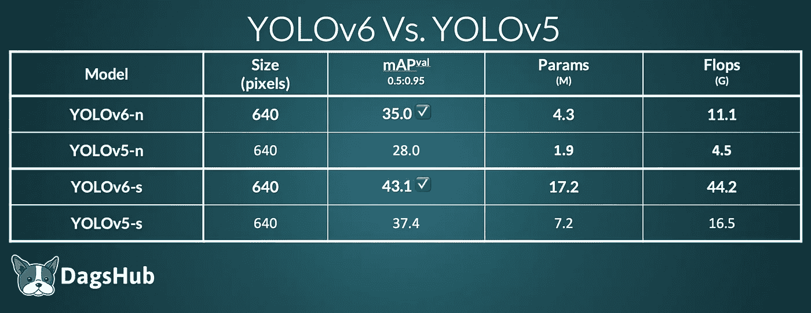

作者图片

# YOLOv5 和 YOLOv6 之间的定性比较

我使用两种型号的 s 版本来检测以下图像中的对象:

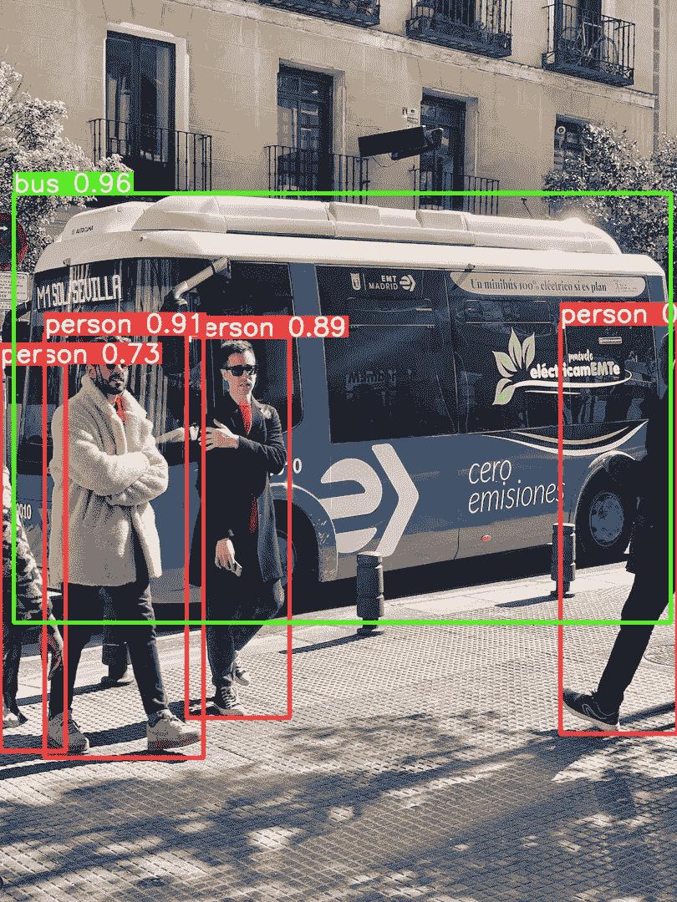

YOLOv6 性能，图像来自 YOLOv5 存储库

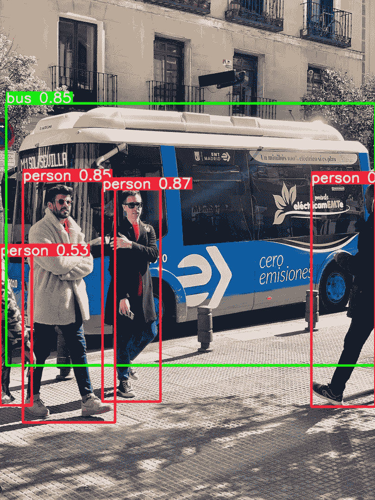

YOLOv5 表演，图片来自 YOLOv5 知识库

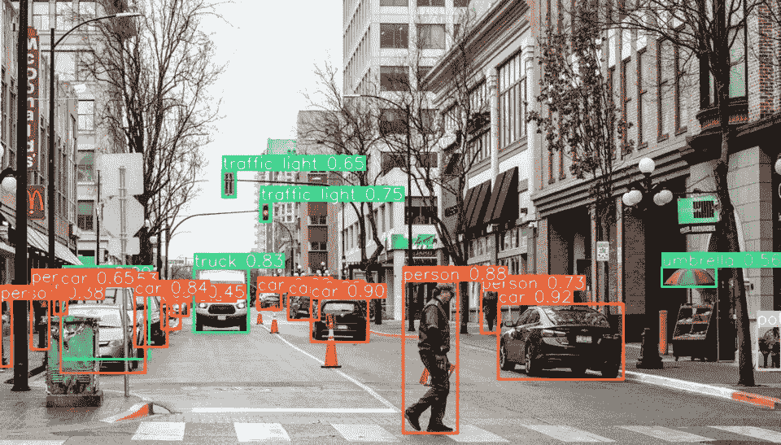

YOLOv6 性能，图像来自 YOLOv5 存储库

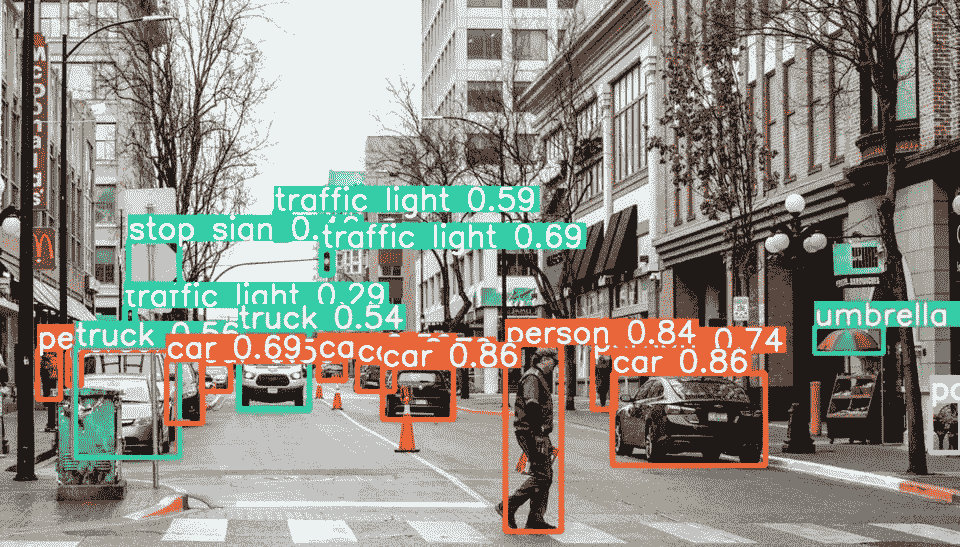

YOLOv5 表演，图片来自 YOLOv5 知识库

我们可以清楚地看到 YOLOv6s 在图像中检测到更多的物体，并且对它们的标签有更高的信心。

# 灵活性

两个项目都有相似的方法来创建不同的模型大小。最大的区别是 [YOLOv5 使用 YAML](https://github.com/ultralytics/yolov5/tree/master/models) ，而 [YOLOv6 直接在 Python](https://dagshub.com/nirbarazida/YOLOv6/src/main/configs) 中定义模型参数。预示性的一瞥也表明 YOLOv5 可能在一定程度上更具可定制性。

然而，YOLOv6 如此灵活的事实意味着我们可以在未来看到更大版本的 YOLOv6，甚至更高精度的预测！

如果你创造了一个更大的 YOLOv6 模型，[让我们知道不和谐](https://discord.com/invite/9gU36Y6)！我们很想看看！

# 使用

[你可以使用 DagsHub 的应用](https://yolov6.dagshubusercontent.com/)与 YOLOv6 的最新版本进行交互。如果您想在本地计算机上使用它，请按照下列步骤操作:

**安装**

```
git clone https://dagshub.com/nirbarazida/YOLOv6 cd
YOLOv6 pip install -r requirements.txt 
dvc pull
```

**推论**

使用 YOLOv6s: `python tools/infer.py --weights yolov6s.pt --source <path to image/directory>`

使用 YOLOv6n: `python tools/infer.py --weights yolov6n.pt --source <path to image/directory>`

# 结论

YOLOv6 是最近发布的最令人兴奋的 OSDS 项目之一。与以前的 YOLO 版本相比，它提供了最先进的结果和各方面的显著改进。维护人员目前专注于丰富模型类型、部署选项和量化工具。尽管如此，与任何开源项目一样，社区可以极大地影响其路线图和进度曲线。

尽管该项目仍处于早期阶段，但它看起来非常有前途，我很想知道它将来会打破哪些基准。