# YOLOv7:深入了解当前物体检测的最新技术

> 原文：<https://towardsdatascience.com/yolov7-a-deep-dive-into-the-current-state-of-the-art-for-object-detection-ce3ffedeeaeb>

## *在定制培训脚本中使用 YOLOv7 需要知道的一切*

*本文由* [*克里斯·休斯*](https://medium.com/@chris.p.hughes10) *&* [*伯纳特普伊格阵营*](https://medium.com/@bepuca) 合著

在其发布后不久，YOLOv7 是用于计算机视觉任务的最快和最准确的实时对象检测模型。[官方论文](https://arxiv.org/abs/2207.02696)在 MS COCO 数据集上展示了这种改进的架构如何在速度和准确性方面超越所有以前的 YOLO 版本以及所有其他对象检测模型；在不使用任何预训练砝码的情况下实现这一性能。此外，在围绕以前的 YOLO 模型的命名惯例的所有[争议之后](https://blog.roboflow.com/yolov4-versus-yolov5/)，由于 YOLOv7 是由开发 [Scaled-YOLOv4](https://arxiv.org/abs/2011.08036) 的同一作者发布的，机器学习社区似乎很乐意接受这是“官方”YOLO 家族的下一个迭代！

在 YOLOv7 发布的时候，我们——作为微软数据和人工智能服务线的一部分——正在进行一个具有挑战性的基于对象检测的客户项目，这个领域与 COCO 完全不同。不用说，我们和客户都对将 YOLOv7 应用于我们的问题的前景感到非常兴奋。不幸的是，当使用开箱即用的设置时，结果是…这么说吧，不太好。

在阅读了官方论文后，我们发现，虽然它对架构的变化进行了全面的概述，但它忽略了许多关于模型如何被训练的细节；例如，应用了哪些数据扩充技术，以及损失函数如何衡量模型做得好不好！为了理解这些技术细节，我们决定直接调试代码。然而，由于 YOLOv7 库是 YOLOR codebase 的一个派生版本，而 YOLOR code base 本身是 YOLOv5 的一个派生版本，我们发现它包含了很多复杂的功能，其中很多在训练模型时并不需要；例如，能够以 Yaml 格式指定定制架构，并将其转换成 PyTorch 模型。此外，代码库包含许多已经从头实现的自定义组件，如多 GPU 训练循环、若干数据扩充、保存数据加载器工作器的采样器和多学习率调度器，其中许多现在可以在 PyTorch 或其他库中获得。结果，有很多代码需要分析；我们花了很长时间来理解一切是如何工作的，以及训练循环的复杂性，这有助于模型的出色性能！最终，有了这种理解，我们就能够建立我们的训练食谱，在我们的任务中获得持续的好结果。

在本文中，我们打算采用一种实用的方法来演示如何在定制的训练脚本中训练 YOLOv7 模型，以及探索诸如数据扩充技术、如何选择和修改锚盒以及揭示损失函数如何工作等领域；(希望如此！)使你能够建立一种直觉，知道什么可能对你自己的问题有效。由于 YOLOv7 架构在官方文件以及许多其他来源中都有详细的描述，所以我们在这里不打算讨论它。相反，我们打算关注所有其他细节，这些虽然对 YOLOv7 的性能有所贡献，但**没有**在论文中涉及。这往往是通过多个版本的 YOLO 模型积累起来的知识，但对于刚进入该领域的人来说，要找到这些知识可能非常困难。

为了说明这些概念，我们将使用我们自己的 YOLOv7 实现，它利用了官方的预训练权重，但在编写时考虑了模块化和可读性。这个项目最初是为了让我们更好地了解 YOLOv7 的工作原理，以便更好地理解如何应用它，但在成功地将它用于几个不同的任务后，我们决定将其公开。虽然我们建议使用[官方实现](https://github.com/WongKinYiu/yolov7)，如果你想准确地复制 COCO 上的公布结果，我们发现这种实现更灵活地应用和扩展到自定义域。希望这个实现能够为任何希望在自己的定制培训脚本中使用 YOLOv7 的人提供一个清晰的起点，同时为最初实现中培训时使用的技术提供更多的透明度。

在本文中，我们将讨论:

*   [以合适的格式加载数据](#0c9c)
*   [使用预先训练的模型进行推理](#e427)
*   [了解 YOLOv7 损失](#7c9e)
*   [微调新数据集](#4f2d)
*   [从零开始训练](#e086)

一路探索所有细节，例如:

*   [锚箱](#2d59)
*   [特征金字塔网络(FPN)](#2440)
*   [中心先验](#c87a)
*   [最优运输分配](#b103)
*   [马赛克增强](#3aa9)
*   [混音增强](#408a)
*   [将权重衰减应用于参数组](#515b)
*   [余弦学习率调度](#6764)
*   [梯度累积，以及这如何影响重量衰减](#162b)
*   [型号 EMA](#0f91)
*   [为您的问题选择合适的锚箱尺寸](#1f98)

***Tl；博士:*** *如果你只想看到一些可以直接使用的工作代码，复制这篇文章所需的所有代码都可以在笔记本* [*这里*](https://github.com/Chris-hughes10/Yolov7-training/blob/main/blog%20post/Yolo7%20blog%20post.ipynb) *中找到。虽然在整篇文章中使用了代码片段，但这主要是出于美观的目的，请遵从笔记本，而* [*和*](https://github.com/Chris-hughes10/Yolov7-training) *为工作代码。*

# 承认

我们要感谢英国航空公司，如果没有他们持续延误的航班，这篇文章可能就不会出现。

# 数据加载

首先，让我们看看如何以 YOLOv7 期望的格式加载我们的数据集。

## 选择数据集

贯穿本文，我们将使用 [Kaggle 汽车对象检测数据集](https://www.kaggle.com/datasets/sshikamaru/car-object-detection)；然而，由于我们的目的是演示 YOLOv7 如何应用于任何问题，这实际上是这项工作中最不重要的部分。此外，由于图像与 COCO 非常相似，这将使我们能够在进行任何训练之前，用预训练的模型进行实验。

该数据集的注释采用. csv 文件的形式，该文件将图像名称与相应的注释相关联；其中每行代表一个边界框。虽然在训练集中有大约 1000 幅图像，但是只有那些带有注释的图像才包含在这个文件中。

我们可以通过将它加载到熊猫数据帧中来查看它的格式。

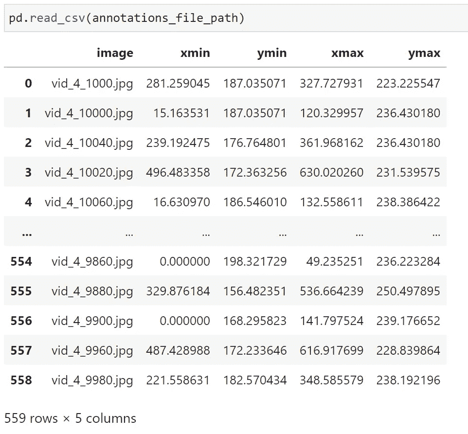

由于我们的数据集中并非所有图像都包含我们试图检测的对象的实例，因此我们还希望包含一些不包含汽车的图像。为此，我们可以定义一个函数来加载注释，其中也包括 100 张“负面”图像。此外，由于指定的测试集是未标记的，让我们随机选取这些图像的 20%作为我们的验证集。

```
# https://github.com/Chris-hughes10/Yolov7-training/blob/main/examples/train_cars.py

import pandas as pd
import random

def load_cars_df(annotations_file_path, images_path):
    all_images = sorted(set([p.parts[-1] for p in images_path.iterdir()]))
    image_id_to_image = {i: im for i, im in enumerate(all_images)}
    image_to_image_id = {v: k for k, v, in image_id_to_image.items()}

    annotations_df = pd.read_csv(annotations_file_path)
    annotations_df.loc[:, "class_name"] = "car"
    annotations_df.loc[:, "has_annotation"] = True

    # add 100 empty images to the dataset
    empty_images = sorted(set(all_images) - set(annotations_df.image.unique()))
    non_annotated_df = pd.DataFrame(list(empty_images)[:100], columns=["image"])
    non_annotated_df.loc[:, "has_annotation"] = False
    non_annotated_df.loc[:, "class_name"] = "background"

    df = pd.concat((annotations_df, non_annotated_df))

    class_id_to_label = dict(
        enumerate(df.query("has_annotation == True").class_name.unique())
    )
    class_label_to_id = {v: k for k, v in class_id_to_label.items()}

    df["image_id"] = df.image.map(image_to_image_id)
    df["class_id"] = df.class_name.map(class_label_to_id)

    file_names = tuple(df.image.unique())
    random.seed(42)
    validation_files = set(random.sample(file_names, int(len(df) * 0.2)))
    train_df = df[~df.image.isin(validation_files)]
    valid_df = df[df.image.isin(validation_files)]

    lookups = {
        "image_id_to_image": image_id_to_image,
        "image_to_image_id": image_to_image_id,
        "class_id_to_label": class_id_to_label,
        "class_label_to_id": class_label_to_id,
    }
    return train_df, valid_df, lookups
```

我们现在可以使用这个函数来加载我们的数据:

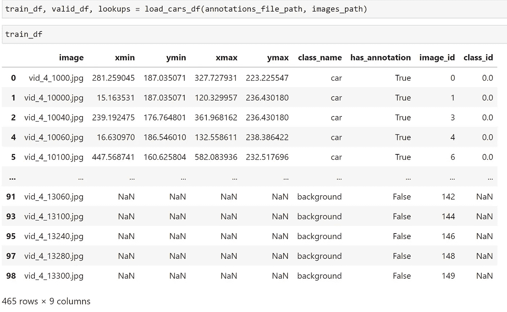

为了更容易地将预测与图像相关联，我们为每个图像分配了一个唯一的 id；在这种情况下，它只是一个递增的整数计数。此外，我们添加了一个整数值来表示我们想要检测的类，在本例中是一个单独的类，即“car”。

一般物体检测模型都会预留`0`作为背景类，所以类标签要从`1`开始。YOLOv7 的情况是**而不是**，所以我们从`0`开始我们的类编码。对于不包含汽车的图像，我们不需要类别 id。我们可以通过检查函数返回的查找来确认这一点。

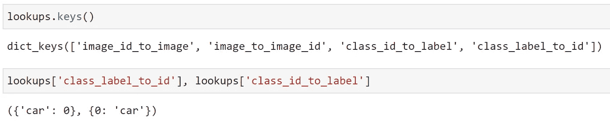

最后，让我们看看我们的训练和验证集的每个类中的图像数量。由于一幅图像可能有多个注释，我们需要确保在计算计数时考虑到这一点:

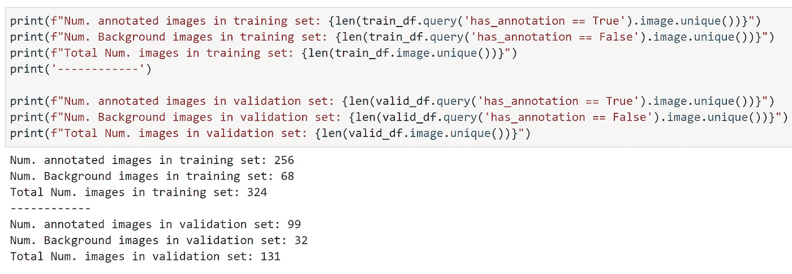

## 创建数据集适配器

通常，在这一点上，我们会创建一个 PyTorch 数据集，该数据集特定于我们将要训练的模型。

然而，我们经常使用首先创建数据集‘adaptor’类的模式，单独负责包装底层数据源并适当地加载它。通过这种方式，我们可以在使用不同数据集时轻松切换适配器，而无需更改任何特定于我们正在训练的模型的预处理逻辑。

因此，现在让我们专注于创建一个`CarsDatasetAdaptor`类，它将特定的原始数据集格式转换成图像和相应的注释。此外，让我们加载我们分配的图像 id，以及我们的图像的高度和宽度，因为它们可能对我们以后有用。

这一点的实现如下所示:

```
# https://github.com/Chris-hughes10/Yolov7-training/blob/main/examples/train_cars.py

from torch.utils.data import Dataset

class CarsDatasetAdaptor(Dataset):
    def __init__(
        self,
        images_dir_path,
        annotations_dataframe,
        transforms=None,
    ):
        self.images_dir_path = Path(images_dir_path)
        self.annotations_df = annotations_dataframe
        self.transforms = transforms

        self.image_idx_to_image_id = {
            idx: image_id
            for idx, image_id in enumerate(self.annotations_df.image_id.unique())
        }
        self.image_id_to_image_idx = {
            v: k for k, v, in self.image_idx_to_image_id.items()
        }

    def __len__(self) -> int:
        return len(self.image_idx_to_image_id)

    def __getitem__(self, index):
        image_id = self.image_idx_to_image_id[index]
        image_info = self.annotations_df[self.annotations_df.image_id == image_id]
        file_name = image_info.image.values[0]
        assert image_id == image_info.image_id.values[0]

        image = Image.open(self.images_dir_path / file_name).convert("RGB")
        image = np.array(image)

        image_hw = image.shape[:2]

        if image_info.has_annotation.any():
            xyxy_bboxes = image_info[["xmin", "ymin", "xmax", "ymax"]].values
            class_ids = image_info["class_id"].values
        else:
            xyxy_bboxes = np.array([])
            class_ids = np.array([])

        if self.transforms is not None:
            transformed = self.transforms(
                image=image, bboxes=xyxy_bboxes, labels=class_ids
            )
            image = transformed["image"]
            xyxy_bboxes = np.array(transformed["bboxes"])
            class_ids = np.array(transformed["labels"])

        return image, xyxy_bboxes, class_ids, image_id, image_hw
```

注意，对于我们的背景图像，我们只是为边界框和类 id 返回一个空数组。

利用这一点，我们可以确认数据集的长度与我们之前计算的训练图像的总数相同。

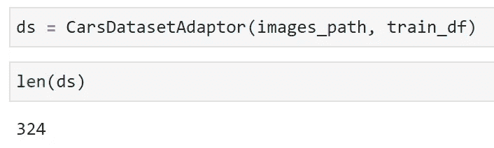

现在，我们可以用它来可视化我们的一些图像，如下所示:

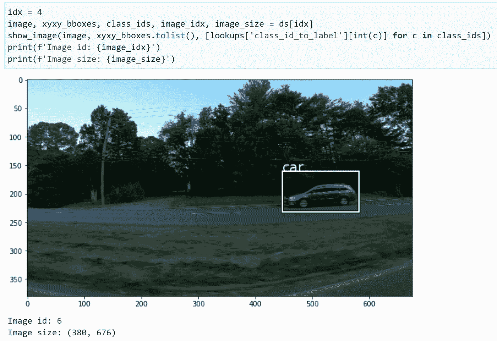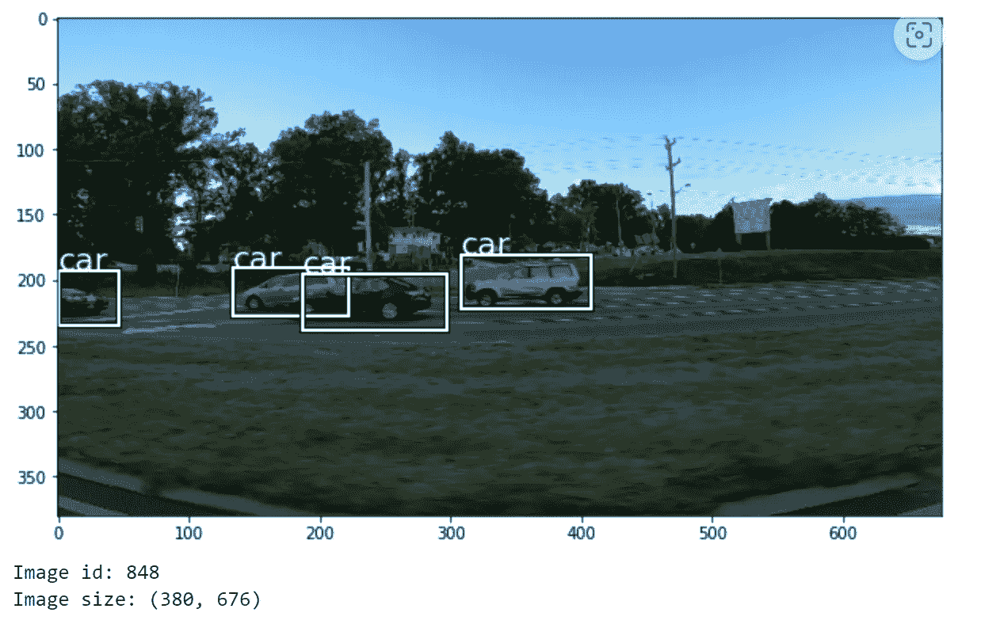

## 创建 YOLOv7 数据集

现在我们已经创建了数据集适配器，让我们创建一个数据集，它将我们的输入预处理成 YOLOv7 不管我们使用的适配器是什么，这些步骤都应该保持不变。

这一点的实现如下所示:

```
# https://github.com/Chris-hughes10/Yolov7-training/blob/main/yolov7/dataset.py

class Yolov7Dataset(Dataset):
    """
    A dataset which takes an object detection dataset returning (image, boxes, classes, image_id, image_hw)
    and applies the necessary preprocessing steps as required by Yolov7 models.

    By default, this class expects the image, boxes (N, 4) and classes (N,) to be numpy arrays,
    with the boxes in (x1,y1,x2,y2) format, but this behaviour can be modified by
    overriding the `load_from_dataset` method.
    """

    def __init__(self, dataset, transforms=None):
        self.ds = dataset
        self.transforms = transforms

    def __len__(self):
        return len(self.ds)

    def load_from_dataset(self, index):
        image, boxes, classes, image_id, shape = self.ds[index]
        return image, boxes, classes, image_id, shape

    def __getitem__(self, index):
        image, boxes, classes, image_id, original_image_size = self.load_from_dataset(
            index
        )

        if self.transforms is not None:
            transformed = self.transforms(image=image, bboxes=boxes, labels=classes)
            image = transformed["image"]
            boxes = np.array(transformed["bboxes"])
            classes = np.array(transformed["labels"])

        image = image / 255  # 0 - 1 range

        if len(boxes) != 0:
            # filter boxes with 0 area in any dimension
            valid_boxes = (boxes[:, 2] > boxes[:, 0]) & (boxes[:, 3] > boxes[:, 1])
            boxes = boxes[valid_boxes]
            classes = classes[valid_boxes]

            boxes = torchvision.ops.box_convert(
                torch.as_tensor(boxes, dtype=torch.float32), "xyxy", "cxcywh"
            )
            boxes[:, [1, 3]] /= image.shape[0]  # normalized height 0-1
            boxes[:, [0, 2]] /= image.shape[1]  # normalized width 0-1
            classes = np.expand_dims(classes, 1)

            labels_out = torch.hstack(
                (
                    torch.zeros((len(boxes), 1)),
                    torch.as_tensor(classes, dtype=torch.float32),
                    boxes,
                )
            )
        else:
            labels_out = torch.zeros((0, 6))

        try:
            if len(image_id) > 0:
                image_id_tensor = torch.as_tensor([])

        except TypeError:
            image_id_tensor = torch.as_tensor(image_id)

        return (
            torch.as_tensor(image.transpose(2, 0, 1), dtype=torch.float32),
            labels_out,
            image_id_tensor,
            torch.as_tensor(original_image_size),
        )
```

让我们使用这个数据集包装我们的数据适配器，并检查一些输出:

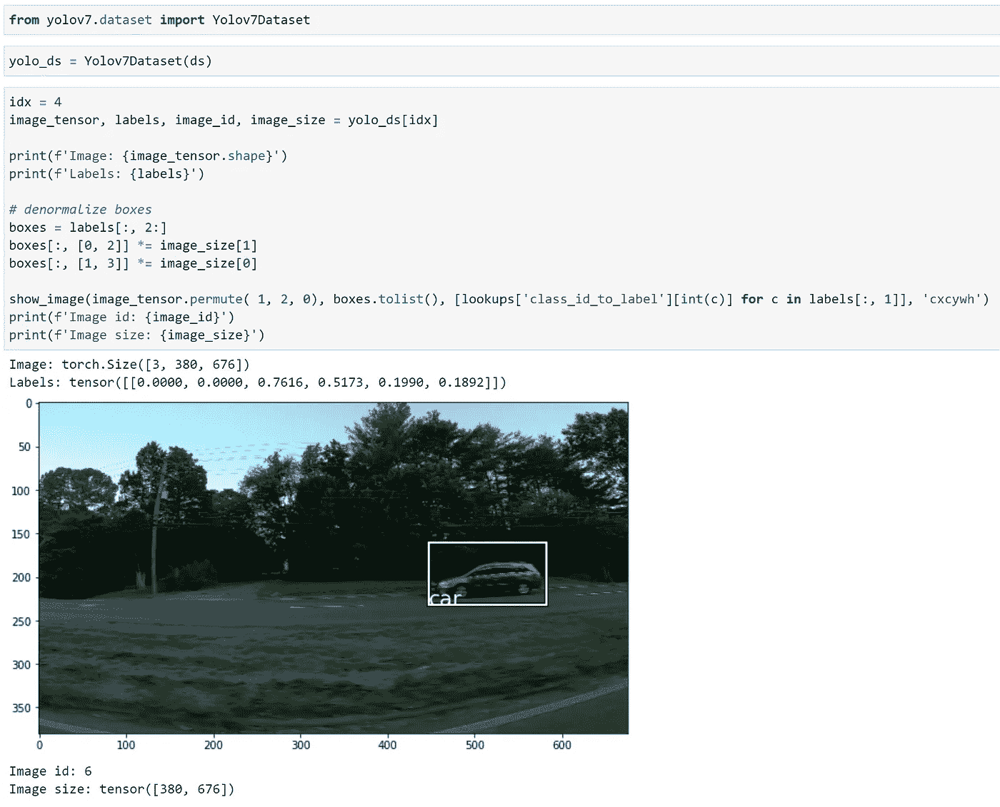

由于我们没有定义任何转换，输出基本上是相同的，主要的例外是盒子现在是规范化的 cxcywh 格式，并且我们所有的输出都被转换成张量。注意`cx`，`cy`代表中心 x 和 y，这意味着坐标对应于盒子的中心。

需要注意的一点是，我们的标签采用了`[0, class_id, ncx, ncy, nw, nh]`的形式。张量开始处的零空间将被 collate 函数稍后使用。

## 转换

现在，让我们定义一些转换！为此，我们将使用优秀的[albuminations 库](https://albumentations.ai/)，它提供了许多转换图像和边界框的选项。

虽然我们选择的转换很大程度上是领域特定的，但是在这里，我们将定义与原始实现中使用的转换相似的转换。

这些是:

*   在保持纵横比的同时，根据给定的输入(640 的倍数)调整图像大小
*   如果图像不是正方形，应用填充。为此，我们将遵循纸在使用灰色填充，这是一个任意的选择。

培训期间:

*   水平翻转。

我们可以使用下面的函数来创建这些转换，如下所示:

```
# https://github.com/Chris-hughes10/Yolov7-training/blob/main/yolov7/dataset.py

def create_yolov7_transforms(
    image_size=(640, 640),
    training=False,
    training_transforms=(A.HorizontalFlip(p=0.5),),
):
    transforms = [
        A.LongestMaxSize(max(image_size)),
        A.PadIfNeeded(
            image_size[0],
            image_size[1],
            border_mode=0,
            value=(114, 114, 114),
        ),
    ]

    if training:
        transforms.extend(training_transforms)

    return A.Compose(
        transforms,
        bbox_params=A.BboxParams(format="pascal_voc", label_fields=["labels"]),
    )
```

现在，让我们重新创建数据集，这一次传递将在评估期间使用的默认转换。对于我们的目标图像尺寸，我们将使用`640`，这是较小的 YOLOv7 模型的训练值。一般来说，我们可以选择 8 的任意倍数。

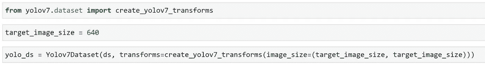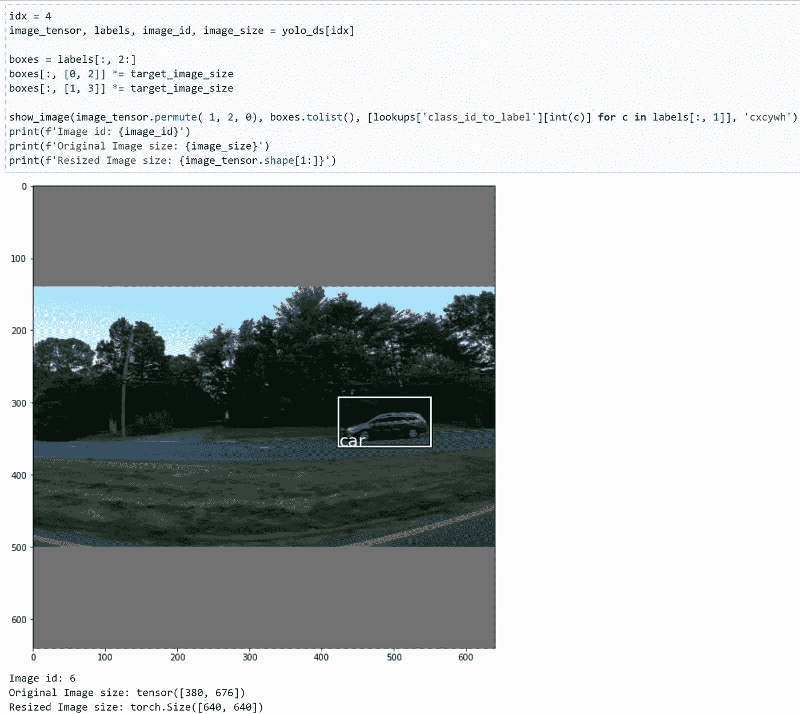

使用这些变换，我们可以看到我们的图像已经被调整到我们的目标大小，并且应用了填充。使用填充的原因是，我们可以保持图像中对象的长宽比，但在我们的数据集中图像有一个共同的大小；使我们能够高效地批量处理它们！

# 使用预训练模型

既然我们已经探索了如何加载和准备我们的数据，让我们继续看看我们如何利用预训练模型来进行一些预测！

## 加载模型

为了理解如何与模型交互，让我们加载一个预训练的检查点，并使用它对数据集中的一些图像进行推断。由于这个检查点是在包含汽车图像的 COCO 上训练的，我们可以假设这个模型在开箱即用的情况下应该在这个任务上表现得相当好。为了查看可用的模型，我们可以导入`AVAILABLE_MODELS`变量。

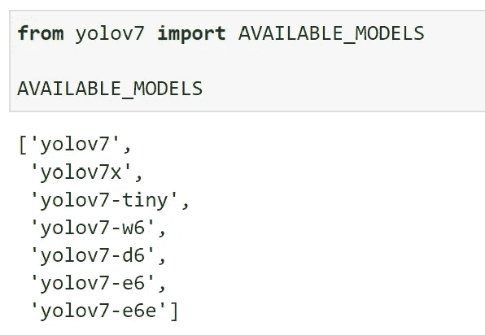

在这里，我们可以看到可用的模型是原始论文中定义的体系结构。让我们使用`create_yolov7_model`函数创建标准的`yolov7`模型。

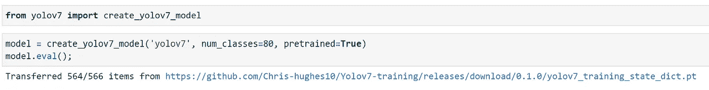

现在，让我们来看看模型的预测。向前通过模型将返回 FPN 头给出的原始特征地图，为了将这些转换成有意义的预测，我们可以使用`postprocess`方法。

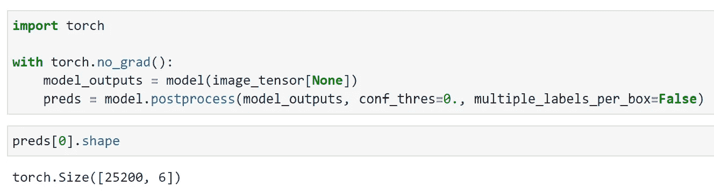

考察形状，可以看到模型已经做了 25200 次预测！每个预测都有一个关联的长度为 6 的张量-条目对应于 xyxy 格式的边界框坐标、置信度得分和类别索引。

通常，对象检测模型倾向于做出许多相似的、重叠的预测。虽然有许多方法来处理这个问题，但在最初的论文中，作者使用了[非最大抑制](https://paperswithcode.com/method/non-maximum-suppression) (NMS)来解决这个问题。我们可以使用下面的函数来应用 NMS 以及第二轮置信度阈值。此外，在后处理过程中，我们通常希望过滤置信度低于预定义阈值的任何预测，让我们在此处增加置信度阈值。

```
# https://github.com/Chris-hughes10/Yolov7-training/blob/main/yolov7/trainer.py

def filter_eval_predictions(
    predictions: List[Tensor],
    confidence_threshold: float = 0.2,
    nms_threshold: float = 0.65,
) -> List[Tensor]:
    nms_preds = []
    for pred in predictions:
        pred = pred[pred[:, 4] > confidence_threshold]

        nms_idx = torchvision.ops.batched_nms(
            boxes=pred[:, :4],
            scores=pred[:, 4],
            idxs=pred[:, 5],
            iou_threshold=nms_threshold,
        )
        nms_preds.append(pred[nms_idx])

    return nms_preds
```

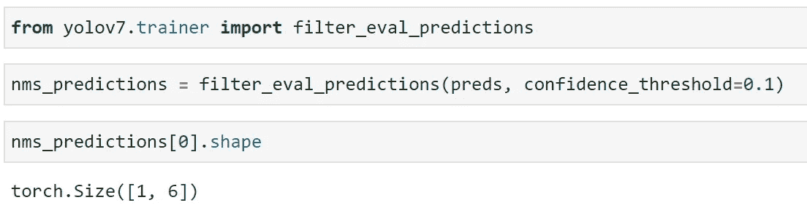

应用 NMS 后，我们可以看到，现在我们只有一个单一的预测这个图像。让我们想象一下这是什么样子:

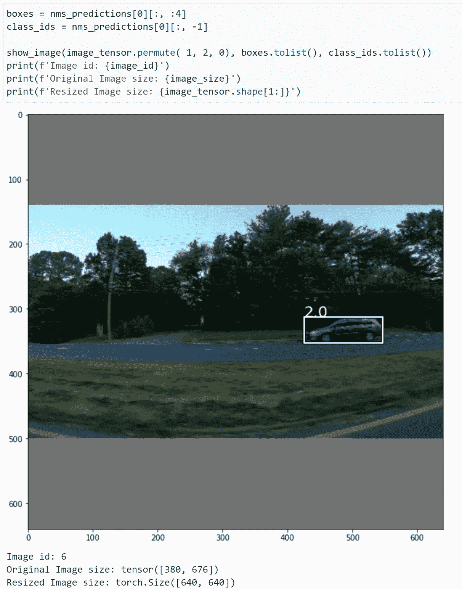

我们可以看到这个看起来相当不错！来自模型的预测实际上比地面事实更紧密地围绕着汽车！

现在我们有了我们的预测，唯一要注意的是边界框是相对于*调整后的*图像大小的。为了将我们的预测缩放回原始图像大小，我们可以使用以下函数:

```
# https://github.com/Chris-hughes10/Yolov7-training/blob/main/yolov7/trainer.py

def scale_bboxes_to_original_image_size(
    xyxy_boxes, resized_hw, original_hw, is_padded=True
):
    scaled_boxes = xyxy_boxes.clone()
    scale_ratio = resized_hw[0] / original_hw[0], resized_hw[1] / original_hw[1]

    if is_padded:
        # remove padding
        pad_scale = min(scale_ratio)
        padding = (resized_hw[1] - original_hw[1] * pad_scale) / 2, (
            resized_hw[0] - original_hw[0] * pad_scale
        ) / 2
        scaled_boxes[:, [0, 2]] -= padding[0]  # x padding
        scaled_boxes[:, [1, 3]] -= padding[1]  # y padding
        scale_ratio = (pad_scale, pad_scale)

    scaled_boxes[:, [0, 2]] /= scale_ratio[1]
    scaled_boxes[:, [1, 3]] /= scale_ratio[0]

    # Clip bounding xyxy bounding boxes to image shape (height, width)
    scaled_boxes[:, 0].clamp_(0, original_hw[1])  # x1
    scaled_boxes[:, 1].clamp_(0, original_hw[0])  # y1
    scaled_boxes[:, 2].clamp_(0, original_hw[1])  # x2
    scaled_boxes[:, 3].clamp_(0, original_hw[0])  # y2

    return scaled_boxes
```

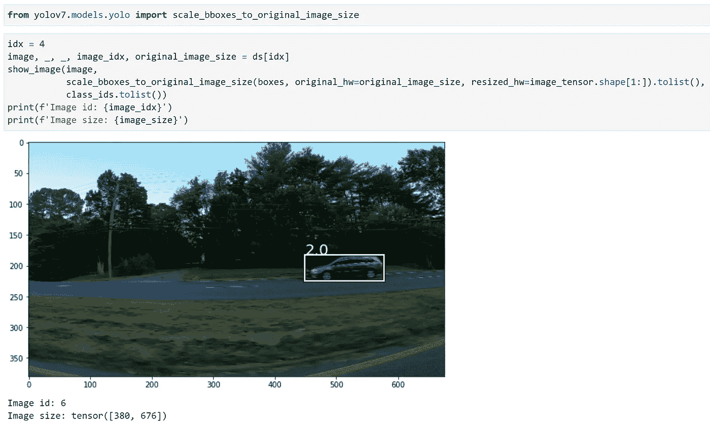

# 理解损失

在我们开始训练之前，除了模型架构之外，我们还需要一个损失函数，它将使我们能够衡量我们的模型执行得有多好；为了更新我们的参数。由于对象检测是教导模型的一个难题，所以这种模型的损失函数通常相当复杂，YOLOv7 也不例外。在这里，我们将尽最大努力说明其背后的直觉，以促进其理解。

在我们深入研究实际损失函数之前，让我们先了解一些需要理解的背景概念。

## 锚箱

目标检测的主要困难之一是输出检测框。也就是说，我们如何训练一个模型来创建一个边界框，并在图像中正确定位它？

有几种不同的方法，但 YOLOv7 家族是我们所说的基于**主播的**模式。在这些模型中，一般的哲学是首先创建许多潜在的包围盒，然后选择最有希望的选项来匹配我们的目标对象；根据需要稍微移动和调整它们的大小，以获得最佳的匹配。

基本思想是，我们在每个图像的顶部绘制一个网格，并且在每个网格交叉点(**锚点**)，基于多个**锚点大小**生成候选框(**锚点框**)。也就是说，同一组框在每个锚点重复出现。这样，model 需要学习的任务，稍微调整这些盒子的位置和大小，比从头开始生成盒子要简单。

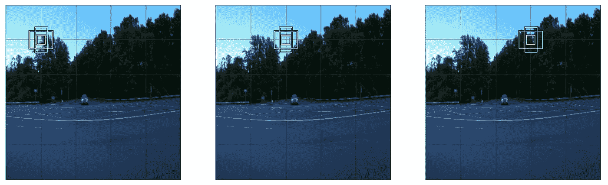

*在锚点样本处生成的锚点框的示例。*

然而，这种方法的一个问题是，我们的目标，地面真相，盒子的大小可以变化——从小到大！因此，通常不可能定义一组可以匹配所有目标的锚尺寸。出于这个原因，基于锚的模型架构通常采用特征金字塔网络(FPN)来协助这一点；YOLOv7 就是这种情况。

## 要素金字塔网络(FPN)

FPNs(在[用于对象检测的特征金字塔网络](https://arxiv.org/abs/1612.03144)中介绍)背后的主要思想是利用卷积层的性质——减少特征空间的大小并增加初始图像中每个特征的覆盖范围——来输出不同比例的预测。fpn 通常被实现为卷积层的堆栈，正如我们通过检查 YOLOv7 模型的检测头所看到的那样。

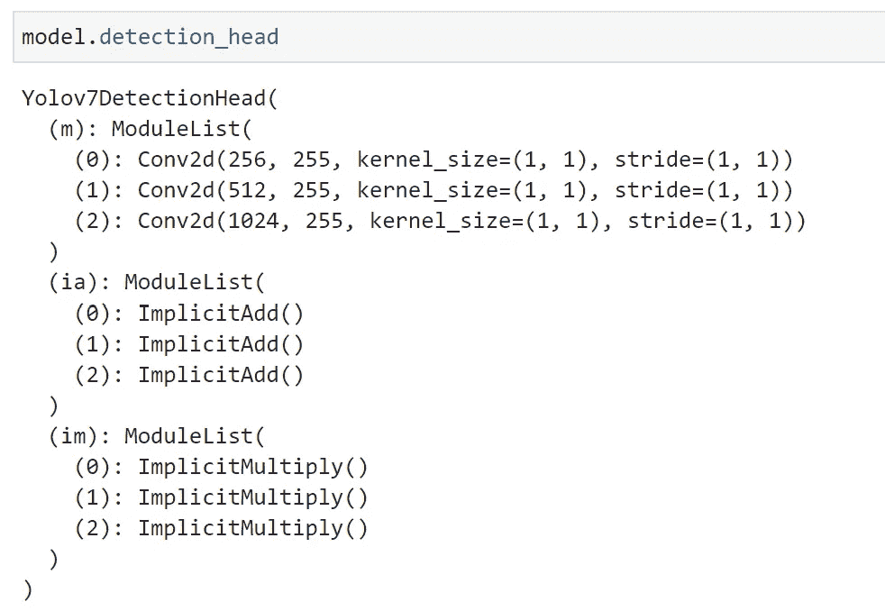

虽然我们可以简单地将最终层的输出作为预测，但是由于较深的卷积层隐含地利用来自先前层的信息来学习更多的高级特征，因此它们无法访问如何检测包含在先前层中的较低级特征的信息；这可能导致检测较小对象时性能不佳。

由于这个原因，自上而下的路径和横向连接被添加到常规的自下而上的路径(回旋层的正常流动)。自上而下的路径通过从更高的金字塔等级向上采样空间上更粗糙但语义上更强的特征地图来产生更高分辨率的特征。然后，通过横向连接，用自下而上路径的特征增强这些特征。自底向上的特征映射具有较低层次的语义，但是它的激活被更精确地定位，因为它被二次抽样的次数更少。

总之，FPNs 在多个尺度上提供了语义强的特征，这使得它们非常适合于对象检测。下图显示了 YOLOv7 在其 FPN 中实现的连接:

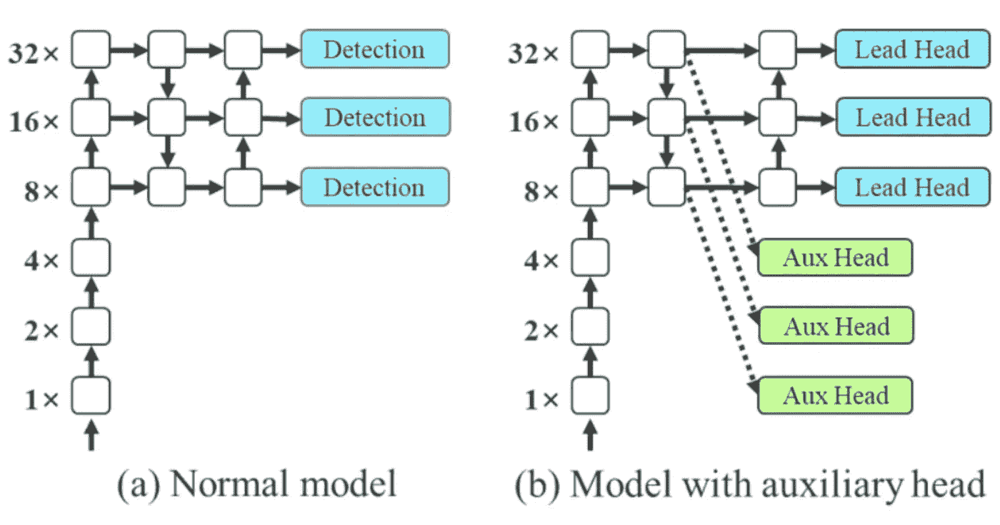

*yolov 7 系列特征提议网络架构的表示。来源:* [*YOLOv7 纸*](https://arxiv.org/abs/2207.02696) *。*

在这里，我们可以看到我们有一个“正常模型”和一个“带辅助头的模型”。这是因为 YOLOv7 家族中一些体型较大的车型在训练时使用了深度监督；也就是说，为了更好地学习任务，他们利用了损失中更深层的输出。稍后我们将进一步探讨这一点。

从图像中，我们可以看到 FPN 中的每个图层(也称为每个 FPN 头)的特征比例是前一个图层的一半(每个引线头及其对应的辅助头的比例相同)。这可以理解为每一个随后的 FPN 头部“看到”的物体都是前一个的两倍大。我们可以通过给每个 FPN 头分配不同**步长**(网格单元边长)和比例锚尺寸的网格来利用这一点。

例如，基本`yolov7`模型的锚配置如下所示:

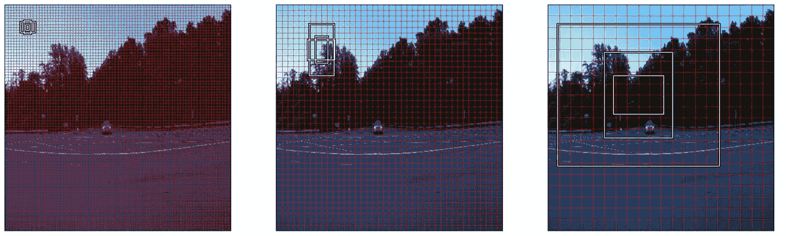

*yolov 7 系列主模型中每个 fpn 头的锚网格和不同(默认)锚框尺寸的图示*

正如我们所看到的，我们有锚框大小和网格，覆盖了完全不同的尺度:从微小的对象到可以占据整个图像的对象。

现在，我们从概念上理解了这些想法，让我们看看从我们的模型中得出的 FPN 输出，这将用于计算我们的损失。

*这些章节直接取自* [*原 FPN 论文*](https://arxiv.org/abs/1612.03144) *，因为我们觉得不需要进一步解释。*

## 分解 FPN 产出

回想一下，当我们之前进行预测时，我们使用模型的`postprocess`方法将原始 FPN 输出转换成可用的边界框。既然我们理解了 FPN 试图做什么背后的直觉，让我们检查这些原始输出。

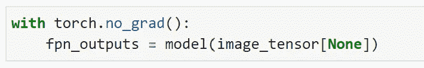

我们模型的输出总是一个`List[Tensor]`，其中每个组件对应一个 FPN 的头。对于使用深度监控的型号，辅助头输出在导联头输出之后(每一个的数量总是相同的，线对的两侧顺序相同)。其余的，包括我们在这里使用的，只有导联头输出。

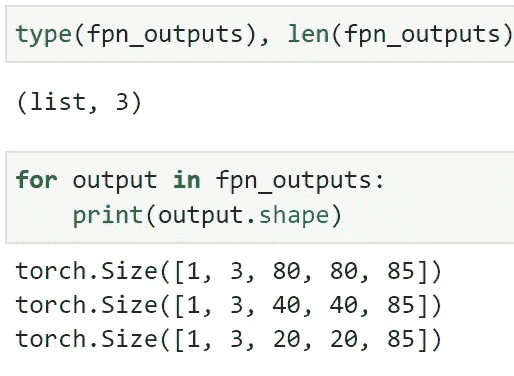

检查每个 FPN 输出的形状，我们可以看到每个输出都有以下尺寸:

```
[n_images, n_anchor_sizes, n_grid_rows, n_grid_cols, n_features]
```

其中:

*   `n_images` —批次中图像的数量(批次大小)。
*   `n_anchor_sizes` -与头部相关的锚尺寸(通常为 3)。
*   `n_grid_rows`——垂直方向上锚的数量，`img_height / stride`。
*   `n_grid_cols` -水平方向的锚数量，`img_width / stride`。
*   `n_features`-`5 + num_classes`-
    -`cx`-锚箱中心水平校正。
    - `cy` -锚箱中心垂直校正。
    - `w` -锚箱宽度修正。
    - `h` -锚箱高度修正。
    - `obj_score` -与锚盒内包含对象的概率成比例的分数。
    - `cls_score` -每类一个，得分与该对象所属类别的概率成比例。

当这些输出在后处理期间被映射成有用的预测时，我们应用以下操作:

*   `cx`、`cy`:`final = 2 * sigmoid(initial) - 0.5`
    *[(∞、∞)、(∞、∞)]→[(0.5，1.5)，(-0.5，1.5)]*
    -模型只能将锚点中心从 0.5 个单元后向前移动 1.5 个单元。请注意，对于损失(即，当我们训练时)，我们使用网格坐标。
*   `w`、`h`:`final = (2 * sigmoid(initial)**2`
    *[(∞、∞)、(∞、∞)] → [(0，4)，(0，4)]*
    ——模型可以任意变小，但最多变大 4 倍。更大的物体，在这个范围之外，必须由下一个 FPN 头预测。
*   `obj_score`:`final = sigmoid(initial)`
    *(∞，∞) → (0，1)*
    -确保分数映射到一个概率。
*   `cls_score`:`final = sigmoid(initial)`
    *(∞，∞) → (0，1)*
    -确保分数映射到一个概率。

## 中心先验

现在，很容易看出，如果我们在每个网格的每个定位点放置 3 个定位框，我们最终会得到很多框:`3*80*80 + 3*40*40 + 3*20*20=25200`准确地说，是每个 640x640px 图像！问题是，这些预测中的大部分都不会包含一个我们归类为“背景”的物体。根据我们需要应用于每个预测的操作顺序，计算很容易堆积起来并减慢训练速度！

为了降低问题的计算成本，YOLOv7 loss 首先找到可能与每个目标框匹配的锚框，并对它们进行不同的处理——这些锚框被称为**中心优先**锚框。该过程应用于每个 FPN 头，对于每个目标框，一次批量跨越所有图像。

每个锚——我们网格中的坐标——定义一个网格单元；其中我们认为锚点位于其对应网格单元的左上方。随后，每个单元格(边界上的单元格除外)有 4 个相邻的单元格(上、下、左、右)。对于每个 FPN 头部，每个目标框位于网格单元内的某个位置。假设我们有下面的网格，目标框的中心用一个`*`表示:

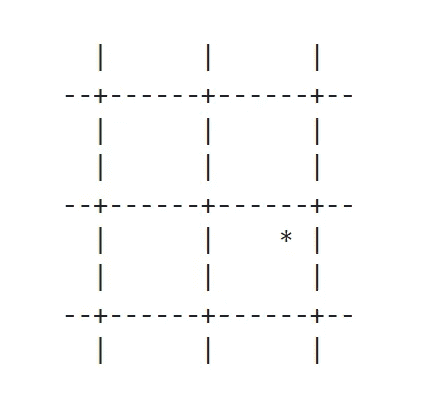

基于模型的设计和训练方式，它能够输出的`x`和`y`修正量在`[-0.5, 1.5]`网格单元的范围内。因此，只有最近锚盒的子集能够匹配目标中心。我们选择这些锚框中的一些来代表目标框的之前的**中心。**

*   对于引线头，我们在之前使用**精细中心，这是一个更有针对性的选择。这由每个头**的 **3 个锚组成:锚与包含目标框中心的单元相关联，旁边是离目标框中心最近的 2 个网格单元的锚。在图中，中心前锚标有`X`。**

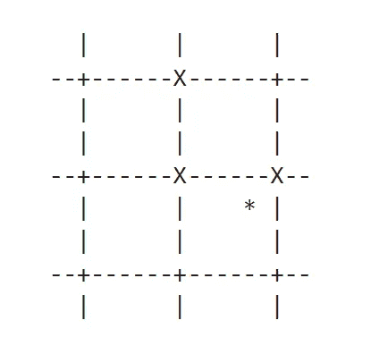

铅检测头的选定中心先验

*   对于辅助头(对于使用深度监控的型号)，我们在之前使用**粗中心，这是一个针对性较低的选择。这由每个头的 **5 个锚组成**:包含目标框中心的单元的锚，在所有 4 个相邻网格单元旁边。**

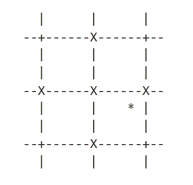

辅助探测头的选定中心先验

这种细与粗的区分背后的推理是，辅助头的学习能力低于领头头，因为领头头在网络中的位置更深。因此，我们尽量避免从辅助头可以学习的地方限制太多，以确保我们不会丢失有价值的信息。

类似于坐标校正，模型只能在间隔`[0, 4]`中对每个锚框的宽度和高度应用乘法修改器。这意味着，它最多可以使锚盒的侧面扩大 4 倍。因此，从被选为中心先验的锚框中，我们过滤那些比目标框大或小 4 倍的锚框。

总之，中心先验由锚框组成，锚框的锚足够靠近目标框中心，并且其边不太偏离目标框边尺寸。

## 最优运输分配

评估对象检测模型时的困难之一是能够将预测框与目标框进行匹配，以便量化模型是否做得好。

最简单的方法是定义 Union (IoU)阈值上的[交集，并基于此做出决定。虽然这通常是可行的，但当存在遮挡、模糊或多个对象非常靠近时，就会出现问题。](https://en.wikipedia.org/wiki/Jaccard_index)[最优传输分配](https://arxiv.org/abs/2103.14259) (OTA)旨在通过将标签分配视为每个图像的全局优化问题来解决其中一些问题。

主要直觉在于将每个目标框视为`k`正标签分配的提供者，而将每个预测框视为一个正标签分配或一个背景分配的需求者。`k`是动态的，依赖于每个目标框。然后，将一个正标签分配从目标盒传送到预测盒具有基于分类和回归的成本。最后，目标是找到一个运输计划(标签分配)，使图像的总成本最小化。

这可以使用现成的解算器来完成，但 YOLOv7 实现了 **simOTA** (在 [YOLOX 论文](https://arxiv.org/abs/2107.08430)中介绍)，这是 OTA 问题的简化版本。以减少标签分配的计算成本为目标，它为每个目标分配具有最低运输成本的𝑘预测盒，而不是解决全局问题。中心先验框被用作该过程的候选者。

这有助于我们进一步筛选可能与真实目标相匹配的模型输出数量。

## YOLOv7 损失算法

既然我们已经介绍了 YOLOv7 损耗计算中使用的最复杂的部分，我们可以将使用的算法分解为以下步骤:

1.  对于每个 FPN 头(或每个 FPN 头和辅助 FPN 头对，如果使用辅助头):

*   找到中心优先锚盒。
*   通过 simOTA 算法优化候选选择。为此，请始终使用铅 FPN 头。
*   使用预测的对象概率和 Union 上的[完全交集](https://arxiv.org/abs/1911.08287) (CIoU)之间的二元交叉熵损失获得**对象损失**分数，将匹配的目标作为基础事实。如果没有匹配，这是 0。
*   如果有选择的候选锚盒，也计算(否则都是 0):
    -**盒(或回归)损失**，定义为所有候选锚盒与其匹配目标之间的`mean(1 - CIoU)`。
    -**分类损失**，使用每个锚盒的预测类别概率和匹配目标的真实类别的独热编码向量之间的二进制交叉熵损失。
*   如果模型使用辅助头，将从辅助头获得的每个分量加到相应的主损耗分量上(即`x = x + aux_wt*aux_x`)。贡献权重(`aux_wt`)由预定义的超参数定义。
*   将目标损失乘以相应的 FPN 头权重(预定义的超参数)。

2.将每个损失成分(客体、分类、回归)乘以其贡献权重(预定义的超参数)。

3.合计已经加权的损失部分。

4.将最终损失值乘以批量。

作为一个技术细节，评估期间报告的损失通过跳过 simOTA 和从不使用辅助头在计算上更便宜，即使对于时尚深度监控的模型也是如此。

虽然这个过程包含很多复杂性，但在实践中，这些都被封装在一个类中，该类可以如下所示创建:

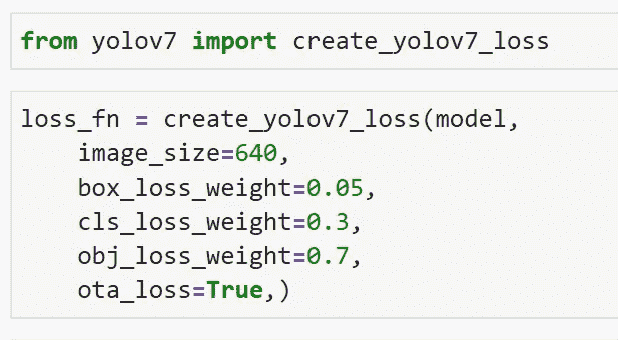

# 微调模型

现在，我们已经了解了如何使用预训练模型进行预测，以及我们的损失函数如何衡量这些预测的质量，让我们看看如何根据自定义任务对模型进行微调。为了获得论文中报告的性能水平，YOLOv7 使用各种技术进行了训练。然而，出于我们的目的，在逐步引入不同的技术之前，让我们从所需的尽可能少的训练循环开始。

为了处理训练循环的样板文件，让我们使用 [PyTorch 加速的](https://github.com/Chris-hughes10/pytorch-accelerated)。这将使我们能够只定义与我们的用例相关的训练循环的部分，而不必管理所有的样板文件。为此，我们可以覆盖[默认 PyTorch 加速](https://pytorch-accelerated.readthedocs.io/en/latest/trainer.html#pytorch_accelerated.trainer.Trainer) `[Trainer](https://pytorch-accelerated.readthedocs.io/en/latest/trainer.html#pytorch_accelerated.trainer.Trainer)`的部分内容，并创建一个特定于 YOLOv7 型号的训练器，如下所示:

```
# https://github.com/Chris-hughes10/Yolov7-training/blob/main/yolov7/trainer.py

from pytorch_accelerated import Trainer

class Yolov7Trainer(Trainer):
    YOLO7_PADDING_VALUE = -2.0

    def __init__(
        self,
        model,
        loss_func,
        optimizer,
        callbacks,
        filter_eval_predictions_fn=None,
    ):
        super().__init__(
            model=model, loss_func=loss_func, optimizer=optimizer, callbacks=callbacks
        )
        self.filter_eval_predictions = filter_eval_predictions_fn

    def training_run_start(self):
        self.loss_func.to(self.device)

    def evaluation_run_start(self):
        self.loss_func.to(self.device)

    def train_epoch_start(self):
        super().train_epoch_start()
        self.loss_func.train()

    def eval_epoch_start(self):
        super().eval_epoch_start()
        self.loss_func.eval()

    def calculate_train_batch_loss(self, batch) -> dict:
        images, labels = batch[0], batch[1]

        fpn_heads_outputs = self.model(images)
        loss, _ = self.loss_func(
            fpn_heads_outputs=fpn_heads_outputs, targets=labels, images=images
        )

        return {
            "loss": loss,
            "model_outputs": fpn_heads_outputs,
            "batch_size": images.size(0),
        }

    def calculate_eval_batch_loss(self, batch) -> dict:
        with torch.no_grad():
            images, labels, image_ids, original_image_sizes = (
                batch[0],
                batch[1],
                batch[2],
                batch[3].cpu(),
            )
            fpn_heads_outputs = self.model(images)
            val_loss, _ = self.loss_func(
                fpn_heads_outputs=fpn_heads_outputs, targets=labels
            )

            preds = self.model.postprocess(fpn_heads_outputs, conf_thres=0.001)

            if self.filter_eval_predictions is not None:
                preds = self.filter_eval_predictions(preds)

            resized_image_sizes = torch.as_tensor(
                images.shape[2:], device=original_image_sizes.device
            )[None].repeat(len(preds), 1)

        formatted_predictions = self.get_formatted_preds(
            image_ids, preds, original_image_sizes, resized_image_sizes
        )

        gathered_predictions = (
            self.gather(formatted_predictions, padding_value=self.YOLO7_PADDING_VALUE)
            .detach()
            .cpu()
        )

        return {
            "loss": val_loss,
            "model_outputs": fpn_heads_outputs,
            "predictions": gathered_predictions,
            "batch_size": images.size(0),
        }

    def get_formatted_preds(
        self, image_ids, preds, original_image_sizes, resized_image_sizes
    ):
        """
        scale bboxes to original image dimensions, and associate image id with predictions
        """
        formatted_preds = []
        for i, (image_id, image_preds) in enumerate(zip(image_ids, preds)):
            # image_id, x1, y1, x2, y2, score, class_id
            formatted_preds.append(
                torch.cat(
                    (
                        scale_bboxes_to_original_image_size(
                            image_preds[:, :4],
                            resized_hw=resized_image_sizes[i],
                            original_hw=original_image_sizes[i],
                            is_padded=True,
                        ),
                        image_preds[:, 4:],
                        image_id.repeat(image_preds.shape[0])[None].T,
                    ),
                    1,
                )
            )

        if not formatted_preds:
            # if no predictions, create placeholder so that it can be gathered across processes
            stacked_preds = torch.tensor(
                [self.YOLO7_PADDING_VALUE] * 7, device=self.device
            )[None]
        else:
            stacked_preds = torch.vstack(formatted_preds)

        return stacked_preds
```

我们的训练步骤非常简单，唯一的修改是我们需要从返回的字典中提取总损失。对于评估步骤，我们首先计算损失，然后检索检测。

## 评估逻辑

为了评估我们的模型在这个任务上的性能，我们可以使用[平均精度](https://en.wikipedia.org/wiki/Evaluation_measures_(information_retrieval)#Mean_average_precision)(mAP)；对象检测任务的标准度量。也许最广泛使用(和信任)的 mAP 实现是包含在 [PyCOCOTools 包](https://pypi.org/project/pycocotools/)中的类，它用于评估官方 COCO 排行榜提交。

然而，由于它没有最具创意的界面，我们[围绕它创建了一个简单的包装器](https://github.com/Chris-hughes10/Yolov7-training/blob/main/yolov7/evaluation/coco_evaluator.py)，使它更加用户友好。此外，对于 COCO 竞赛排行榜之外的许多案例，使用固定的借据阈值评估预测可能是有利的，而不是默认使用的借据范围，我们在评估器中添加了一个选项来执行此操作。

为了封装我们的评估逻辑以便在训练中使用，让我们[为这个](https://pytorch-accelerated.readthedocs.io/en/latest/callbacks.html#creating-new-callbacks)创建一个回调；其将在每个评估步骤结束时被更新，然后在每个评估时期结束时被计算。

```
 # https://github.com/Chris-hughes10/Yolov7-training/blob/main/yolov7/evaluation/calculate_map_callback.py

from pytorch_accelerated.callbacks import TrainerCallback

class CalculateMeanAveragePrecisionCallback(TrainerCallback):
    """
    A callback which accumulates predictions made during an epoch and uses these to calculate the Mean Average Precision
    from the given targets.

    .. Note:: If using distributed training or evaluation, this callback assumes that predictions have been gathered
    from all processes during the evaluation step of the main training loop.
    """

    def __init__(
        self,
        targets_json,
        iou_threshold=None,
        save_predictions_output_dir_path=None,
        verbose=False,
    ):
        """
        :param targets_json: a COCO-formatted dictionary with the keys "images", "categories" and "annotations"
        :param iou_threshold: If set, the IoU threshold at which mAP will be calculated. Otherwise, the COCO default range of IoU thresholds will be used.
        :param save_predictions_output_dir_path: If provided, the path to which the accumulated predictions will be saved, in coco json format.
        :param verbose: If True, display the output provided by pycocotools, containing the average precision and recall across a range of box sizes.
        """
        self.evaluator = COCOMeanAveragePrecision(iou_threshold)
        self.targets_json = targets_json
        self.verbose = verbose
        self.save_predictions_path = (
            Path(save_predictions_output_dir_path)
            if save_predictions_output_dir_path is not None
            else None
        )

        self.eval_predictions = []
        self.image_ids = set()

    def on_eval_step_end(self, trainer, batch, batch_output, **kwargs):
        predictions = batch_output["predictions"]
        if len(predictions) > 0:
            self._update(predictions)

    def on_eval_epoch_end(self, trainer, **kwargs):
        preds_df = pd.DataFrame(
            self.eval_predictions,
            columns=[
                XMIN_COL,
                YMIN_COL,
                XMAX_COL,
                YMAX_COL,
                SCORE_COL,
                CLASS_ID_COL,
                IMAGE_ID_COL,
            ],
        )

        predictions_json = self.evaluator.create_predictions_coco_json_from_df(preds_df)
        self._save_predictions(trainer, predictions_json)

        if self.verbose and trainer.run_config.is_local_process_zero:
            self.evaluator.verbose = True

        map_ = self.evaluator.compute(self.targets_json, predictions_json)
        trainer.run_history.update_metric(f"map", map_)

        self._reset()

    @classmethod
    def create_from_targets_df(
        cls,
        targets_df,
        image_ids,
        iou_threshold=None,
        save_predictions_output_dir_path=None,
        verbose=False,
    ):
        """
        Create an instance of :class:`CalculateMeanAveragePrecisionCallback` from a dataframe containing the ground
        truth targets and a collections of all image ids in the dataset.

        :param targets_df: DF w/ cols: ["image_id", "xmin", "ymin", "xmax", "ymax", "class_id"]
        :param image_ids: A collection of all image ids in the dataset, including those without annotations.
        :param iou_threshold:  If set, the IoU threshold at which mAP will be calculated. Otherwise, the COCO default range of IoU thresholds will be used.
        :param save_predictions_output_dir_path: If provided, the path to which the accumulated predictions will be saved, in coco json format.
        :param verbose: If True, display the output provided by pycocotools, containing the average precision and recall across a range of box sizes.
        :return: An instance of :class:`CalculateMeanAveragePrecisionCallback`
        """

        targets_json = COCOMeanAveragePrecision.create_targets_coco_json_from_df(
            targets_df, image_ids
        )

        return cls(
            targets_json=targets_json,
            iou_threshold=iou_threshold,
            save_predictions_output_dir_path=save_predictions_output_dir_path,
            verbose=verbose,
        )

    def _remove_seen(self, labels):
        """
        Remove any image id that has already been seen during the evaluation epoch. This can arise when performing
        distributed evaluation on a dataset where the batch size does not evenly divide the number of samples.

        """
        image_ids = labels[:, -1].tolist()

        # remove any image_idx that has already been seen
        # this can arise from distributed training where batch size does not evenly divide dataset
        seen_id_mask = torch.as_tensor(
            [False if idx not in self.image_ids else True for idx in image_ids]
        )

        if seen_id_mask.all():
            # no update required as all ids already seen this pass
            return []
        elif seen_id_mask.any():  # at least one True
            # remove predictions for images already seen this pass
            labels = labels[~seen_id_mask]

        return labels

    def _update(self, predictions):
        filtered_predictions = self._remove_seen(predictions)

        if len(filtered_predictions) > 0:
            self.eval_predictions.extend(filtered_predictions.tolist())
            updated_ids = filtered_predictions[:, -1].unique().tolist()
            self.image_ids.update(updated_ids)

    def _reset(self):
        self.image_ids = set()
        self.eval_predictions = []

    def _save_predictions(self, trainer, predictions_json):
        if (
            self.save_predictions_path is not None
            and trainer.run_config.is_world_process_zero
        ):
            with open(self.save_predictions_path / "predictions.json", "w") as f:
                json.dump(predictions_json, f)
```

现在，我们所要做的就是将我们的回调插入我们的训练器，我们的地图将在每个时期被记录下来！

## 跑步训练

现在，让我们将目前为止看到的所有内容放入一个简单的培训脚本中。在这里，我们使用了一个简单的训练方法，它适用于各种任务，并且进行了最小的超参数调整。

因为我们注意到这个数据集的基础事实框可以包含对象周围相当多的空间，所以我们决定将用于评估的 IoU 阈值设置得相当低；因为由该模型产生的盒子很可能会更紧地围绕该对象。

```
# https://github.com/Chris-hughes10/Yolov7-training/blob/main/examples/minimal_finetune_cars.py

import os
import random
from functools import partial
from pathlib import Path

import numpy as np
import pandas as pd
import torch
from func_to_script import script
from PIL import Image
from pytorch_accelerated.callbacks import (
    EarlyStoppingCallback,
    SaveBestModelCallback,
    get_default_callbacks,
)
from pytorch_accelerated.schedulers import CosineLrScheduler
from torch.utils.data import Dataset

from yolov7 import create_yolov7_model
from yolov7.dataset import Yolov7Dataset, create_yolov7_transforms, yolov7_collate_fn
from yolov7.evaluation import CalculateMeanAveragePrecisionCallback
from yolov7.loss_factory import create_yolov7_loss
from yolov7.trainer import Yolov7Trainer, filter_eval_predictions

def load_cars_df(annotations_file_path, images_path):
    all_images = sorted(set([p.parts[-1] for p in images_path.iterdir()]))
    image_id_to_image = {i: im for i, im in enumerate(all_images)}
    image_to_image_id = {v: k for k, v, in image_id_to_image.items()}

    annotations_df = pd.read_csv(annotations_file_path)
    annotations_df.loc[:, "class_name"] = "car"
    annotations_df.loc[:, "has_annotation"] = True

    # add 100 empty images to the dataset
    empty_images = sorted(set(all_images) - set(annotations_df.image.unique()))
    non_annotated_df = pd.DataFrame(list(empty_images)[:100], columns=["image"])
    non_annotated_df.loc[:, "has_annotation"] = False
    non_annotated_df.loc[:, "class_name"] = "background"

    df = pd.concat((annotations_df, non_annotated_df))

    class_id_to_label = dict(
        enumerate(df.query("has_annotation == True").class_name.unique())
    )
    class_label_to_id = {v: k for k, v in class_id_to_label.items()}

    df["image_id"] = df.image.map(image_to_image_id)
    df["class_id"] = df.class_name.map(class_label_to_id)

    file_names = tuple(df.image.unique())
    random.seed(42)
    validation_files = set(random.sample(file_names, int(len(df) * 0.2)))
    train_df = df[~df.image.isin(validation_files)]
    valid_df = df[df.image.isin(validation_files)]

    lookups = {
        "image_id_to_image": image_id_to_image,
        "image_to_image_id": image_to_image_id,
        "class_id_to_label": class_id_to_label,
        "class_label_to_id": class_label_to_id,
    }
    return train_df, valid_df, lookups

class CarsDatasetAdaptor(Dataset):
    def __init__(
        self,
        images_dir_path,
        annotations_dataframe,
        transforms=None,
    ):
        self.images_dir_path = Path(images_dir_path)
        self.annotations_df = annotations_dataframe
        self.transforms = transforms

        self.image_idx_to_image_id = {
            idx: image_id
            for idx, image_id in enumerate(self.annotations_df.image_id.unique())
        }
        self.image_id_to_image_idx = {
            v: k for k, v, in self.image_idx_to_image_id.items()
        }

    def __len__(self) -> int:
        return len(self.image_idx_to_image_id)

    def __getitem__(self, index):
        image_id = self.image_idx_to_image_id[index]
        image_info = self.annotations_df[self.annotations_df.image_id == image_id]
        file_name = image_info.image.values[0]
        assert image_id == image_info.image_id.values[0]

        image = Image.open(self.images_dir_path / file_name).convert("RGB")
        image = np.array(image)

        image_hw = image.shape[:2]

        if image_info.has_annotation.any():
            xyxy_bboxes = image_info[["xmin", "ymin", "xmax", "ymax"]].values
            class_ids = image_info["class_id"].values
        else:
            xyxy_bboxes = np.array([])
            class_ids = np.array([])

        if self.transforms is not None:
            transformed = self.transforms(
                image=image, bboxes=xyxy_bboxes, labels=class_ids
            )
            image = transformed["image"]
            xyxy_bboxes = np.array(transformed["bboxes"])
            class_ids = np.array(transformed["labels"])

        return image, xyxy_bboxes, class_ids, image_id, image_hw

DATA_PATH = Path("/".join(Path(__file__).absolute().parts[:-2])) / "data/cars"

@script
def main(
    data_path: str = DATA_PATH,
    image_size: int = 640,
    pretrained: bool = True,
    num_epochs: int = 30,
    batch_size: int = 8,
):

    # Load data
    data_path = Path(data_path)
    images_path = data_path / "training_images"
    annotations_file_path = data_path / "annotations.csv"

    train_df, valid_df, lookups = load_cars_df(annotations_file_path, images_path)
    num_classes = 1

    # Create datasets
    train_ds = CarsDatasetAdaptor(
        images_path,
        train_df,
    )
    eval_ds = CarsDatasetAdaptor(images_path, valid_df)

    train_yds = Yolov7Dataset(
        train_ds,
        create_yolov7_transforms(training=True, image_size=(image_size, image_size)),
    )
    eval_yds = Yolov7Dataset(
        eval_ds,
        create_yolov7_transforms(training=False, image_size=(image_size, image_size)),
    )

    # Create model, loss function and optimizer
    model = create_yolov7_model(
        architecture="yolov7", num_classes=num_classes, pretrained=pretrained
    )

    loss_func = create_yolov7_loss(model, image_size=image_size)

    optimizer = torch.optim.SGD(
        model.parameters(), lr=0.01, momentum=0.9, nesterov=True
    )
    # Create trainer and train
    trainer = Yolov7Trainer(
        model=model,
        optimizer=optimizer,
        loss_func=loss_func,
        filter_eval_predictions_fn=partial(
            filter_eval_predictions, confidence_threshold=0.01, nms_threshold=0.3
        ),
        callbacks=[
            CalculateMeanAveragePrecisionCallback.create_from_targets_df(
                targets_df=valid_df.query("has_annotation == True")[
                    ["image_id", "xmin", "ymin", "xmax", "ymax", "class_id"]
                ],
                image_ids=set(valid_df.image_id.unique()),
                iou_threshold=0.2,
            ),
            SaveBestModelCallback(watch_metric="map", greater_is_better=True),
            EarlyStoppingCallback(
                early_stopping_patience=3,
                watch_metric="map",
                greater_is_better=True,
                early_stopping_threshold=0.001,
            ),
            *get_default_callbacks(progress_bar=True),
        ],
    )

    trainer.train(
        num_epochs=num_epochs,
        train_dataset=train_yds,
        eval_dataset=eval_yds,
        per_device_batch_size=batch_size,
        create_scheduler_fn=CosineLrScheduler.create_scheduler_fn(
            num_warmup_epochs=5,
            num_cooldown_epochs=5,
            k_decay=2,
        ),
        collate_fn=yolov7_collate_fn,
    )

if __name__ == "__main__":
    main()
```

启动训练[如这里所述](https://pytorch-accelerated.readthedocs.io/en/latest/quickstart.html)，使用单个 V100 GPU 并启用 fp16，经过 3 个时期后，我们获得了`0.995`的地图，这表明模型已经几乎完美地学习了任务！

然而，虽然这是一个伟大的结果，但它在很大程度上是意料之中的，因为 COCO 包含了汽车的图像。

# 从头开始训练

现在，我们已经成功地微调了一个预训练的 YOLOv7 模型，让我们探索如何从头开始训练这个模型。虽然这可以使用许多不同的训练食谱来完成，但让我们来看看作者在 COCO 上训练时使用的一些关键技术。

## 镶嵌增强

数据扩充是深度学习中的一项重要技术，其中我们通过在训练期间对我们的数据应用一系列扩充来综合扩展我们的数据集。虽然对象检测中常见的变换往往是增强，如翻转和旋转，但 YOLO 的作者采用了一种略有不同的方法，即应用马赛克增强；之前由 YOLOv4、YOLOv5 和 YOLOX 型号使用。

镶嵌增强的目的是克服对象检测模型倾向于集中于检测朝向图像中心的项目的观察。关键的想法是，如果我们将多幅图像拼接在一起，对象很可能位于通常在数据集中看到的图像中观察不到的位置和上下文中；这将迫使模型学习的特征更加位置不变。

虽然 mosaic 有几个不同的实现，每个都有微小的差异，但这里我们将展示一个组合了四个不同图像的实现。这种实现在过去对我们很有效，有各种各样的对象检测模型。

虽然在创建镶嵌图之前不需要调整图像的大小，但这确实会导致创建的镶嵌图大小相似。因此，我们将在这里采用这种方法。我们可以通过创建一个简单的调整大小转换并将其添加到数据集适配器中来实现这一点。

```
# https://github.com/Chris-hughes10/Yolov7-training/blob/main/yolov7/dataset.py

import albumentations as A

def create_base_transforms(target_image_size):
    return A.Compose(
        [
            A.LongestMaxSize(target_image_size),
        ],
        bbox_params=A.BboxParams(format="pascal_voc", label_fields=["labels"]),
    )
```

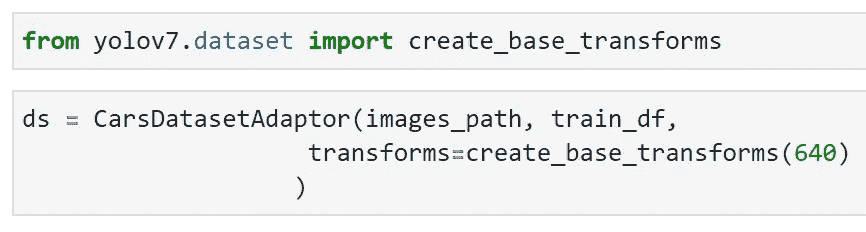

为了应用我们的增强，我们再次使用白蛋白，它支持许多对象检测转换。

虽然数据扩充通常以函数的形式实现，传递给 PyTorch 数据集并在加载图像后立即应用，但由于镶嵌需要从数据集中加载多幅图像，因此这种方法在这里不起作用。我们决定将 mosaic 实现为数据集包装类，以清晰地封装这一逻辑。我们可以导入并使用它，如下所示:

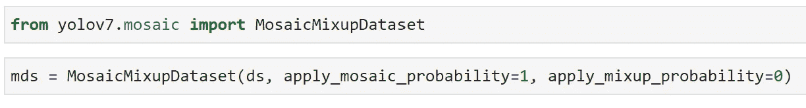

让我们看一些产生的图像类型的例子。由于我们还没有向镶嵌数据集传递任何调整大小的变换，这些图像相当大。

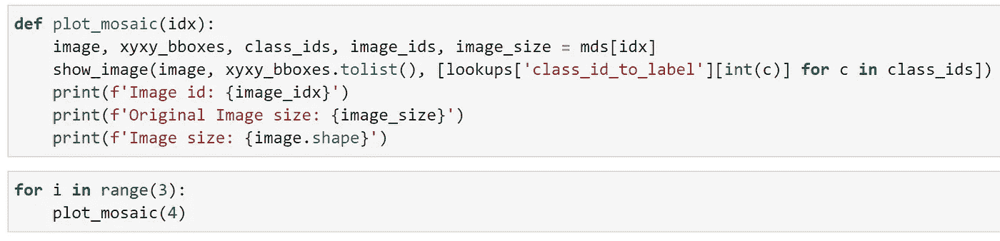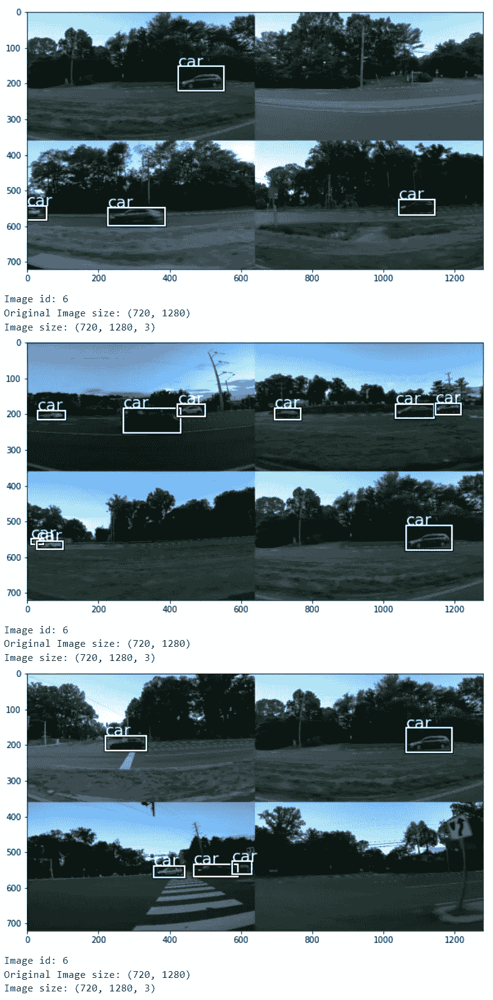

请注意，虽然镶嵌图像看起来非常不同，但它们都被称为具有相同索引的*，因此被应用于相同的图像！创建镶嵌图时，它会从数据集中随机选择另外 3 幅图像，并将它们放置在随机位置，这样每次都会生成不同外观的图像。因此，应用这种增强确实打破了我们对训练时期的概念——数据集中的每幅图像只被看到一次——因为图像可以被看到多次！*

因此，在使用 mosaic 进行训练时，我们的策略是不要过多考虑历元的数量，尽可能长时间地训练模型，直到它停止收敛。毕竟，纪元的概念只有在帮助我们跟踪训练时才真正有用——该模型只能看到连续的图像流！

## 混合增强

镶嵌增强通常与另一种变换一起应用— [混合](https://arxiv.org/abs/1710.09412v2)。为了形象化这是做什么的，让我们暂时禁用马赛克，并启用它自己的混音，我们可以这样做，如下所示:

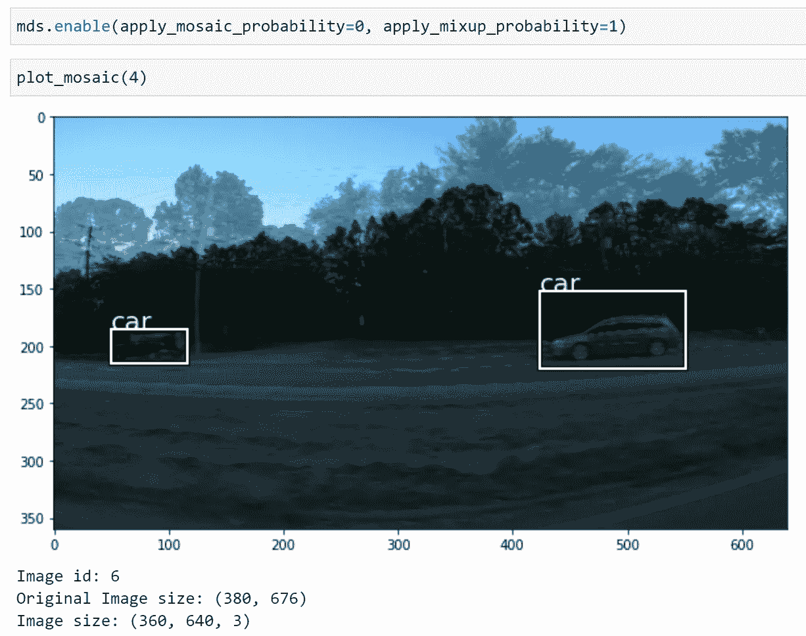

有意思！我们可以看到，它已经结合了两个图像在一起，这导致了一些'幽灵'寻找汽车和背景！现在，让我们启用两种转换并检查我们的输出。

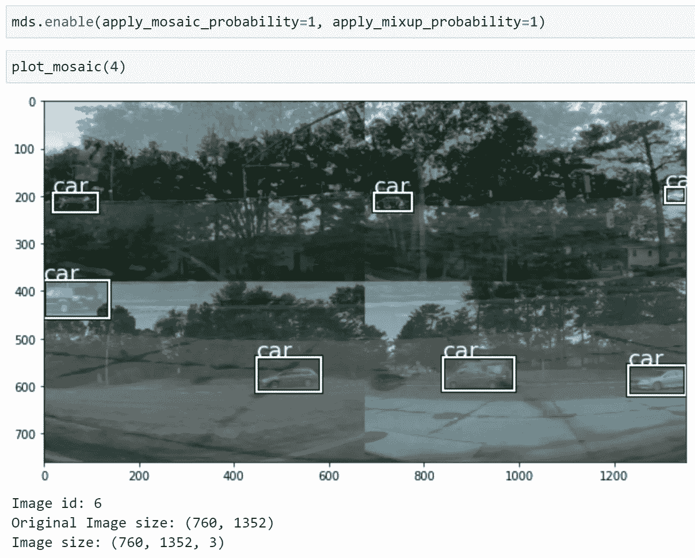

哇！在我们生成的图像中有相当多的汽车要检测，在许多不同的位置——这对模型来说肯定是一个挑战！请注意，当我们一起应用马赛克和 mixup 时，单个图像与马赛克混合在一起。

## 镶嵌后仿射变换

正如我们之前提到的，我们正在创建的镶嵌图比我们将用来训练模型的图像尺寸要大得多，所以我们需要在这里做一些大小调整。最简单的方法是在创建马赛克后简单地应用调整大小变换。

虽然这可以工作，但这可能会导致一些非常小的对象，因为我们实际上是将四个图像的大小调整为一个图像的大小——这可能会成为一个问题，因为域已经包含非常小的边界框了！此外，我们的每个马赛克在结构上非常相似，每个象限都有一个图像。回想一下，我们的目标是使模型对位置变化更加健壮，这实际上可能没有多大帮助；因为模型可能只是从每个象限的中间开始寻找。

为了克服这一点，我们可以采取的一种方法是简单地从我们的马赛克中随机选取一部分。这将仍然提供定位的可变性，同时保持目标对象的大小和纵横比。在这一点上，这也可能是一个很好的机会，加入一些其他的变换，如缩放和旋转，以增加更多的可变性。

所使用的精确变换和大小将在很大程度上取决于您所使用的图像，因此我们建议在训练模型之前，先试验这些设置，以确保所有对象仍然可见和可识别！

我们可以定义应用于镶嵌图像的变换，如下所示。这里，我们选择了一系列仿射变换——在我们目标数据的合理范围内——然后是随机裁剪。在最初的实现之后，我们也比 mosaic 更少地应用 mixup。

```
# https://github.com/Chris-hughes10/Yolov7-training/blob/main/yolov7/mosaic.py

def create_post_mosaic_transform(
        output_height,
        output_width,
        pad_colour=(0, 0, 0),
        rotation_range=(-10, 10),
        shear_range=(-10, 10),
        translation_percent_range=(-0.2, 0.2),
        scale_range=(0.08, 1.0),
        apply_prob=0.8,
):
    return A.Compose(
        [
            A.Affine(
                cval=pad_colour,
                rotate=rotation_range,
                shear=shear_range,
                translate_percent=translation_percent_range,
                scale=None,
                keep_ratio=True,
                p=apply_prob,
            ),
            A.HorizontalFlip(),
            A.RandomResizedCrop(height=output_height, width=output_width, scale=scale_range),
        ],
        bbox_params=A.BboxParams(format="pascal_voc", label_fields=["labels"], min_visibility=0.25),
    )
```

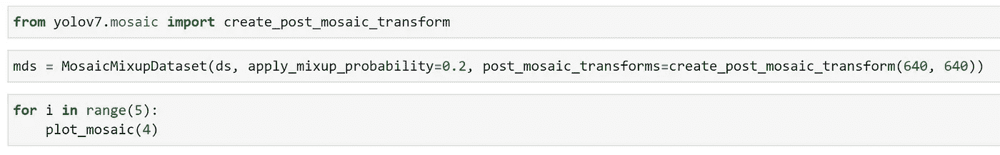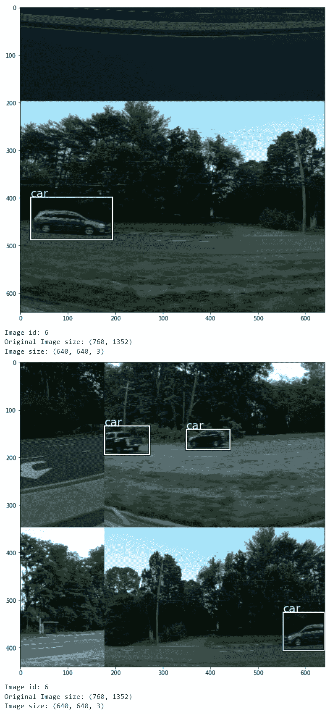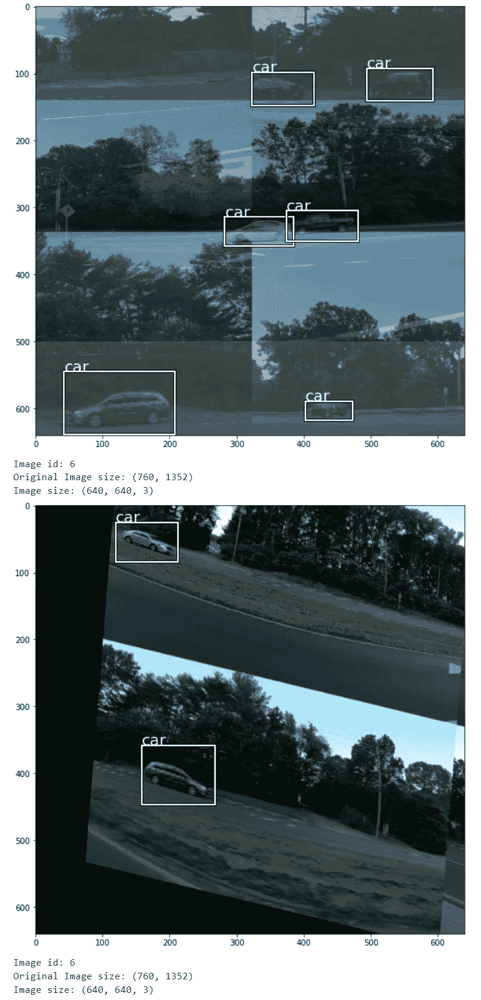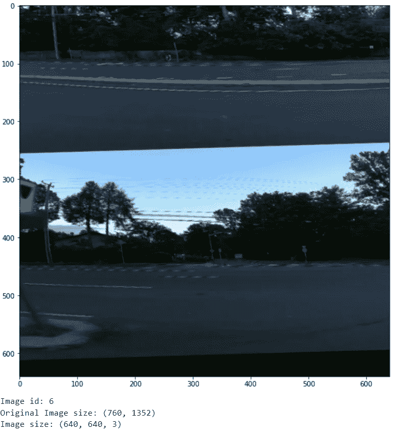

查看这些图像，我们可以看到大量的变化，这些图像现在是用于训练的正确大小。由于我们选择了随机比例，我们还可以看到，并非每个图像看起来都像马赛克，因此这些输出不应与模型在推理过程中看到的图像太不相似。如果使用更极端的增强，例如在训练图像和推断图像之间存在显著差异，则在训练结束前不久禁用这些增强可能是有利的。

在官方实现中，作者在训练期间使用 4 和 9 图像的马赛克。然而，当结合缩放和裁剪来检查这些增强的输出时，在许多情况下，输出看起来非常相似，所以我们选择在这里省略这一点。

## 将权重衰减应用于参数组

在前面的简单示例中，我们创建了优化器，以便它可以优化我们模型的所有参数。然而，如果我们想跟随作者介绍[权重衰减正则化](https://medium.com/analytics-vidhya/deep-learning-basics-weight-decay-3c68eb4344e9)，遵循[的使用卷积神经网络进行图像分类的锦囊妙计](https://arxiv.org/pdf/1812.01187.pdf)中给出的指导，这可能不是最佳的；该论文建议权重衰减应该仅应用于卷积和全连接层。

为了在 PyTorch 中实现这一点，我们需要创建两个不同的参数组来进行优化；一个包含我们的卷积权重，另一个包含剩余的参数。我们可以这样做，如下所示:

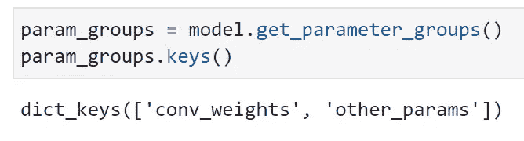

检查方法定义，我们可以看到这是一个简单的过滤操作:

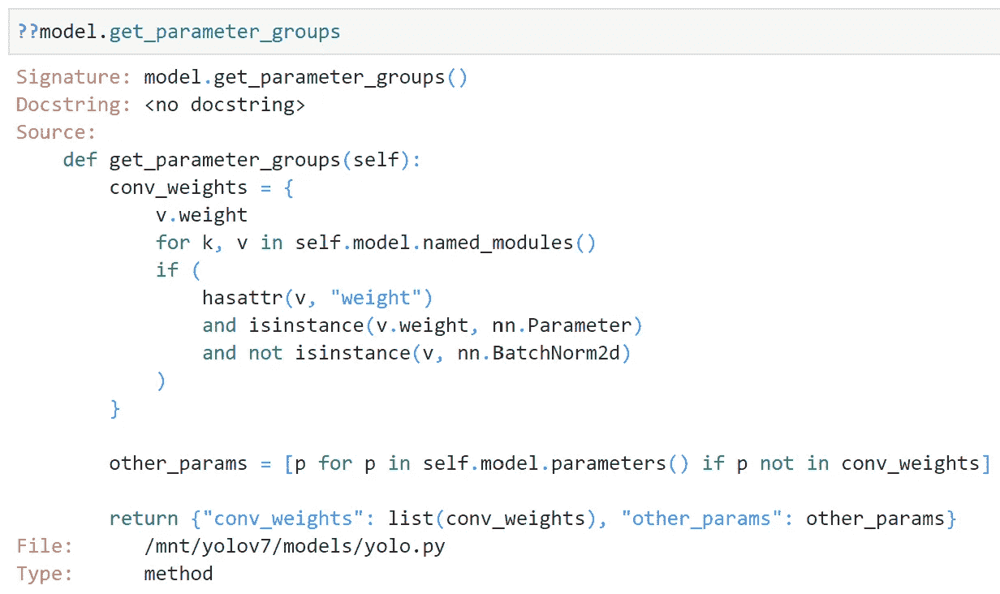

现在我们可以简单地将这些传递给优化器:

```
optimizer = torch.optim.SGD(
        param_groups["other_params"], lr=0.01, momentum=0.937, nesterov=True
    )

optimizer.add_param_group(
        {"params": param_groups["conv_weights"], "weight_decay": weight_decay}
    )
```

## *学习率调度*

当训练神经网络时，我们经常希望在训练期间调整我们的学习率的值；这是使用学习率调度器来完成的。虽然有许多流行的时间表，但作者选择了余弦学习率时间表——在训练开始时进行线性热身。它具有以下形状:

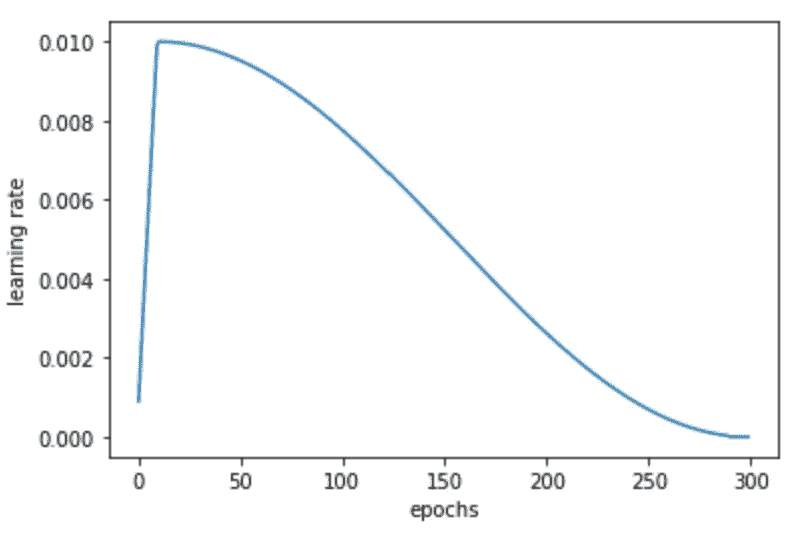

余弦学习率计划(带热身)

在实践中，我们发现一段时间的预热和冷却——学习率保持在最小值——通常是这个调度器的一个好策略。此外，调度程序 PyTorch-accelerated 支持一个 [k-decay 参数](https://arxiv.org/abs/2004.05909)，该参数可用于调整退火的积极程度。

对于这个问题，我们发现使用 k-decay 将学习速率保持在一个更高的值更长的时间效果很好。该时间表以及预热和冷却时间如下所示:

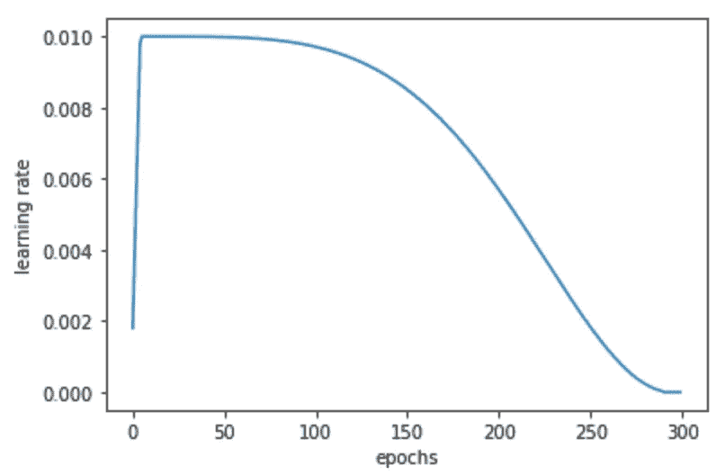

余弦学习率计划(带预热)，设置为 k_decay = 2

## 梯度累积、缩放权重衰减

在训练一个模型的时候，我们使用的批量大小往往是由我们的硬件决定的；因为我们想尽量增加我们可以放在 GPU 上的数据量。但是，必须考虑一些因素:

*   对于非常小的批量，我们无法估计整个数据集的梯度。这可能导致训练不稳定。
*   修改批量大小会导致超参数需要不同的设置，例如学习率和权重衰减。这使得很难找到一组一致的超参数。

为了克服这一点，作者使用了一种称为 [*梯度累积*](/what-is-gradient-accumulation-in-deep-learning-ec034122cfa) 的技术，其中来自多个步骤的梯度被累积以模拟更大的批量。例如，假设我们在 GPU 上可以容纳的最大批量是 8。我们可以保存梯度值，继续下一批并添加这些新梯度，而不是在每批结束时更新模型的参数。在指定数量的步骤之后，我们执行更新；如果我们将步骤数设置为 4，这大致相当于使用 32 的批量大小！

在 PyTorch 中，这可以手动执行，如下所示:

```
num_accumulation_steps = 4  

# loop through ennumerated batches
for step, (inputs, labels) in enumerate(data_loader):

        model_outputs = model(inputs)
        loss  = loss_fn(model_outputs, labels)

        # normalize loss to account for batch accumulation
        loss = loss / num_accumulation_steps 

        # calculate gradients, these are summed automatically
        loss.backward()

        if ((step + 1) % num_accumulation_steps == 0) or
            (step + 1 == len(data_loader)):
            # perform weight update
            optimizer.step()
            optimizer.zero_grad()
```

在最初的 YOLOv7 实施中，选择梯度累积步骤的数量，使得总批量(在所有过程中)至少为 64；这缓解了前面讨论的两个问题。此外，作者以下列方式根据批次大小调整重量衰减:

```
nominal_batch_size = 64
num_accumulate_steps = max(round(nominal_batch_size / total_batch_size), 1)

base_weight_decay = 0.0005
scaled_weight_decay = (
    base_weight_decay * total_batch_size * num_accumulate_steps / nominal_batch_size
)
```

我们可以将这些关系形象化如下:

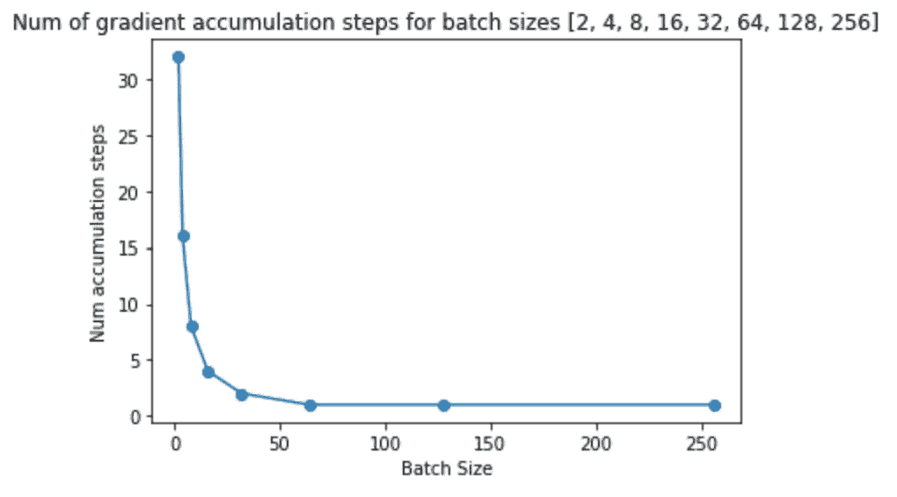

首先查看累积步骤的数量，我们可以看到累积步骤的数量会减少，直到达到我们的名义批量，然后不再需要梯度累积。

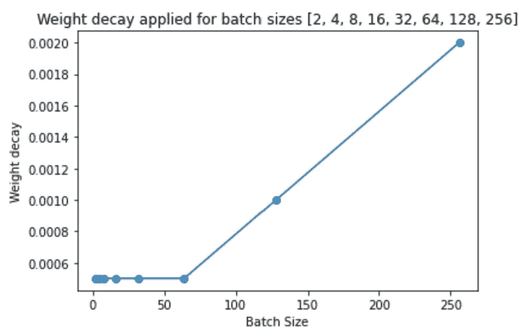

现在来看看所使用的重量衰减量，我们可以看到，在达到标称批量之前，重量衰减量保持在基础值，然后随着批量的增加而线性增加；随着批量变大，应用更多的重量衰减。

## 模型 EMA

在训练模型时，通过对在整个训练运行中观察到的参数进行移动平均来设置模型权重值可能是有益的，这与使用在最后一次增量更新之后获得的参数相反。这通常通过维护模型参数的指数加权平均值(EMA)来实现，在实践中，这通常意味着维护模型的另一个副本来存储这些平均权重。然而，不是在每个更新步骤之后更新该模型的所有参数，而是使用现有参数值和更新值的线性组合来设置这些参数。

这是使用以下公式完成的:

```
updated_EMA_model_weights = decay * EMA_model_weights + (1\. - decay) * updated_model_weights
```

其中*衰减*是我们设定的参数。例如，如果我们设置 decay=0.99，我们有:

```
updated_EMA_model_weights = 0.99 * EMA_model_weights + 0.01 * updated_model_wei.99 * EMA_model_weights + 0.01 * updated_model_weights
```

我们可以看到它保留了 99%的现有状态，只保留了 1%的新状态！

为了理解为什么这可能是有益的，让我们考虑这样的情况，我们的模型在训练的早期阶段，在一批数据上表现得非常差。这可能导致对我们的参数进行大量更新，过度补偿所获得的高损失，这对即将到来的批次是不利的。通过仅并入最新参数的一小部分，大的更新将被“平滑”，并且对模型的权重具有较小的整体影响。有时，这些平均参数有时可以在评估期间产生明显更好的结果，并且这种技术已经在用于流行模型的若干训练方案中使用，例如训练 MNASNet、MobileNet-V3 和 EfficientNet 使用 TensorFlow 中包含的实现。

YOLOv7 作者采用的 EMA 方法与其他实现略有不同，因为它不使用固定的衰减，而是根据更新次数来改变衰减量。我们可以扩展 PyTorch-accelerated 中包含的 [ModelEMA 类来实现如下定义的行为:](https://pytorch-accelerated.readthedocs.io/en/latest/utils.html)

```
# https://github.com/Chris-hughes10/Yolov7-training/blob/main/yolov7/utils.py

from pytorch-accelerated.utils import ModelEma

class Yolov7ModelEma(ModelEma):
    def __init__(self, model, decay=0.9999):
        super().__init__(model, decay)
        self.num_updates = 0
        self.decay_fn = lambda x: decay * (
            1 - math.exp(-x / 2000)
        )  # decay exponential ramp (to help early epochs)
        self.decay = self.decay_fn(self.num_updates)

    def update(self, model):
        super().update(model)
        self.num_updates += 1
        self.decay = self.decay_fn(self.num_updates)
```

在这里，我们可以看到衰减是通过在每次更新后调用一个函数来设置的。让我们想象一下这是什么样子:

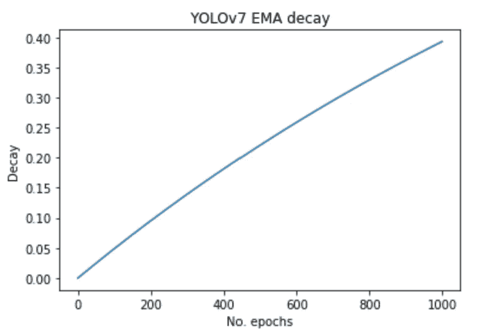

由此可以看出，衰减量随着更新次数的增加而增加，即每个历元一次。

回想上面的公式，这意味着，最初，我们倾向于使用更新的模型权重，而不是历史平均值。然而，随着训练的进行，我们开始加入更多以前时期的平均体重。这与这种技术的通常用法有很大的不同，这种技术的设计是为了帮助 EMA 模型在更早的时期更快地收敛。

## 选择合适的锚箱尺寸

回想一下之前关于锚框的讨论，以及这些如何在 YOLOv7 如何检测对象方面发挥重要作用，让我们看看如何评估我们选择的锚框是否适合我们的问题，如果不适合，为我们的数据集找到一些明智的选择。

这里的方法很大程度上是从 YOLOv5 中使用的自身抗体方法改编而来的，YOLOv7 中也使用了这种方法。

**评估当前锚盒**

最简单的方法是简单地使用与 COCO 相同的锚盒，这些锚盒已经与定义的架构捆绑在一起。

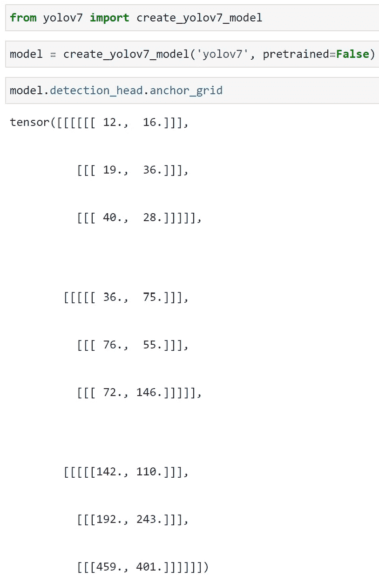

这里我们可以看到，我们有 3 个组，每个组对应于特征金字塔网络的每一层。这些数字对应于我们的锚大小，锚框的宽度和高度将被生成。

回想一下，特征金字塔网络(FPN)有三个输出，每个输出的作用是根据对象的比例来检测对象。

例如:

*   P3 8 号用于探测较小的物体。
*   P4/16 用于探测中等物体。
*   P5/32 用于探测更大的物体。

考虑到这一点，我们需要为每一层设置相应的锚点大小。

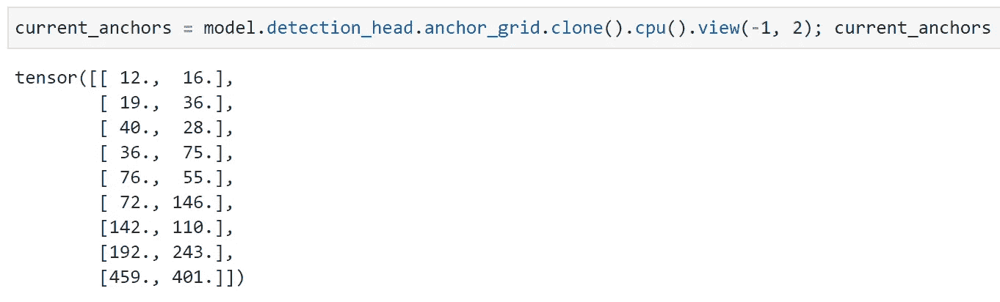

为了评估我们当前的锚盒，我们可以计算最好的可能召回，如果模型能够成功地将适当的锚盒与基础事实相匹配，这将会发生。

**查找和调整地面真实边界框**

为了评估锚盒，我们首先需要了解数据集中对象的形状和大小。然而，在我们可以评估之前，我们需要根据我们将在其上训练的图像的大小来调整我们的地面真相框的宽度和高度——对于该架构，这被推荐为 640。

让我们从找出训练集中所有地面真值框的宽度和高度开始。我们可以如下所示计算这些值:

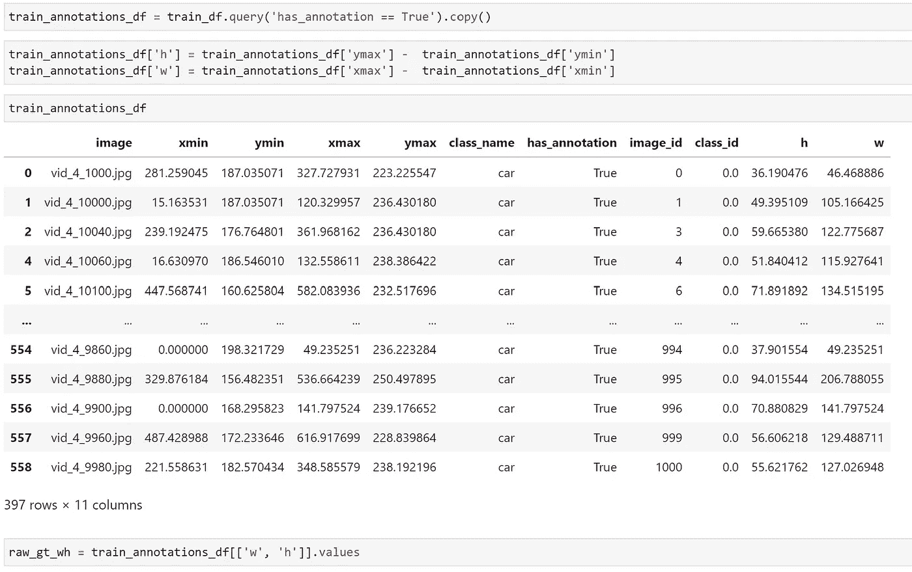

接下来，我们需要图像的高度和宽度。有时候，我们提前掌握了这些信息，在这种情况下，我们可以直接使用这些知识。否则，我们可以这样做:

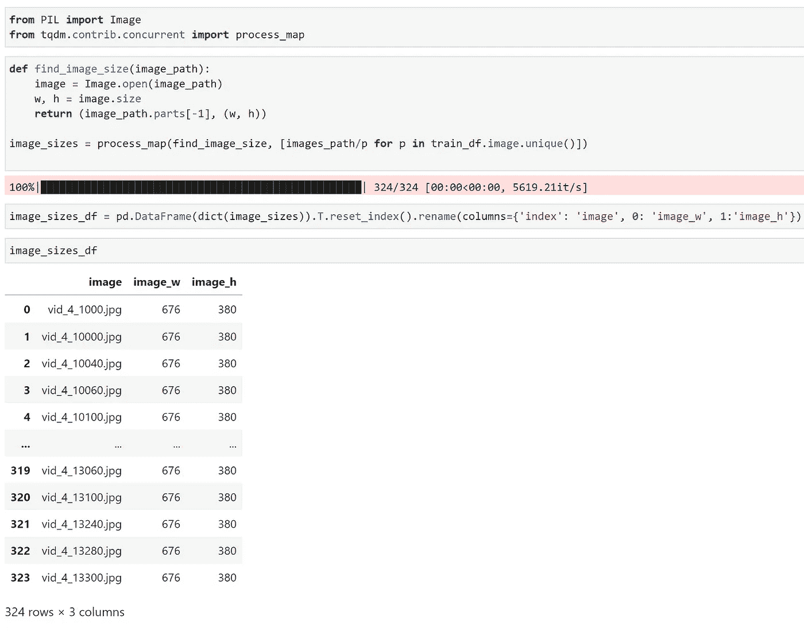

我们现在可以将其与现有的数据框架合并:

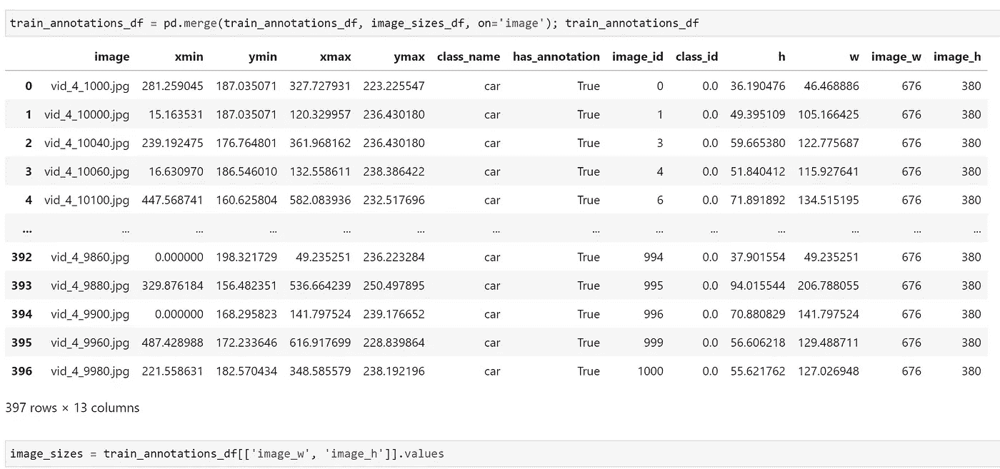

现在，我们可以使用这些信息来获得地面实况目标相对于目标图像大小的调整后的宽度和高度。为了保持图像中对象的纵横比，调整大小的推荐方法是缩放图像，使最长的尺寸等于我们的目标尺寸。我们可以使用下面的函数做到这一点:

```
 # https://github.com/Chris-hughes10/Yolov7-training/blob/main/yolov7/anchors.py

def calculate_resized_gt_wh(gt_wh, image_sizes, target_image_size=640):
    """
    Given an array of bounding box  widths and heights, and their corresponding image sizes,
    resize these relative to the specified target image size.

    This function assumes that resizing will be performed by scaling the image such that the longest
    side is equal to the given target image size.

    :param gt_wh: an array of shape [N, 2] containing the raw width and height of each box.
    :param image_sizes: an array of shape [N, 2] or [1, 2] containing the width and height of the image corresponding to each box.
    :param target_image_size: the size of the images that will be used during training.

    """
    normalized_gt_wh = gt_wh / image_sizes
    target_image_sizes = (
        target_image_size * image_sizes / image_sizes.max(1, keepdims=True)
    )

    resized_gt_wh = target_image_sizes * normalized_gt_wh

    tiny_boxes_exist = (resized_gt_wh < 3).any(1).sum()
    if tiny_boxes_exist:
        print(
            f"""WARNING: Extremely small objects found.
            {tiny_boxes_exist} of {len(resized_gt_wh)} labels are < 3 pixels in size. These will be removed
            """
        )
        resized_gt_wh = resized_gt_wh[(resized_gt_wh >= 2.0).any(1)]

    return resized_gt_wh
```

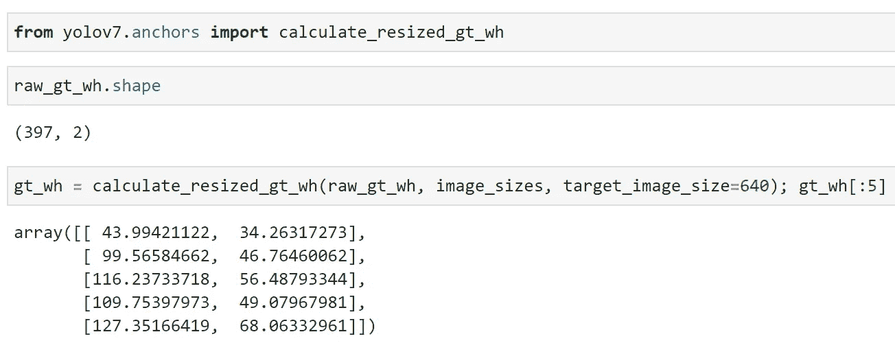

或者，在这种情况下，由于我们所有的图像都是相同的大小，我们可以简单地指定一个图像大小。

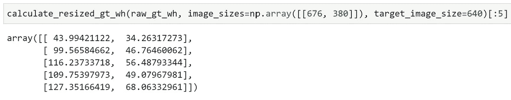

请注意，我们还过滤掉了相对于新图像尺寸而言非常小(高度或宽度都小于 3 个像素)的任何框，因为这些框通常太小而没有用！

**计算最佳可能回忆**

既然我们在训练集中有了所有地面真实框的宽度和高度，我们可以如下评估我们当前的锚框:

```
# https://github.com/Chris-hughes10/Yolov7-training/blob/main/yolov7/anchors.py

def calculate_best_possible_recall(anchors, gt_wh):
    """
    Given a tensor of anchors and and an array of widths and heights for each bounding box in the dataset,
    calculate the best possible recall that can be obtained if every box was matched to an appropriate anchor.

    :param anchors: a tensor of shape [N, 2] representing the width and height of each anchor
    :param gt_wh: a tensor of shape [N, 2] representing the width and height of each ground truth bounding box

    """
    best_anchor_ratio = calculate_best_anchor_ratio(anchors=anchors, wh=gt_wh)
    best_possible_recall = (
        (best_anchor_ratio > 1.0 / LOSS_ANCHOR_MULTIPLE_THRESHOLD).float().mean()
    )

    return best_possible_recall
```

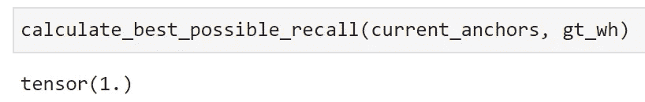

由此，我们可以看到，当前的锚盒很适合这个数据集；这很有道理，因为这些图像与《可可》中的图像非常相似。

*这是怎么回事？*

在这一点上，你可能想知道，我们到底是如何计算最佳可能的回忆。要回答这个问题，让我们手动完成这个过程。

直觉上，我们希望确保至少有一个锚可以匹配到每个地面真相框。虽然我们可以通过将它框架化为一个优化问题来做到这一点——我们如何将每个地面真相框与其最佳锚匹配——但这将为我们试图做的事情带来很多复杂性。

给定一个锚定盒，我们需要一种更简单的方法来衡量它能在多大程度上适合地面真相盒。让我们研究一种可以做到这一点的方法，从单个地面真相框的宽度和高度开始。

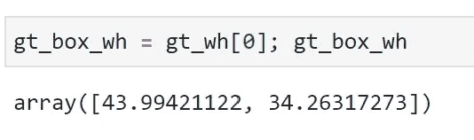

对于每个锚盒，我们可以检查其高度和宽度与地面真实目标的高度和宽度的比率，并使用它来了解最大的差异在哪里。

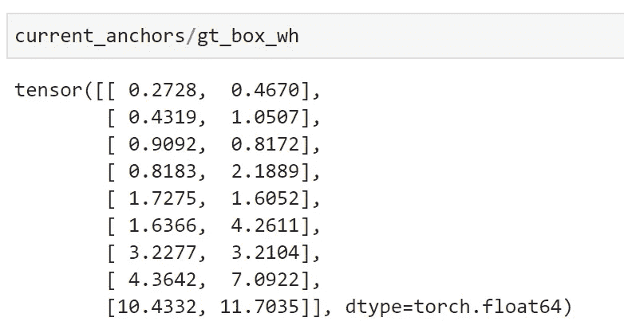

因为这些比率的比例将取决于锚盒的边是大于还是小于我们的地面真值盒的边，所以我们可以通过计算倒数并取每个锚的最小比率来确保我们的幅度在范围[0，1]内。

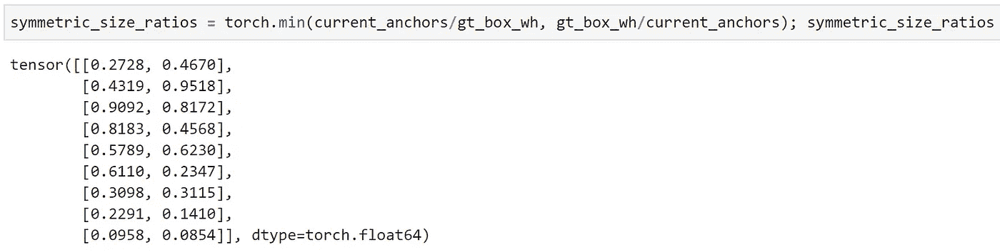

由此，我们现在有了一个指示，即每个锚盒的宽度和高度独立地“适合”我们的地面真实目标的程度。

现在，我们的挑战是如何评估宽度和高度的匹配度！

一种方法是，对每个锚取最小比率；代表最不符合我们现实的一方。

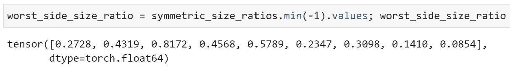

我们之所以在这里选择最不合适的一边，是因为我们知道另一边与我们的目标*至少*以及所选择的一边相匹配；我们可以认为这是最坏的情况！

现在，让我们从这些选项中选择最匹配的锚框，这只是最大的值。

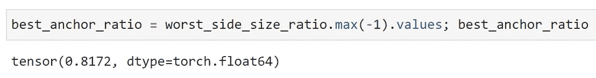

在最差的拟合选项中，这是我们选择的匹配！

回想一下，损失函数只匹配比地面真实目标的大小大或小 4 倍的锚框，我们现在可以验证这个锚是否在这个范围内，并且将被认为是成功的匹配。

我们可以如下所示，取损失倍数的倒数，以确保它与我们的价值在同一范围内:

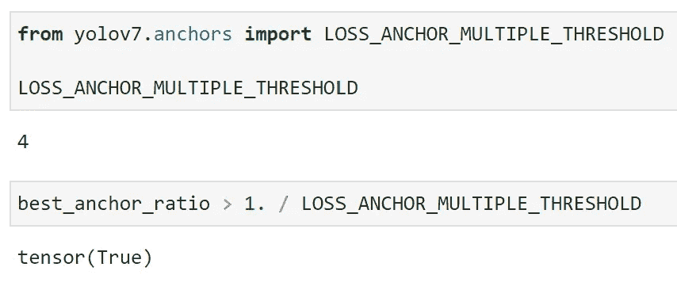

由此，我们可以看到，至少我们的一个锚可以成功地匹配到我们选择的地面真实目标！

既然我们理解了步骤的顺序，我们现在可以将相同的逻辑应用于我们所有的基础事实框，以查看我们可以用当前的锚集获得多少匹配:

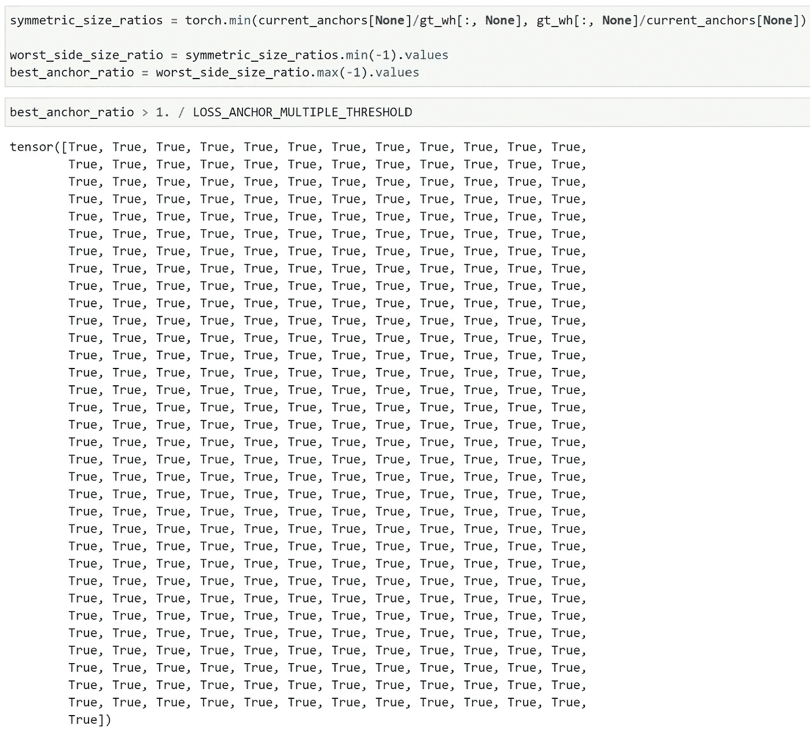

现在我们已经计算了，对于每个地面真值盒，它是否有一个匹配。我们可以取平均匹配数来找出最佳可能回忆；在我们的例子中，这是 1，正如我们前面看到的！

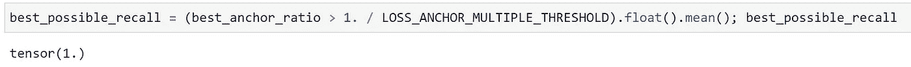

**选择新的锚箱**

虽然使用预定义锚可能是类似数据集的好选择，但这可能并不适用于所有数据集，例如，包含大量小对象的数据集。在这些情况下，更好的方法可能是选择全新的锚。

让我们探索一下如何做到这一点！

首先，让我们定义我们的架构需要的锚点数量。

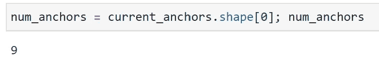

现在，基于我们的边界框，我们需要定义一个合理的锚模板的宽度和高度。我们可以估计这一点的一种方法是通过使用 [K-means](https://en.wikipedia.org/wiki/K-means_clustering) 来根据我们需要的锚大小的数量来聚集我们的地面真实纵横比。然后，我们可以使用这些质心作为我们的开始估计。我们可以使用以下函数来实现这一点:

```
# https://github.com/Chris-hughes10/Yolov7-training/blob/main/yolov7/anchors.py

def estimate_anchors(num_anchors, gt_wh):
    """
    Given a target number of anchors and an array of widths and heights for each bounding box in the dataset,
    estimate a set of anchors using the centroids from Kmeans clustering.

    :param num_anchors: the number of anchors to return
    :param gt_wh: an array of shape [N, 2] representing the width and height of each ground truth bounding box

    """
    print(f"Running kmeans for {num_anchors} anchors on {len(gt_wh)} points...")
    std_dev = gt_wh.std(0)
    proposed_anchors, _ = kmeans(
        gt_wh / std_dev, num_anchors, iter=30
    )  # divide by std so they are in approx same range
    proposed_anchors *= std_dev

    return proposed_anchors
```

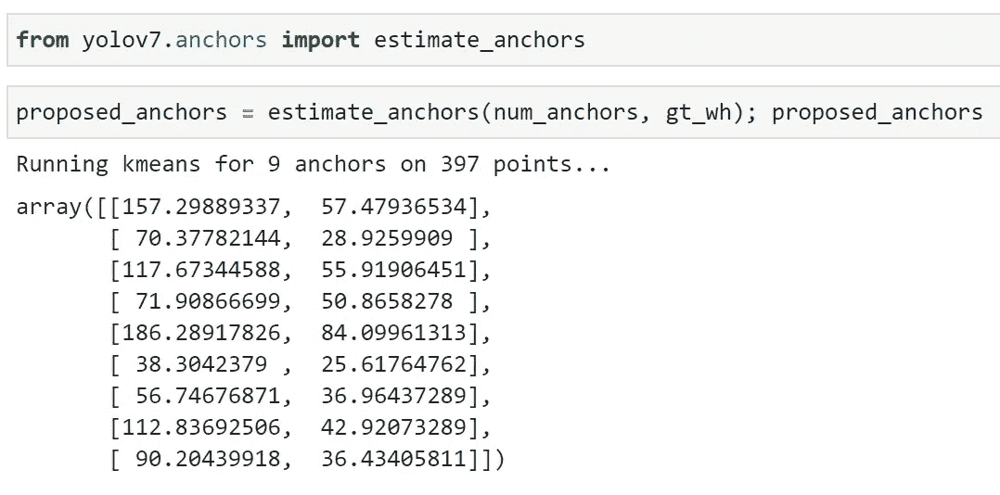

在这里，我们可以看到，我们现在有了一组锚模板，可以用作起点。像以前一样，让我们使用这些锚盒来计算我们的最佳可能回忆:

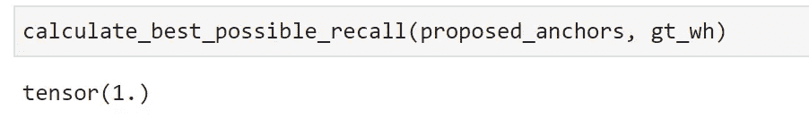

我们再次看到，我们的最佳可能召回率是 1，这意味着这些锚大小也很适合我们的问题！

虽然在这种情况下可能是不必要的，但我们可以使用[遗传算法](https://www.geeksforgeeks.org/genetic-algorithms/)进一步改进这些锚。遵循这种方法，我们可以定义一个*适应度*(或奖励)函数来衡量我们的锚盒与我们的数据匹配的程度，并对我们的锚大小进行小的随机改变，以尝试并最大化该函数。

在这种情况下，我们可以将我们的适应度函数定义如下:

```
def anchor_fitness(anchors, wh):
    """
    A fitness function that can be used to evolve a set of anchors. This function calculates the mean best anchor ratio
    for all matches that are within the multiple range considered during the loss calculation.
    """
    best_anchor_ratio = calculate_best_anchor_ratio(anchors=anchors, gt_wh=wh)
    return (
        best_anchor_ratio
        * (best_anchor_ratio > 1 / LOSS_ANCHOR_MULTIPLE_THRESHOLD).float()
    ).mean()
```

在这里，我们为每场比赛取最佳锚定比，在损失计算时会考虑。如果一个定位框比它匹配的边界框大或小四倍以上，它不会影响我们的分数。让我们用这个来计算我们建议的锚尺寸的适合度分数:

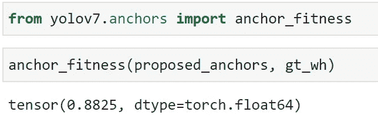

现在，让我们在优化我们的锚时使用这个作为适应度函数，如下所示:

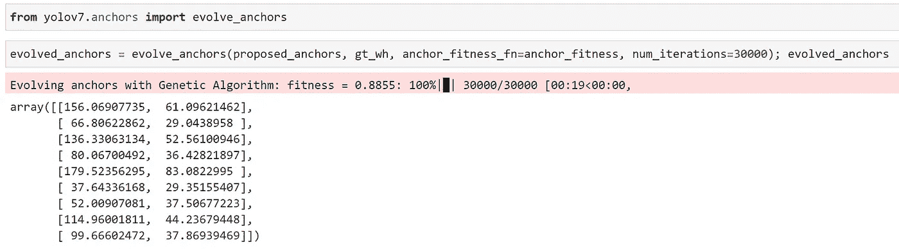

检查这个函数的定义，我们可以看到，对于指定的迭代次数，我们只是从正态分布中采样随机噪声，并使用它来改变我们的锚大小。如果这一变化导致分数增加，我们将这些作为我们的锚尺寸！

```
# https://github.com/Chris-hughes10/Yolov7-training/blob/main/yolov7/anchors.py

def evolve_anchors(
    proposed_anchors,
    gt_wh,
    num_iterations=1000,
    mutation_probability=0.9,
    mutation_noise_mean=1,
    mutation_noise_std=0.1,
    anchor_fitness_fn=anchor_fitness,
    verbose=False,
):
    """
    Use a genetic algorithm to mutate the given anchors to try and optimise them based on the given widths and heights of the
    ground truth boxes based on the provided fitness function. Anchor dimensions are mutated by adding random noise sampled
    from a normal distribution with the mean and standard deviation provided.

    :param proposed_anchors: a tensor containing the aspect ratios of the anchor boxes to evolve
    :param gt_wh: a tensor of shape [N, 2] representing the width and height of each ground truth bounding box
    :param num_generations: the number of iterations for which to run the algorithm
    :param mutation_probability: the probability that each anchor dimension is mutated during each iteration
    :param mutation_noise_mean: the mean of the normal distribution from which the mutation noise will be sampled
    :param mutation_noise_std: the standard deviation of the normal distribution from which the mutation noise will be sampled
    :param anchor_fitness_fn: the reward function that will be used during the optimization process. This should accept proposed_anchors and gt_wh as arguments
    :param verbose: if True, the value of the fitness function will be printed at the end of each iteration

    """
    best_fitness = anchor_fitness_fn(proposed_anchors, gt_wh)
    anchor_shape = proposed_anchors.shape

    pbar = tqdm(range(num_iterations), desc=f"Evolving anchors with Genetic Algorithm:")
    for i, _ in enumerate(pbar):
        # Define mutation by sampling noise from a normal distribution 
        anchor_mutation = np.ones(anchor_shape)
        anchor_mutation = (
            (np.random.random(anchor_shape) < mutation_probability)
            * np.random.randn(*anchor_shape)
            * mutation_noise_std
            + mutation_noise_mean
        ).clip(0.3, 3.0)

        mutated_anchors = (proposed_anchors.copy() * anchor_mutation).clip(min=2.0)
        mutated_anchor_fitness = anchor_fitness_fn(mutated_anchors, gt_wh)

        if mutated_anchor_fitness > best_fitness:
            best_fitness, proposed_anchors = (
                mutated_anchor_fitness,
                mutated_anchors.copy(),
            )
            pbar.desc = (
                f"Evolving anchors with Genetic Algorithm: fitness = {best_fitness:.4f}"
            )
            if verbose:
                print(f"Iteration: {i}, Fitness: {best_fitness}")

    return proposed_anchors
```

让我们看看这是否提高了我们的分数:

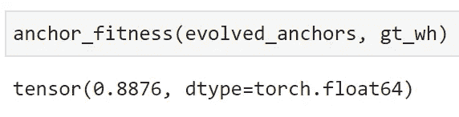

我们可以看到，正如我们所预期的那样，我们进化的锚比我们最初提出的锚具有更好的适应度分数！

现在，剩下要做的就是考虑每个锚的最小维度，按照粗略的升序对锚进行排序。

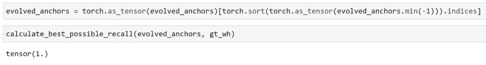

**将所有这些放在一起**

现在我们已经了解了这个过程，我们可以使用下面的函数在一个步骤中为我们的数据集计算锚。

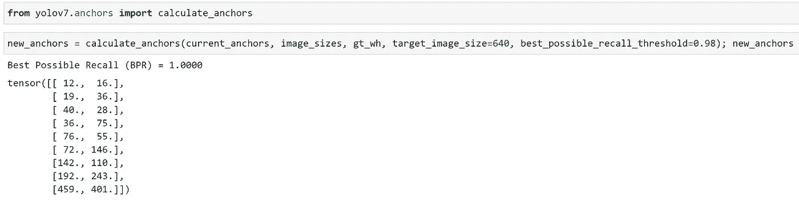

在这种情况下，由于我们的最佳召回率已经大于阈值，所以我们可以保持原始的锚大小！

但是，如果我们的锚点大小发生变化，我们可以按如下所示进行更新:

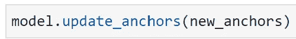

## 跑步训练

现在，我们已经研究了在原始培训配方中使用的一些技术，让我们更新我们的培训脚本，以包括其中的一些功能。更新后的脚本如下所示:

```
# https://github.com/Chris-hughes10/Yolov7-training/blob/main/examples/train_cars.py

import random
from functools import partial
from pathlib import Path

import numpy as np
import pandas as pd
import torch
from func_to_script import script
from PIL import Image
from pytorch_accelerated.callbacks import (
    ModelEmaCallback,
    ProgressBarCallback,
    SaveBestModelCallback,
    get_default_callbacks,
)
from pytorch_accelerated.schedulers import CosineLrScheduler
from torch.utils.data import Dataset

from yolov7 import create_yolov7_model
from yolov7.dataset import (
    Yolov7Dataset,
    create_base_transforms,
    create_yolov7_transforms,
    yolov7_collate_fn,
)
from yolov7.evaluation import CalculateMeanAveragePrecisionCallback
from yolov7.loss_factory import create_yolov7_loss
from yolov7.mosaic import MosaicMixupDataset, create_post_mosaic_transform
from yolov7.trainer import Yolov7Trainer, filter_eval_predictions
from yolov7.utils import SaveBatchesCallback, Yolov7ModelEma

def load_cars_df(annotations_file_path, images_path):
    all_images = sorted(set([p.parts[-1] for p in images_path.iterdir()]))
    image_id_to_image = {i: im for i, im in enumerate(all_images)}
    image_to_image_id = {v: k for k, v, in image_id_to_image.items()}

    annotations_df = pd.read_csv(annotations_file_path)
    annotations_df.loc[:, "class_name"] = "car"
    annotations_df.loc[:, "has_annotation"] = True

    # add 100 empty images to the dataset
    empty_images = sorted(set(all_images) - set(annotations_df.image.unique()))
    non_annotated_df = pd.DataFrame(list(empty_images)[:100], columns=["image"])
    non_annotated_df.loc[:, "has_annotation"] = False
    non_annotated_df.loc[:, "class_name"] = "background"

    df = pd.concat((annotations_df, non_annotated_df))

    class_id_to_label = dict(
        enumerate(df.query("has_annotation == True").class_name.unique())
    )
    class_label_to_id = {v: k for k, v in class_id_to_label.items()}

    df["image_id"] = df.image.map(image_to_image_id)
    df["class_id"] = df.class_name.map(class_label_to_id)

    file_names = tuple(df.image.unique())
    random.seed(42)
    validation_files = set(random.sample(file_names, int(len(df) * 0.2)))
    train_df = df[~df.image.isin(validation_files)]
    valid_df = df[df.image.isin(validation_files)]

    lookups = {
        "image_id_to_image": image_id_to_image,
        "image_to_image_id": image_to_image_id,
        "class_id_to_label": class_id_to_label,
        "class_label_to_id": class_label_to_id,
    }
    return train_df, valid_df, lookups

class CarsDatasetAdaptor(Dataset):
    def __init__(
        self,
        images_dir_path,
        annotations_dataframe,
        transforms=None,
    ):
        self.images_dir_path = Path(images_dir_path)
        self.annotations_df = annotations_dataframe
        self.transforms = transforms

        self.image_idx_to_image_id = {
            idx: image_id
            for idx, image_id in enumerate(self.annotations_df.image_id.unique())
        }
        self.image_id_to_image_idx = {
            v: k for k, v, in self.image_idx_to_image_id.items()
        }

    def __len__(self) -> int:
        return len(self.image_idx_to_image_id)

    def __getitem__(self, index):
        image_id = self.image_idx_to_image_id[index]
        image_info = self.annotations_df[self.annotations_df.image_id == image_id]
        file_name = image_info.image.values[0]
        assert image_id == image_info.image_id.values[0]

        image = Image.open(self.images_dir_path / file_name).convert("RGB")
        image = np.array(image)

        image_hw = image.shape[:2]

        if image_info.has_annotation.any():
            xyxy_bboxes = image_info[["xmin", "ymin", "xmax", "ymax"]].values
            class_ids = image_info["class_id"].values
        else:
            xyxy_bboxes = np.array([])
            class_ids = np.array([])

        if self.transforms is not None:
            transformed = self.transforms(
                image=image, bboxes=xyxy_bboxes, labels=class_ids
            )
            image = transformed["image"]
            xyxy_bboxes = np.array(transformed["bboxes"])
            class_ids = np.array(transformed["labels"])

        return image, xyxy_bboxes, class_ids, image_id, image_hw

DATA_PATH = Path("/".join(Path(__file__).absolute().parts[:-2])) / "data/cars"

@script
def main(
    data_path: str = DATA_PATH,
    image_size: int = 640,
    pretrained: bool = False,
    num_epochs: int = 300,
    batch_size: int = 8,
):

    # load data
    data_path = Path(data_path)
    images_path = data_path / "training_images"
    annotations_file_path = data_path / "annotations.csv"
    train_df, valid_df, lookups = load_cars_df(annotations_file_path, images_path)
    num_classes = 1

    # create datasets
    train_ds = DatasetAdaptor(
        images_path, train_df, transforms=create_base_transforms(image_size)
    )
    eval_ds = DatasetAdaptor(images_path, valid_df)

    mds = MosaicMixupDataset(
        train_ds,
        apply_mixup_probability=0.15,
        post_mosaic_transforms=create_post_mosaic_transform(
            output_height=image_size, output_width=image_size
        ),
    )
    if pretrained:
        # disable mosaic if finetuning
        mds.disable()

    train_yds = Yolov7Dataset(
        mds,
        create_yolov7_transforms(training=True, image_size=(image_size, image_size)),
    )
    eval_yds = Yolov7Dataset(
        eval_ds,
        create_yolov7_transforms(training=False, image_size=(image_size, image_size)),
    )

    # create model, loss function and optimizer
    model = create_yolov7_model(
        architecture="yolov7", num_classes=num_classes, pretrained=pretrained
    )
    param_groups = model.get_parameter_groups()

    loss_func = create_yolov7_loss(model, image_size=image_size)

    optimizer = torch.optim.SGD(
        param_groups["other_params"], lr=0.01, momentum=0.937, nesterov=True
    )

    # create evaluation callback and trainer
    calculate_map_callback = (
        CalculateMeanAveragePrecisionCallback.create_from_targets_df(
            targets_df=valid_df.query("has_annotation == True")[
                ["image_id", "xmin", "ymin", "xmax", "ymax", "class_id"]
            ],
            image_ids=set(valid_df.image_id.unique()),
            iou_threshold=0.2,
        )
    )

    trainer = Yolov7Trainer(
        model=model,
        optimizer=optimizer,
        loss_func=loss_func,
        filter_eval_predictions_fn=partial(
            filter_eval_predictions, confidence_threshold=0.01, nms_threshold=0.3
        ),
        callbacks=[
            calculate_map_callback,
            ModelEmaCallback(
                decay=0.9999,
                model_ema=Yolov7ModelEma,
                callbacks=[ProgressBarCallback, calculate_map_callback],
            ),
            SaveBestModelCallback(watch_metric="map", greater_is_better=True),
            SaveBatchesCallback("./batches", num_images_per_batch=3),
            *get_default_callbacks(progress_bar=True),
        ],
    )

    # calculate scaled weight decay and gradient accumulation steps
    total_batch_size = (
        batch_size * trainer._accelerator.num_processes
    )  # batch size across all processes

    nominal_batch_size = 64
    num_accumulate_steps = max(round(nominal_batch_size / total_batch_size), 1)
    base_weight_decay = 0.0005
    scaled_weight_decay = (
        base_weight_decay * total_batch_size * num_accumulate_steps / nominal_batch_size
    )

    optimizer.add_param_group(
        {"params": param_groups["conv_weights"], "weight_decay": scaled_weight_decay}
    )

    # run training
    trainer.train(
        num_epochs=num_epochs,
        train_dataset=train_yds,
        eval_dataset=eval_yds,
        per_device_batch_size=batch_size,
        create_scheduler_fn=CosineLrScheduler.create_scheduler_fn(
            num_warmup_epochs=5,
            num_cooldown_epochs=5,
            k_decay=2,
        ),
        collate_fn=yolov7_collate_fn,
        gradient_accumulation_steps=num_accumulate_steps,
    )

if __name__ == "__main__":
    main()
```

再次启动训练，[如本文所述](https://pytorch-accelerated.readthedocs.io/en/latest/quickstart.html)，使用单个 V100 GPU 并启用 fp16，在 300 个时期后，我们获得了模型和 EMA 模型的`0.997`图；比我们的迁移学习运行略有增加，并且可能是在这个数据集上可以实现的最高性能！

# 结论

希望这已经提供了 YOLOv7 培训过程中一些最有趣的想法的全面概述，以及如何在定制培训脚本中应用这些想法。

*复制这篇文章所需的所有代码都可以作为笔记本* [*在这里*](https://github.com/Chris-hughes10/Yolov7-training/blob/main/blog%20post/Yolo7%20blog%20post.ipynb) *。虽然在整篇文章中使用了代码片段，但这主要是出于美观的目的，请遵从笔记本，而*[](https://github.com/Chris-hughes10/Yolov7-training)**为工作代码。**

*[*克里斯·休斯*](https://www.linkedin.com/in/chris-hughes1/) *和*[T21【伯纳特】普伊格阵营](https://www.linkedin.com/in/bepuca/) *都在领英**

# *使用的数据集*

*这里，我们使用了来自 Kaggle 的[汽车物体检测数据集，该数据集作为](https://www.kaggle.com/datasets/sshikamaru/car-object-detection)[竞赛六(tjmachinelearning.com)](https://tjmachinelearning.com/2020/comp_six)的一部分公开提供。该数据集[经常用于](https://www.kaggle.com/datasets/sshikamaru/car-object-detection/code)学习目的。*

*虽然这个数据集没有明确的许可，但是我们从作者那里得到了明确的许可，可以将它作为本文的一部分使用。除非另有说明，本文中使用的所有图像都来自该数据集。*

# *参考*

*   *[【2207.02696】yolov 7:可训练的赠品袋为实时物体探测器树立了新的艺术水平(arxiv.org)](https://arxiv.org/abs/2207.02696)*
*   *[回应关于 yolov 5(roboflow.com)的争议](https://blog.roboflow.com/yolov4-versus-yolov5/)*
*   *[【2011.08036】Scaled-yolov 4:缩放跨级局部网络(arxiv.org)](https://arxiv.org/abs/2011.08036)*
*   *[WongKinYiu/yolor:论文的实现——你只学习一种表示法:多任务统一网络(https://arxiv.org/abs/2105.04206)(github.com)](https://github.com/WongKinYiu/yolor)*
*   *[ultralytics/yolov5: YOLOv5🚀在 py torch>ONNX>CoreML>TF lite(github.com)](https://github.com/ultralytics/yolov5)*
*   *Chris-Hughes 10/yolov 7-training:yolov 7 模型系列的一个干净的模块化实现，它使用官方的预训练权重，并带有用于训练模型执行定制(非 COCO)任务的实用程序。(github.com)*
*   *【WongKinYiu/yolov7:纸的实现——yolov 7:可训练的免费包为实时物体探测器树立了新的艺术水平(github.com)*
*   *[相册:快速灵活的图像增强](https://albumentations.ai/)*
*   *[非最大抑制解释|论文代码](https://paperswithcode.com/method/non-maximum-suppression)*
*   *[【1612.03144】用于目标检测的特征金字塔网络(arxiv.org)](https://arxiv.org/abs/1612.03144)*
*   *[Jaccard 索引—维基百科](https://en.wikipedia.org/wiki/Jaccard_index)*
*   *[【2103.14259】OTA:目标检测的最佳运输分配(arxiv.org)](https://arxiv.org/abs/2103.14259)*
*   *[【2107.08430】YOLOX:2021 年超越 YOLO 系列(arxiv.org)](https://arxiv.org/abs/2107.08430)*
*   *Chris-Hughes 10/pytorch-accelerated:一个轻量级库，旨在通过提供一个最小但可扩展的训练循环来加速 py torch 模型的训练过程，该训练循环足够灵活，可以处理大多数用例，并且能够利用不同的硬件选项，而无需更改代码。文件:https://pytorch-accelerated.readthedocs.io/en/latest/(github.com)*
*   *[培训师— pytorch 加速 0.1.3 文档](https://pytorch-accelerated.readthedocs.io/en/latest/trainer.html#pytorch_accelerated.trainer.Trainer)*
*   *[评估措施(信息检索)—维基百科](https://en.wikipedia.org/wiki/Evaluation_measures_(information_retrieval)#Mean_average_precision)*
*   *[pycocotools PyPI](https://pypi.org/project/pycocotools/)*
*   *[回调— pytorch 加速的 0.1.3 文档](https://pytorch-accelerated.readthedocs.io/en/latest/callbacks.html#creating-new-callbacks)*
*   *[快速入门— pytorch 加速的 0.1.3 文档](https://pytorch-accelerated.readthedocs.io/en/latest/quickstart.html)*
*   *【arxiv.org *
*   *[深度学习基础——体重衰减|作者:Sophia Yang | Analytics vid hya | Medium](https://medium.com/analytics-vidhya/deep-learning-basics-weight-decay-3c68eb4344e9)*
*   *[【1812.01187】利用卷积神经网络进行图像分类的锦囊妙计(arxiv.org)](https://arxiv.org/abs/1812.01187)*
*   *[什么是深度学习中的梯度积累？|作者拉兹·罗滕博格|走向数据科学](/what-is-gradient-accumulation-in-deep-learning-ec034122cfa)*
*   *[Utils — pytorch 加速的 0.1.3 文档](https://pytorch-accelerated.readthedocs.io/en/latest/utils.html#pytorch_accelerated.utils.ModelEma)*
*   *[遗传算法——GeeksforGeeks](https://www.geeksforgeeks.org/genetic-algorithms/)*