# “你不能预测你的模型的错误”…或者你能吗？

> 原文：<https://towardsdatascience.com/you-cant-predict-the-errors-of-your-model-or-can-you-1a2e4a1f38a0>

## NannyML 已经发布了 DLE，这是一种算法，能够在缺乏基本事实的情况下预测回归模型的平均误差和均方误差

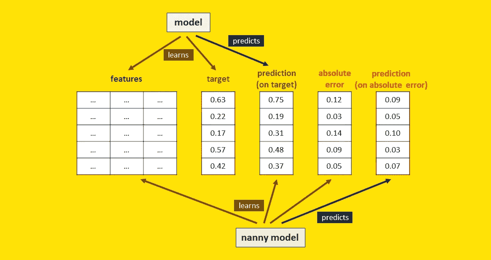

[图片由作者提供]

在 a [之前的文章](/predict-your-models-performance-without-waiting-for-the-control-group-3f5c9363a7da)中，我们已经看到了如何在地面真相可用之前预测你的分类模型的性能。这在现实世界中非常有用，因为它可以为您提供模型在生产中表现如何的早期反馈。

这是由 NannyML 构想的一种算法实现的，称为“[基于信心的性能估计](https://nannyml.readthedocs.io/en/stable/how_it_works/performance_estimation.html#confidence-based-performance-estimation-cbpe)”(CBPE)，它使用模型预测的概率来获得任何分类指标的可靠估计。一个自然的问题是:

> 我们能对回归模型也这样做吗？

根据 NannyML 的说法，是的，我们可以。他们开发了一种称为“[直接损失估计](https://nannyml.readthedocs.io/en/stable/how_it_works/performance_estimation.html#direct-loss-estimation-dle)”(DLE)的方法，允许在无法获得基本事实的情况下，估计任何回归模型的性能(特别是平均绝对误差和均方误差)。

他们声称[在这里](https://nannyml.readthedocs.io/en/stable/how_it_works/performance_estimation.html)作为评估性能的一站式解决方案，DLE 优于其他方法，如贝叶斯方法或整合分位数回归。但是除非我们看到，否则我们不会相信，对吗？因此，在本文中，我们将探索 DLE，在真实数据集上尝试它，看看它是否真的像 NannyML 承诺的那样表现良好。

# 主要思想

DLE 背后的直觉非常简单。简单到好得难以置信。基本上，**的想法是直接预测模型**产生的误差。

我知道你在想什么。你可能会持怀疑态度，因为你听说过:

> "你不能让一个模型预测另一个模型的误差."

但这是真的吗？要回答这个问题，需要从后验分布说起。

# 介绍后验分布

我们习惯于为每个观察返回单个值的模型，也称为“**点预测**”。但是，我们必须记住，在点预测的背后，总是有一个完整的分布。如果你喜欢花哨的统计术语，你可以称之为“**后验分布**”。

后验分布是什么意思？

> 后验分布给出了预测不确定性的完整描述。

让我们借助一个例子来理解它。

假设我们训练了一个模型，根据一个人的国家、性别、年龄、婚姻状况和工作来预测她的收入。现在，假设我们有 10，000 人，他们都具有以下特征:

*   国家:美国。
*   性别:女。
*   年龄:27。
*   婚姻状况:已婚。
*   工作:销售人员。

当然，即使他们有相同的特征，他们也不会有相同的收入。我们可以把他们收入的分布想象成这种特殊特征组合的后验分布。

让我们用 Python 生成一个后验分布:

```
**# generate posterior distribution**import numpy as npposterior_distribution = np.random.lognormal(0, .25, 10000) * 50000
```

这是分布的直方图:

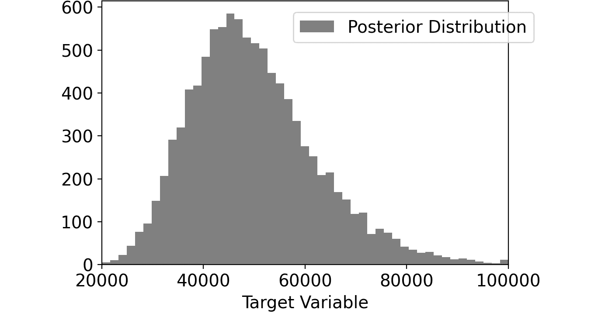

个人收入的后验分布。[图片由作者提供]

知道后验分布最酷的一点是，我们可以计算任何我们想要的东西:百分位数、平均值、中位数……任何东西。

然而，大多数预测模型被设计成获得点预测。的确，**当给定上面的 10，000 个人时，你的模型将预测他们每个人的收入是相同的**。正如您所猜测的，模型通常被设计用来预测后验分布的平均值。

```
np.mean(posterior_distribution)
```

在我们的例子中，这是 50，000 美元。这是模型的预测。

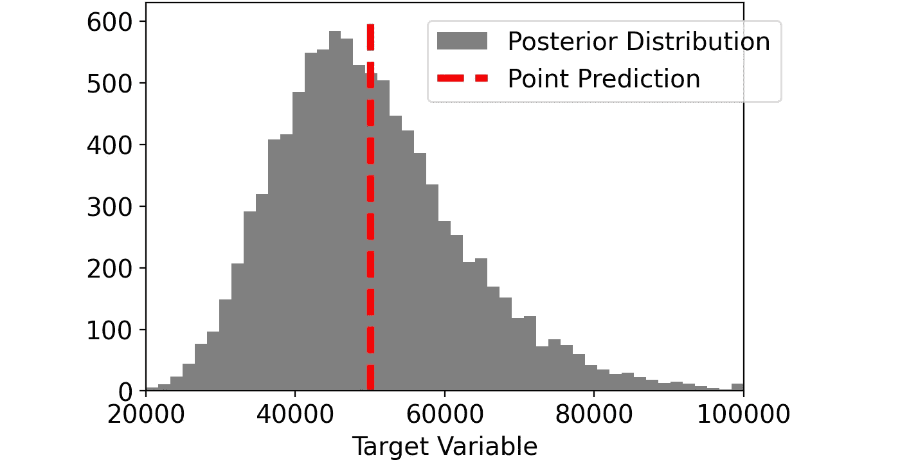

点预测对应于后验分布的平均值。[图片由作者提供]

# 为什么预测误差没有意义…

对于我们每一个个体，误差是由点预测和真实值之间的差给出的。例如，如果一个人的收入是 65，000 美元，模型产生的误差是-15，000 美元。

```
error_distribution = point_prediction - posterior_distribution
```

如果你取平均误差:

```
mean_error = np.mean(error_distribution)
```

根据定义，这当然是零。

平均误差为零的事实很有意义。这意味着，平均而言，我们的模型做出了正确的预测，因为正误差抵消了负误差。

在这一点上，很容易理解为什么**预测误差没有意义。因为这意味着试图预测定义为空的东西**。 *******

但是我们不是说过 DLE 正是建立在预测误差的基础上吗？那么，有什么条件呢？

> ******* 我们假设模型预测的是后验分布的均值。情况并非总是如此。例如，如果您使用不同于 MSE 的损失函数，您的误差可能不会以 0 为中心。然而，在这种情况下，预测带符号的误差仍然是没有意义的:这就像“纠正”您在一开始选择的损失函数一样。

# …但是预测绝对误差很有意义。

重点是 **DLE 不预测符号误差，而是预测绝对误差**！

这似乎是一个很小的区别，但实际上，这是一个完全不同的故事。事实上，与带符号的错误相反:

> 绝对误差是我们的点预测的不确定性的度量。

有了后验分布，我们可以计算绝对误差:

```
absolute_error_distribution = np.abs(point_prediction - posterior_distribution)
```

如果我们取平均值，我们得到平均绝对误差:

```
mean_absolute_error = np.mean(absolute_error_distribution)
```

对于我们模拟的分布，平均绝对误差约为 10，000 美元。这意味着，平均而言，实际收益与我们的模型给出的点预测相差 10，000 美元。

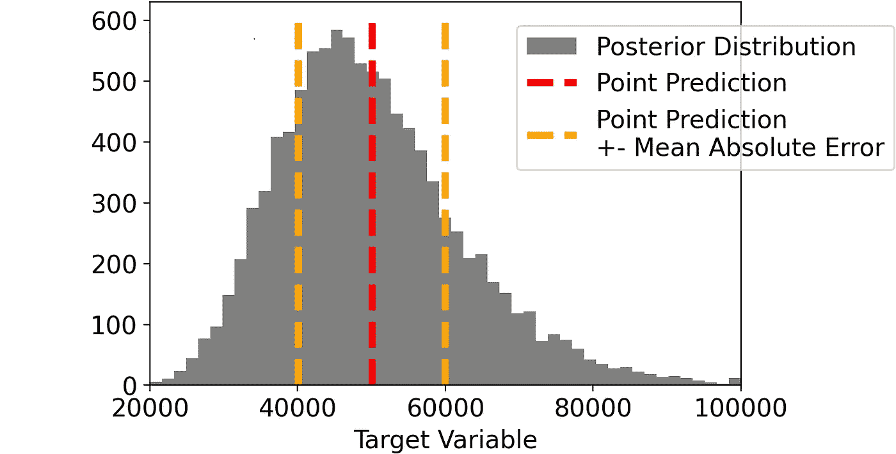

点预测和平均绝对误差。[图片由作者提供]

总而言之:

*   试图预测有符号的错误是没有意义的，因为我们试图纠正一个我们认为是最好的模型。
*   试图预测绝对(平方)误差很有意义，因为我们试图量化与预测相关的不确定性。

请注意，我们的模型的最终性能直接与不确定性相关联。很直观。**不确定性越多，表现越差。不确定性越少，性能越好**。

# 描述 DLE 算法

在实践中，DLE 训练了一个新模型，该模型学习与原始模型的预测相关的不确定性。事实上:

*   原始模型进行点预测(一如既往)。
*   DLE 引入的模型预测主模型产生的绝对(或平方)误差。NannyML 称之为“保姆模型”(原因很明显)。

我们可以将整个过程总结为 4 个步骤。

像往常一样，一切都从在训练数据集上训练模型开始。

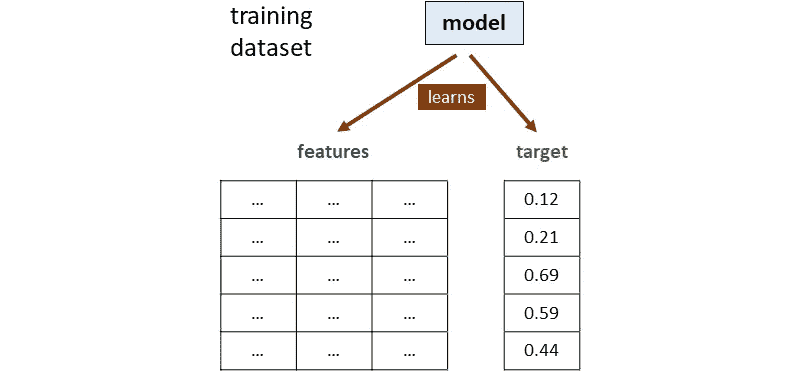

第一步。该模型在训练数据集上学习。[图片由作者提供]

然后，该模型用于对测试数据集进行预测。一旦我们有了预测，我们也可以计算绝对误差，作为目标和预测之间的绝对差:

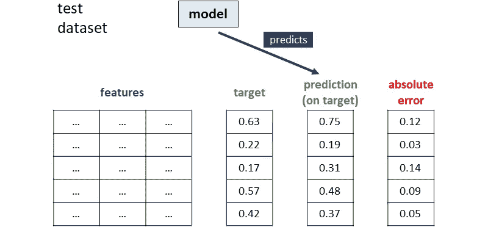

第二步。该模型对测试数据进行预测，并计算绝对误差。[图片由作者提供]

此时，第二个模型——称为保姆模型——使用原始特征和第一个模型做出的预测来学习关于绝对误差的模式。

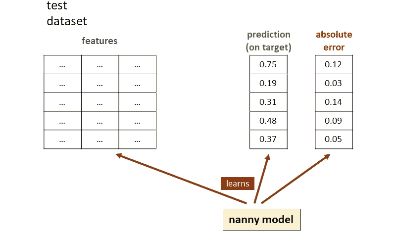

第三步。该模型学习预测测试数据的绝对误差。[图片由作者提供]

最后，当在生产中使用模型进行预测*、*时，我们可以使用第一个模型来预测目标变量，使用保姆模型来预测绝对误差。

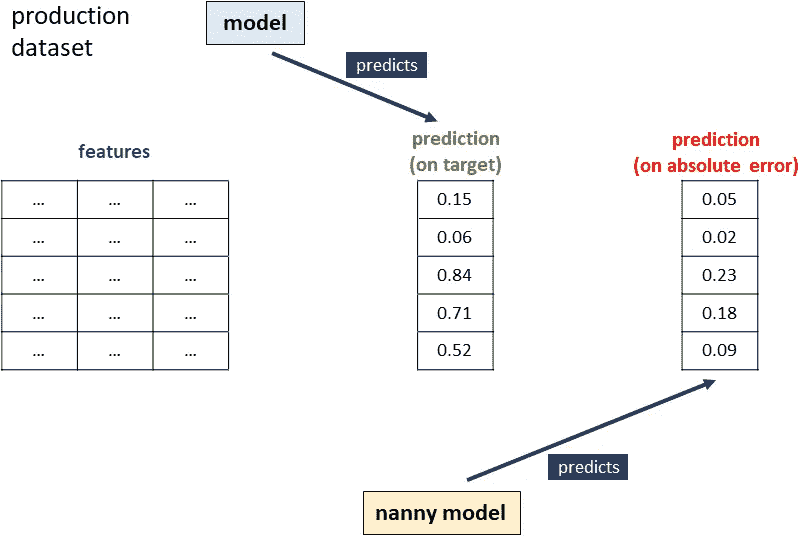

第四步。一旦生产数据可用，主模型就对目标进行预测，而保姆模型对绝对误差进行预测。[图片由作者提供]

总而言之，这是整个流程的视图(为了清晰起见，没有区分培训、测试和生产数据集):

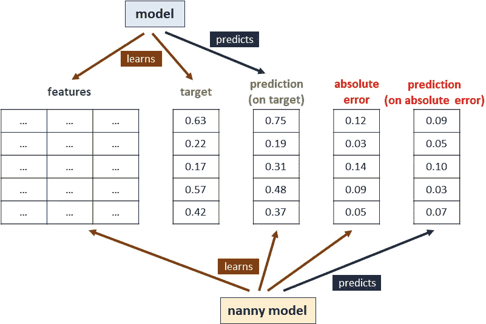

直接损失估算的所有步骤。为了简单起见，这里没有区分训练、测试和生产数据集。[图片由作者提供]

# 在真实数据集上预测性能

让我们看看 DLE 是否在真实数据集上工作。

我们将使用[超导体数据集](https://archive.ics.uci.edu/ml/datasets/superconductivty+data)，一个来自 UCI 的开源数据集。该数据集由 21，263 种材料组成，记录了关于原子质量、原子半径、密度等的 81 个特征。目标是预测临界温度。

我们将把数据集分为培训数据集、测试数据集和生产数据集。

```
**# load data and split into train, test, prod**import pandas as pddf = pd.read_csv(‘/kaggle/input/superconductor-dataset/train.csv’).sample(frac=1, random_state=123)df_train = df.iloc[:int(len(df)/5)]
df_test = df.iloc[int(len(df)/5):int(len(df)/5*2)]
df_prod = df.iloc[int(len(df)/5*2):]X_train = df_train.drop("critical_temp", axis=1)
X_test = df_test.drop("critical_temp", axis=1)
X_prod = df_prod.drop("critical_temp", axis=1)

y_train = df_train["critical_temp"]
y_test = df_test["critical_temp"]
y_prod = df_prod["critical_temp"]
```

此时，我们已经准备好训练我们的模型:

```
**# train model**from lightgbm import LGBMRegressormodel = LGBMRegressor().fit(X=X_train,y=y_train)
```

然后，我们使用测试数据集来计算模型产生的误差。

```
**# compute observed errors made by the model on test data**pred_test = pd.Series(model.predict(X_test),
  index=X_test.index).clip(0)error_test = pred_test — y_test
```

一旦我们有了错误，我们就可以训练保姆模型。请注意，nanny 模型使用所有原始特征加上第一个模型所做的预测作为特征。

```
**# train model to predict the absolute error**model_abs_error = LGBMRegressor().fit(
  X=pd.concat([X_test, pred_test], axis=1),
  y=error_test.abs()
)
```

在生产数据集上，我们首先使用主模型来获得预测。然后，我们使用保姆模型来获得预测的绝对误差。

```
**# predict the absolute errors on production data**pred_prod = pd.Series(model.predict(X_prod), index=X_prod.index).clip(0)pred_abs_error_prod = pd.Series(model_abs_error.predict(pd.concat([X_prod, pred_prod], axis=1)), index=X_prod.index)
```

在这一点上，我们有了对每一次观察的绝对误差的预测。因此，我们最终可以预测生产数据集的平均绝对误差(MAE ),这是我们最初的目标。

```
**# predict MAE on production set**pred_mae_prod = np.mean(pred_abs_error_prod)
```

# 针对数据漂移测试 DLE

DLE 的全部目的是在我们没有基本事实时预测我们模型的平均误差(或均方误差)。这在现实场景中非常有用，因为我们想提前知道模型的性能是否有所下降。

为了模拟这个场景，我们将把生产集分成十个部分。**为了重现数据漂移，我们不会随机分割褶皱，而是会根据模型**做出的预测进行分割。通过这种方式，我们确保折叠彼此之间有足够的差异，并且跨文件夹的性能有合理的差异。

因此，让我们将每个文件夹上的实际 MAE 与作为保姆模型预测的绝对误差的平均值而获得的 MAE 进行比较。

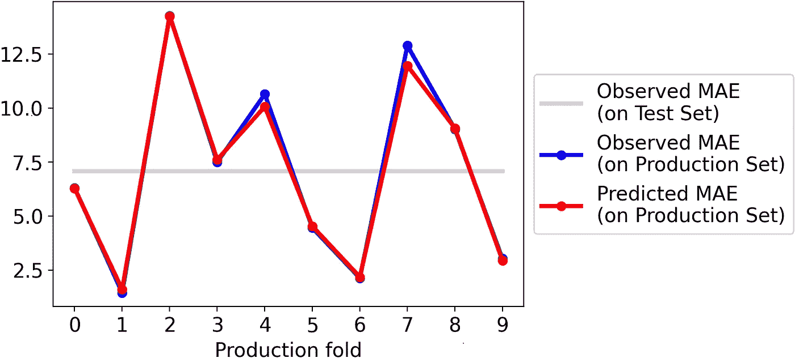

在测试褶皱上观测 MAE 和预测 MAE 的比较。[图片由作者提供]

结果令人印象深刻。通过保姆模型预测的 MAE 实际上与实际的 MAE 相同。

让我们试试 MSE:

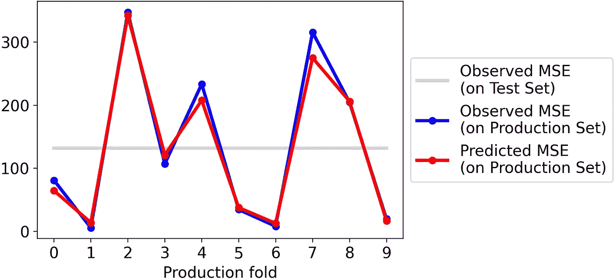

测试褶皱上观测 MSE 和预测 MSE 的比较。[图片由作者提供]

同样在这种情况下，结果是惊人的好。

# 如果我们试图估计误差(而不是绝对误差)，会发生什么？

我们已经看到，从理论的角度来看，试图估计符号误差是没有意义的。但是既然数据科学家更喜欢实践而不是理论，我们还是试着去做吧。

换句话说，这意味着重复上面的过程，但是不是在测试绝对错误上训练保姆模型，而是在测试符号错误上训练它。

在 Python 中，这意味着以下内容:

```
**# train model to predict the error (which makes no sense)**model_error = LGBMRegressor().fit(
  X=pd.concat([X_test, pred_test], axis=1),
  y=error_test
)
```

现在，我们能够预测测试集中每个观察值的有符号误差。如果我们取这些预测，取它们的绝对值，然后平均它们，这是对 MAE 的新估计。

让我们看看它在上述相同的测试折叠中表现如何:

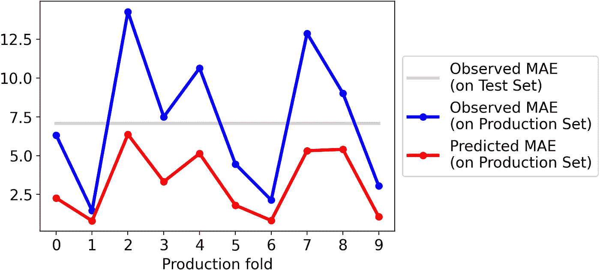

在测试褶皱上观测 MAE 和预测 MAE 的比较。这里预测的 MAE 是从一个基于符号误差而不是绝对误差训练的保姆模型中获得的。[图片由作者提供]

很明显，使用这种新策略，预测的 MAE 系统地低估了实际的 MAE。

如果我们尝试为 MSE 这样做，情况会更糟:

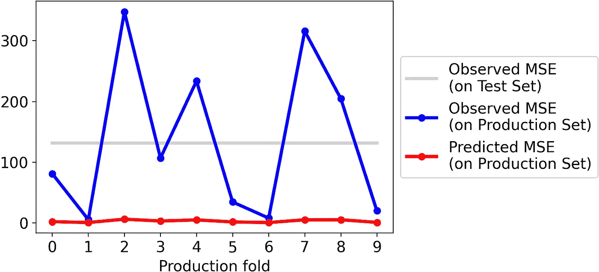

测试褶皱上观测 MSE 和预测 MSE 的比较。这里预测的 MSE 是从一个基于符号误差而不是平方误差训练的保姆模型中获得的。[图片由作者提供]

这只是进一步证明，预测绝对误差与预测带符号误差然后取绝对误差完全不同。

# 如果你不想重新发明轮子…

在本文中，我们从头实现了 DLE，以展示它是如何工作的。然而，在现实生活中，使用维护良好的库往往更好。

所以，您可能想直接使用 NannyML，它有几个本机功能，比如为您拟合超参数。

```
**# use DLE directly with NannyML**import nannyml as nmlestimator = nml.DLE(
    feature_column_names=features,
    y_pred='y_pred',
    y_true='critical_temp',
    metrics=['mae', 'mse'],
    chunk_number=10,
    tune_hyperparameters=False
)estimator.fit(df_test)
results = estimator.estimate(df_prod_drifted)
```

此外，您可以通过一行代码轻松获得关于模型性能的精彩图表:

```
results.plot(metric=’mae’)
```


# **当它不起作用时**

当使用 DLE 估计性能时，有一些假设你应该注意。事实上，如果这些假设中的一些被违反，DLE 估计的性能可能不再可靠。这些是假设:

*   没有**概念漂移**。如果特征和目标变量之间的关系以不可预见的方式改变，你试图预测的误差也会改变，因此保姆模型可能会失败。
*   在输入空间中，没有**协变移动到以前看不见的区域**。主模型和保姆模型都学习原始特性。如果特征漂移到在训练/验证阶段看不到的值，模型可能做出不正确的猜测。
*   **数据的样本足够大**。当然，训练和验证数据集都需要足够大，以使两个模型都足够健壮。

# 总结

在本文中，我们已经看到了**当基础事实不可用**时，如何可靠地预测回归模型的预期性能(特别是 MAE 和 MSE)。

这种算法被称为“直接损失估计”(DLE)，由 NannyML (一个专注于部署后数据科学的开源库)在本文[中提出。](https://nannyml.readthedocs.io/en/stable/how_it_works/performance_estimation.html#direct-loss-estimation-dle)

**DLE 基于直接预测每个单次观测的绝对(或平方)误差的直觉**。我们已经在超导体数据集上进行了测试，并获得了出色的结果。


您可以在 Github 资源库中找到本文使用的所有代码。

*感谢您的阅读！我希望你喜欢这篇文章。如果你愿意，* [*在 Linkedin 上加我*](https://www.linkedin.com/in/samuelemazzanti/) *！*