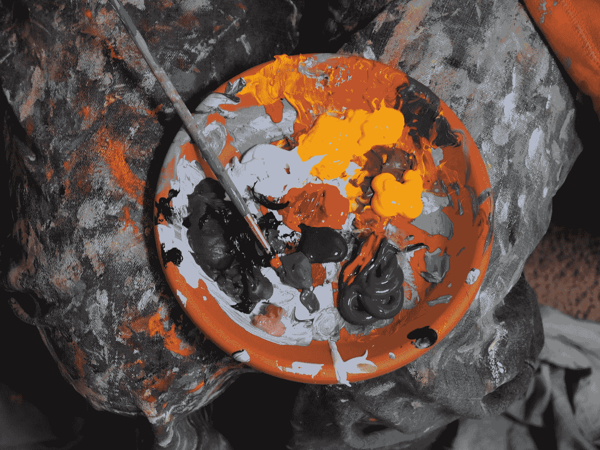
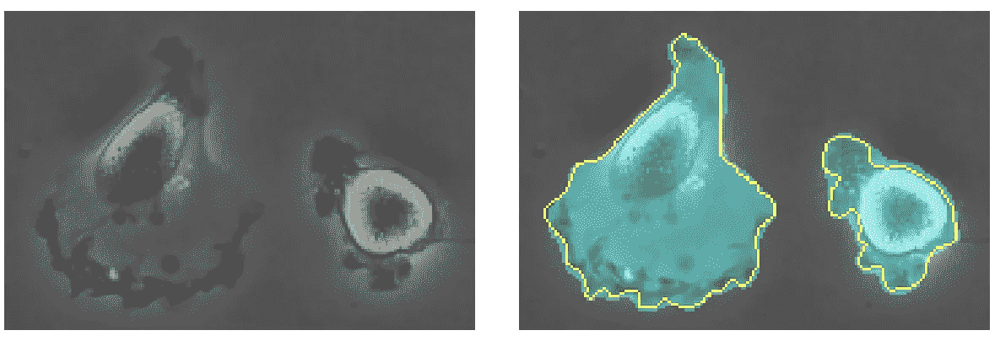
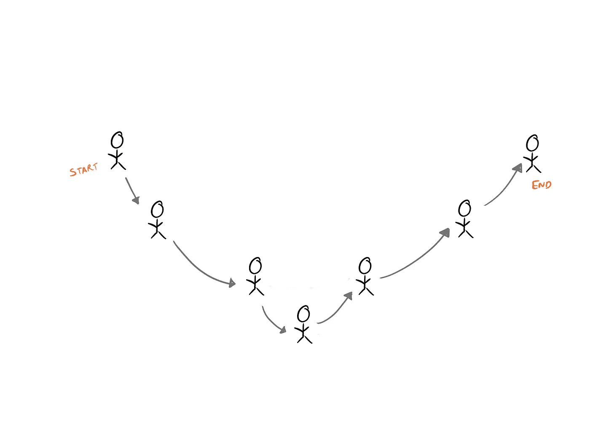
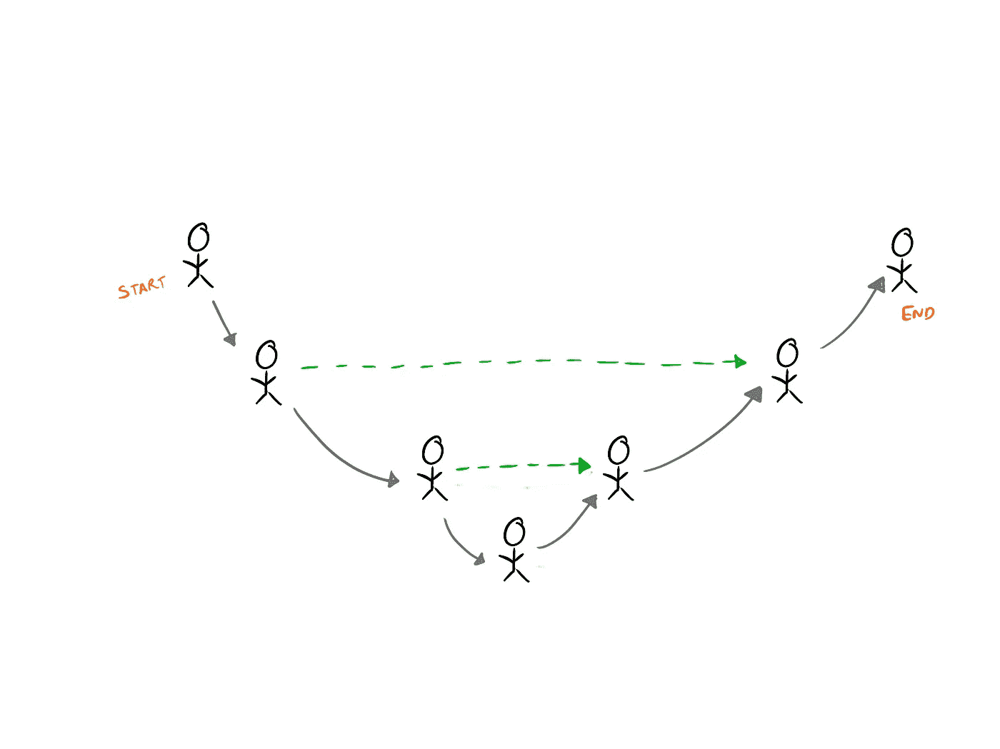

# 没有 U，你不能拼写扩散

> 原文：<https://towardsdatascience.com/you-cant-spell-diffusion-without-u-60635f569579>

## 理解稳定扩散的核心构件之一

迈克·彼得鲁奇在 [Unsplash](https://unsplash.com?utm_source=medium&utm_medium=referral) 上的照片

就在最近， [StabilityAI](https://stability.ai/blog/stable-diffusion-v2-release) ，stability Diffusion 背后的公司，发布了他们最新版本的图像生成器。如果从纯文本生成令人难以置信的好图像还不够，该模型现在可以生成更高分辨率的图像，并可以做真正有趣的事情，如使用深度图来生成新颖的图像。

事实上，自其发布以来，没有其他软件被开发者采用得更快。

看稳定扩散[发行说明](https://github.com/Stability-AI/stablediffusion#news)。我想特别提请你们注意一句话:

> 新的稳定扩散模型(稳定扩散 2.0-v)，分辨率为 768x768。U-Net 中的参数数量与 1.5 相同，但是…

U-Net 中相同数量的参数。这个 U-Net 是怎么回事？为什么 U-Net 周围的所有机械都变了，但它在这个模型的机舱中保持不变？今天我们的故事就从这里开始。

U-Net 是这种图像生成模型的核心构件之一。这里有一个过于简单的解释。稳定扩散中的 U-Net 将编码文本(处理成它能理解的格式的纯文本)和一组嘈杂的数字作为输入。经过多次迭代，它从接收到的噪声阵列中产生一个包含可成像信息的阵列。然后，U-Net 的输出被另一个称为解码器的网络用来创建我们都视为输出的图片。

但这根本不是 U-Net 的设计初衷。事实上，早在 2015 年，它就是为医学成像而设计的！那么，它是如何成为最先进的图像生成软件的呢？让我们解构 U 网，一探究竟！

# 了解 U-Net

为什么叫 U 网？看一眼它的结构就会告诉你答案。

来自[1]

U-Net 只接受一幅图像作为输入，并产生另一幅图像作为输出。更具体地说，给定下面左边的图像，U-Net 产生右边的图像。

来自[1]

这个任务叫做语义分割。给定一幅图像，将每个像素(图像的最小原子单位)分配给它所属的类。

所以，你可以看到，这个神经网络的结构是 u 形的。这种对称是有原因的。“U”的前半部分收缩输入图像，并在每个阶段从中提取有意义的信息(称为特征)。它通过使用卷积神经网络的基本构建模块来实现这一点，这些模块包括[卷积层](https://paperswithcode.com/method/convolution)、[汇集层](https://paperswithcode.com/method/max-pooling)和[激活层](https://paperswithcode.com/method/relu)。“U”的后半部分与此过程相反，将中间结果(称为特征图)扩展到越来越大的尺寸，直到最终输出与输入图像的尺寸相同。为此，除了汇集和激活层之外，它还使用了一个称为转置卷积的层([不要说去卷积](https://datascience.stackexchange.com/questions/6107/what-are-deconvolutional-layers))。

于是，卷积网络+卷积网络的镜像= U-Net。但是，它有另一个特殊的特点。注意到连接网络前半部分和后半部分的灰色箭头了吗？它们有助于扩张过程。

我们用一个小时候的游戏来进一步理解这一点。

# 您说什么？

作为一个孩子，我相信你一定玩过[电话游戏](https://www.wikihow.com/Play-the-Telephone-Game)(又名小道消息交流游戏)。一群孩子站成一排。第一个孩子在第二个孩子耳边小声说了些什么。第二个孩子小声告诉第三个孩子，以此类推。最终，最后一个孩子必须猜出最初耳语的内容。通常情况下，秘密文本在不同的孩子之间变化如此之大，以至于最终版本几乎不像原始版本。

现在，让我们把这个游戏加一个转折。第一个孩子要问一个问题，而不是低声说一句话。最后一个孩子必须回答这个问题。随着这个问题从一个孩子传到另一个孩子，它不断变化，最终，最后一个孩子对“人生的目的是什么？”这个问题的回答是“42”。

作者创建的图像

现在，如果我们改变规则来帮助孩子们呢？(我的意思是，他们毕竟是孩子)根据新的规则，一个孩子在链条的前面可以和后面的孩子交流。但是，他们只能问他们听到的问题。那不是让最后一个孩子回答原问题更容易吗？

作者创建的图像

这就是 U-Net 架构中灰色连接器背后的直觉。

它们帮助模型的后半部分猜测丢失的像素可能是什么。为什么我说缺失像素？在 U-Net 的前半部分，模型有完整的图片(双关语)。每一层都会缩小图片，并在将图片传递给下一层之前，有效地删除原始信息。

网络的后半部分具有将小图片(特征地图)扩展回与网络接收的原始图片相同大小的困难任务。但是，在不知道要在扩展的区域中填充什么的情况下，如何扩展某些内容呢？虽然这是一个值得单独贴出的话题，但可以肯定地说，如果你有背景知识，那么做起来会更容易。这种背景来自灰色的连接器(在我们的游戏链中较早的孩子)。

# 反向旅程

传统上，独特的神经网络首先在计算机视觉社区中被提出用于图像相关的问题，然后发展到其他领域，如医学成像等。

U-Net 是这一规则的例外之一。它旨在解决医学成像问题，但它是如此通用和有用，以至于它进入了许多计算机视觉问题——从赢得 Kaggle 比赛到从卫星图像中提取道路或建筑物。

今天，它位于稳定扩散的核心，它将高维图像映射到另一个图像的能力使我们只需键入几个词就可以创建令人难以置信的图像。

# 参考

1.  U-Net:用于生物医学图像分割的卷积网络【https://arxiv.org/abs/1505.04597v1 
2.  稳定的扩散采用率:【https://a16z.com/2022/11/16/creativity-as-an-app/ 