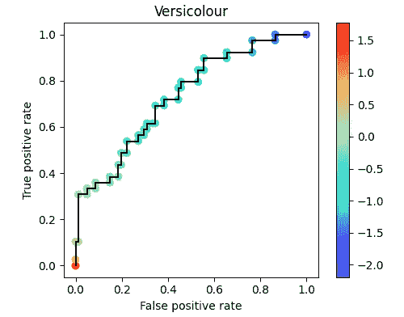
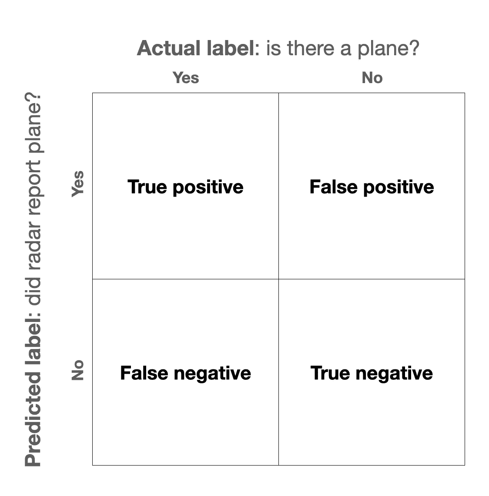
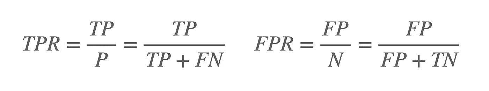
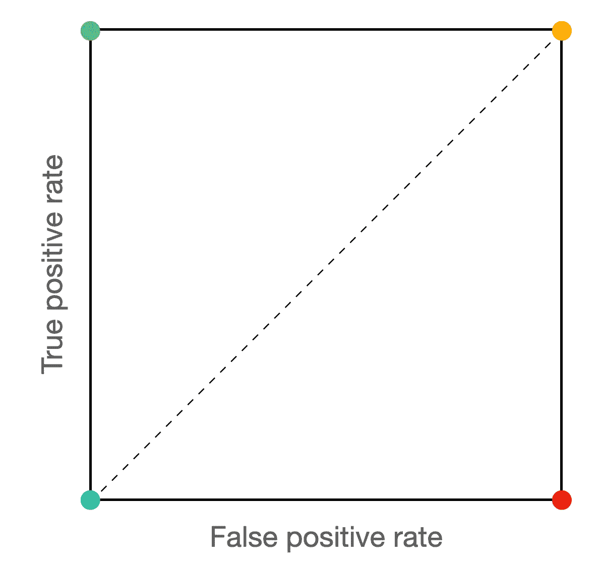
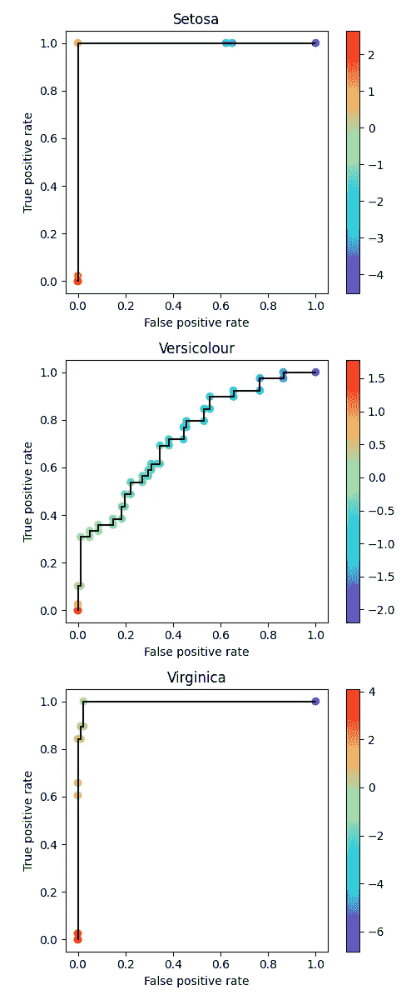

# 你值得拥有更好的 ROC 曲线

> 原文：<https://towardsdatascience.com/you-deserve-a-better-roc-curve-970617528ce8>

## 通过 ROC 阈值可视化提取更深入的见解

具有可视化决策阈值的 ROC。我们将学习如何阅读它！图片作者。

本文中的所有源代码都可以在 Github 上[获得！在任何上下文中随意重用图形，无需注明出处(不保留任何权利)。](https://github.com/peterbbryan/rainbow-roc/blob/main/scripts/sample_use.py)

# 动机

接收器操作特性(ROC)曲线对于理解模型的行为是非常宝贵的。不过，这些曲线包含的信息比你通常看到的要多。通过可视化阈值，我们可以更多地了解我们的分类器。另外，保留这些信息可以使 ROC 曲线更加直观。

# 历史

ROC 曲线是由战时挑战激发的。在第二次世界大战中，人们希望量化雷达系统的行为。让我们考虑雷达解释的四种可能结果:

> **真阴性(TN)** :射程内没有飞机，雷达技师报告没有飞机。唷。
> 
> **真阳性(TP)** :射程内有飞机，雷达技师报告有飞机。至少我们知道它在那里！
> 
> **假阴性(TN)** :射程内有一架飞机，但雷达技师没有报告。啊哦，我们毫无准备。
> 
> **误报(FP)** :范围内没有飞机，但雷达技师报告有飞机。我们在浪费资源准备一架不真实的飞机！

二元分类器结果。图片作者。

显然，前两种结果比后两种好，即真比假好。然而，在现实中，我们不得不进行权衡。

例如，如果我们的雷达技术人员有很多假阴性，我们可以让她的指挥官对她大喊，直到她报告更多出现在她屏幕上的东西。通过降低她报告的“决策门槛”，她会得到更少的假阴性和更多的真阳性。然而，不幸的是，她也更有可能意外报告假阳性。

为了总结雷达“接收器”的“工作特性”的权衡，军事分析家们提出了“接收器工作特性”曲线。

# 标准 ROC 曲线

怎样才能有意义地总结这四个量之间的关系？一种方法是使用真阳性率(TPR)和假阳性率(FPR)。

TPR 有很多名字。你可能会称之为“敏感”或“回忆”。它是所有实际阳性(TP+FN)的一部分，我们的模型将其标记为阳性。这是我们的雷达技术报告的真正飞机的一部分。相比之下，FPR 是非平面场景(FP+TN)的百分比，我们的雷达技术报告为平面。

ROC 曲线将 TPR 绘制为不同决策阈值下 FPR 的函数。基于这些定义，我们希望在最大化 TPR 的同时最小化我们的 FPR。

定义真阳性率(TPR)和假阳性率(FPR)。图片作者。

实现低 FPR 有一个简单的方法…永远不要报告*任何*飞机(蓝色)。也有一个简单的方法来实现高 TPR…称*一切*为飞机(黄色)。不过，理想情况下，我们会两者兼得。我们将拥有 100%的 TPR 和 0%的 FPR。我们的雷达技术人员将正确地报告所有真实的飞机，而不会意外地报告一架非飞机(绿色)。如果我们真的非常非常不擅长我们的工作，我们可能无法正确地报告*任何*真实的飞机，而把每一个非飞机称为*飞机(红色)。*

基本 ROC 曲线解释，参见第节。图片作者。

一个好的模型(或雷达技术)会弯向绿色角落。不好的模型(即随机的)会拥抱对角线。一个可笑的坏模型(即，比随机模型更坏)将向红色角落弯曲。

不过，这开始变得抽象了……让我们用具体的雷达例子来说明这一点。

一组样本分类决策的 ROC 曲线。图片作者。

让我们考虑一下我们想象中的雷达技术的六种分类情况，三种飞机和三种非飞机。对于每一项，她都用 0%到 100%的范围来表示自己的信心。在一个给定的阈值处，我们想象我们的雷达技术将关于该阈值的一切都报告为一架飞机。然后，我们使用上面的等式计算 FPR 和 TPR。绘制这些值的结果就是…上图所示的 ROC 曲线！

# 带阈值的 ROC 曲线

我的问题是:我们使用决策阈值来计算那条绿线，但随后我们丢弃了那条信息！从绿线中，我们无法判断每个点的决策阈值。在部署后选择要使用的决策阈值时，这些信息非常有用。

让我们试着用彩色地图保存这些信息。我还没有在网上为这种 ROC 曲线找到一个好名字…所以我称它为彩虹 ROC。

让我们放下雷达技术的例子，考虑一个真正的分类器。让我们使用[虹膜数据集](https://scikit-learn.org/stable/auto_examples/datasets/plot_iris_dataset.html)。我们将把三个类的问题视为一个[一对其余](https://scikit-learn.org/stable/modules/generated/sklearn.multiclass.OneVsRestClassifier.html)的问题，结果是每个类有一个 ROC。

首先，我们需要加载数据集并拟合我们的模型。我们将使用基本的 SVM！

数据加载和模型拟合。作者来源。

现在我们有了分类器，我们可以得到分类分数并生成我们的 ROC 曲线。

CLI 处理程序和彩虹 ROC 逻辑。作者来源。

结果是具有可视化决策阈值的 ROC 曲线。基于我们对假阳性率和期望的真阳性率的容忍度，我们可以为我们的用例选择适当的决策阈值。

彩虹 ROC 曲线与彩色地图的决策阈值。图片作者。

# 结论

彩虹 ROC 帮助我们保持阈值信息，并且，至少对我来说，使得解释 ROC 曲线更容易。感谢阅读！我希望你学到了一些东西。