# 不需要样本数据，需要 Python Faker

> 原文：<https://towardsdatascience.com/you-dont-need-sample-data-you-need-python-faker-fa87c2a119a9>


图片来自 [Pixabay](https://pixabay.com/?utm_source=link-attribution&utm_medium=referral&utm_campaign=image&utm_content=2014555) 的 [anncapictures](https://pixabay.com/users/anncapictures-1564471/?utm_source=link-attribution&utm_medium=referral&utm_campaign=image&utm_content=2014555)

## 一个可扩展的 Python 库，它生成假数据来“填充”你的项目

Python 有一个内置模块“random”，允许我们随机生成多种类型的数据，比如数字和字符串。但是，它不能生成任何“有意义”的数据，如人名。有时，当我们需要生成一些虚拟数据以方便演示或实验时，将人名命名为“Christopher Tao”会比“Llisdfkjwe Asdfsdf”好得多:)

一个常见的解决方案可能是从开源数据集中下载一些样本数据。然而，如果我们对数据的分布或虚拟数据的特定模式没有任何偏好，那么最好和最简单的解决方案就是生成假数据。

在本文中，我将介绍这样一个 Python 第三方库——Faker。它可以生成各种类型的假数据，而不仅仅是姓名。现在我们应该开始了。

# 1.基础


图片来自 [Pixabay](https://pixabay.com/?utm_source=link-attribution&utm_medium=referral&utm_campaign=image&utm_content=167089) 的[sarajughernaut](https://pixabay.com/users/sarajuggernaut-28237/?utm_source=link-attribution&utm_medium=referral&utm_campaign=image&utm_content=167089)

首先，我们需要使用`pip`安装库，如下所示。

```
pip install Faker
```

然后，让我们从一些基本的使用模式开始。在生成任何假数据之前，我们需要如下实例化 Faker 的对象。

```
from faker import Faker
fake = Faker()
```

一旦我们有了“假”实例，一切都很简单。比如生成一个人的名字，我们就用它的`name()`方法。

```
fake.name()
```

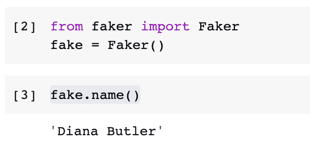

要生成一个地址，我们可以使用它的`address()`方法。

```
fake.address()
```

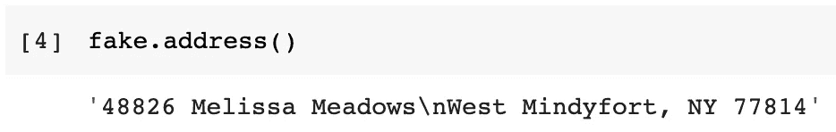

我们也可以使用 Faker 来生成一些文本。这没有任何意义，但至少看起来像真实的句子。这个阶段不要期望太高，这里没有机器学习模型这样的魔法。一切都是基于随机性。

```
fake.text()
```

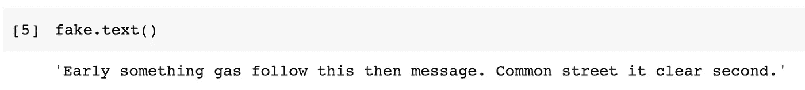

在 Faker 库术语中，上述每种类型的“生成器”都被称为“提供者”。供应商太多了，我无法一一列举。然而，当您继续阅读时，可以在本文的其余部分找到一些新的提供者。如果您想获得它们的完整列表，文档总是您的好朋友。

  

# 2.批量生成


图片由 [S .赫尔曼& F .里克特](https://pixabay.com/users/pixel2013-2364555/?utm_source=link-attribution&utm_medium=referral&utm_campaign=image&utm_content=3099605)从[皮克斯拜](https://pixabay.com/?utm_source=link-attribution&utm_medium=referral&utm_campaign=image&utm_content=3099605)拍摄

如果我们每次只能生成一个假数据的话，用处不会很大。因此，了解我们可以批量生成假数据是很重要的。

## 2.1 使用 For 循环

假设我们想要生成一些虚假的用户资料。每个配置文件应该包含用户的名字/姓氏，家庭住址，职位和他们工作的公司。最简单的方法是将所有内容放入一个 for 循环，如下所示。

```
for _ in range(3):
    print('Name:', fake.name())
    print('Address:', fake.street_address())
    print('Job:', fake.job())
    print('Company:', fake.company())
    print()
```


可以看出，虽然我们只是重复调用这些方法，但配置文件是不同的。Faker 的内部机制是基于随机性的。因此，我们每次生成的假数据也是随机的。

## 2.2 使用内置提供程序

Fake 不仅能够每次生成一种类型的数据。以用户配置文件为例，我们实际上不必单独生成每个字段，因为 Faker 有能力生成假的配置文件。就调用它的`fake.profile()`方法。

```
import pprintfor _ in range(3):
    pprint.pprint(fake.profile())
```

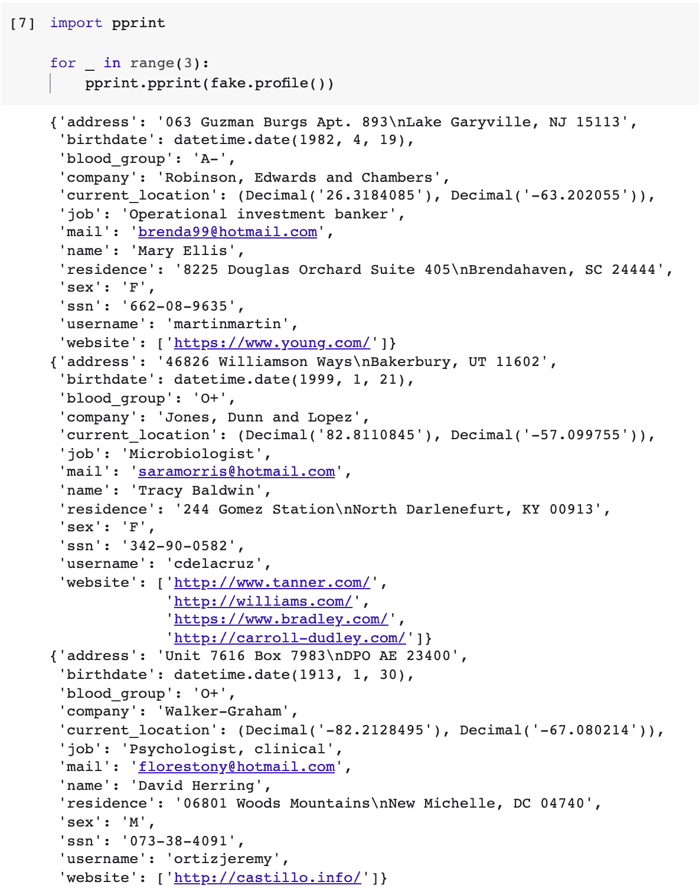

## 2.3 生成熊猫数据框架

使用像`profile()`这样的高级伪提供者的好处在于，它为我们生成字典。这意味着我们可以将它与熊猫等其他工具无缝集成。

例如，我们想在熊猫数据框架中生成用户配置文件。Faker 的设计让它变得非常容易。从字面上看，只有一行代码。

```
import pandas as pdpd.DataFrame([fake.profile() for _ in range(10)])
```

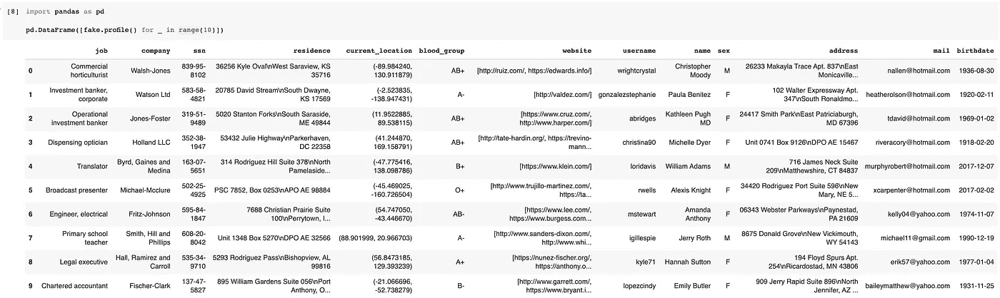

点击图像放大

## *再贴一张有部分栏目的截图，以防上面的完整截图在你的设备上不太可读*

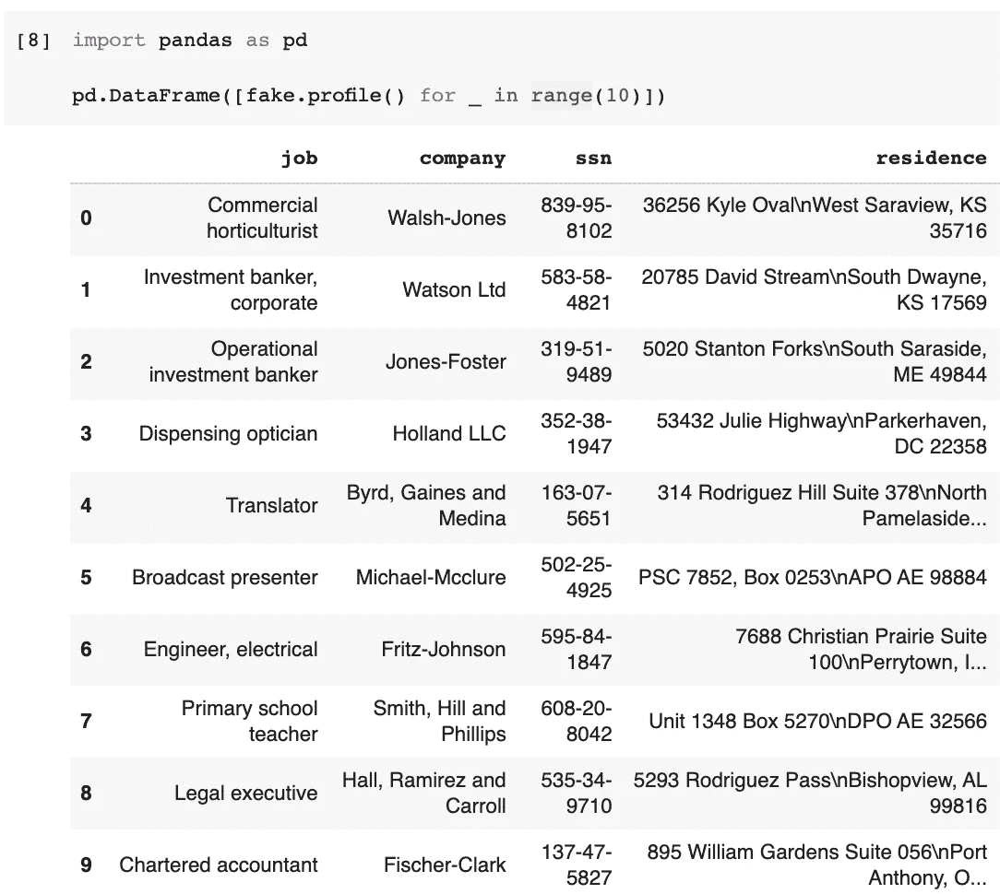

# 3.扩展提供程序


图片来自 [Pixabay](https://pixabay.com/?utm_source=link-attribution&utm_medium=referral&utm_campaign=image&utm_content=3149305) 的[沃尔夫冈·埃克特](https://pixabay.com/users/anaterate-2348028/?utm_source=link-attribution&utm_medium=referral&utm_campaign=image&utm_content=3149305)

Faker 有许多内置的提供程序，可以在大多数时候满足我们的要求。这些可以在官方文档中获得。

然而，如果事实证明我们找不到我们需要的提供商呢？不要担心，Faker 已经开放了它的“协议”,以便社区可以贡献更多的提供商。在 Faker，他们称这些为“扩展提供商”。这是目前为止他们的名单。

  

我将选择这辆车作为展示的例子。Faker 无法生成车辆品牌、型号等，但已经有一个扩展提供商可以提供帮助。

首先，根据文档，我们需要首先安装扩展的提供程序。也可以用`pip`安装。

```
pip install faker_vehicle
```

然后，我们需要向 faker 实例注册这个扩展提供者。

```
from faker_vehicle import VehicleProviderfake.add_provider(VehicleProvider)
```

完成后，我们现在就可以开始使用它了。生成汽车制造商的简单示例。

```
fake.vehicle_make()
```

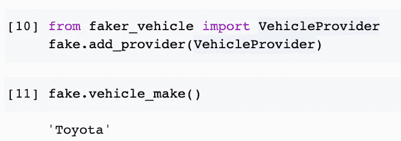

这个扩展提供程序也有一些高级方法。例如，我们可以使用方法`fake.vehicle_year_make_model()`生成汽车的轮廓。

```
for _ in range(5):
    print(fake.vehicle_year_make_model())
```

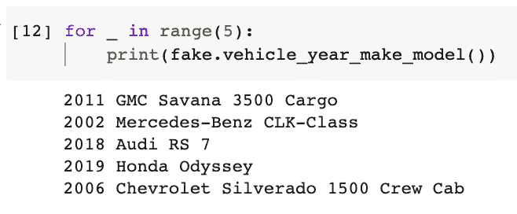

还注意到品牌和型号可以匹配。非常感谢这个扩展提供者的作者。

# 4.定制的 Lorem


图片来自 [Pixabay](https://pixabay.com/?utm_source=link-attribution&utm_medium=referral&utm_campaign=image&utm_content=4013402) 的[格哈德 G.](https://pixabay.com/users/blende12-201217/?utm_source=link-attribution&utm_medium=referral&utm_campaign=image&utm_content=4013402)

我们可以如下使用 Faker 生成一个句子。

```
fake.sentence()
```

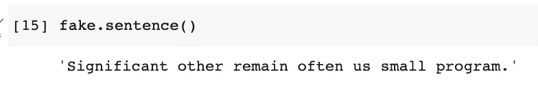

然而，如果我们希望句子是从我们的“字典”中生成的呢？换句话说，我们希望使用有限的单词作为我们将要生成的所有随机句子的库。

一些造假者支持定制，`sentence()`方法就是其中之一。我们可以传入一个单词列表，这样所有的句子都将在预定义的单词库中生成。

```
my_words = [
    'only', 'these', 'words', 'are',
    'allowed', 'to', 'be', 'used'
]for _ in range(5):
    print(fake.sentence(ext_word_list=my_words))
```

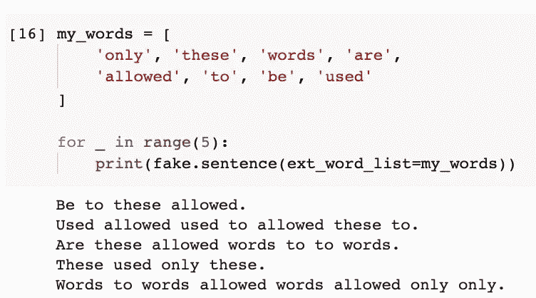

# 5.独特的价值观


图片来自 [Pixabay](https://pixabay.com/?utm_source=link-attribution&utm_medium=referral&utm_campaign=image&utm_content=1155808)

通过了解 Fake 的机制是从后台的现有池中随机生成假数据，您可能会担心，如果我们为足够的卷生成一种类型的假数据，它可能会生成重复数据。

答案是肯定的。如果我们使用不带任何注释的方法，就有可能生成重复的数据。让我们做一个简单的实验，生成 500 个名字。这里我们生成名而不是全名是为了更容易产生问题。

```
names = [fake.first_name() for _ in range(500)]
print('Unique sentences:', len(set(names)))
```

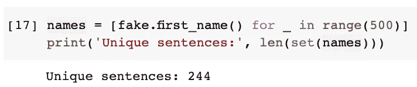

可以看到，在我们生成的 500 个名称中，只有 244 个名称是唯一的。

Faker 提供了这个问题的解决方案。也就是说，在调用方法之前调用`unique`属性。例如，我们应该使用`fake.unique.first_name()`，而不是使用`fake.first_name()`。

```
names = [fake.unique.first_name() for _ in range(500)]
print('Unique sentences:', len(set(names)))
```

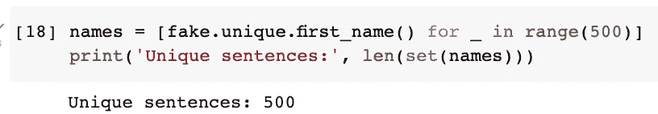

这一次，我们让所有 500 个名字都变得独一无二。然而，如果你和我一样好奇，你可能会问这样一个问题:如果我生成了更多的名字呢？让我们测试 2000 个名字。

```
names = [fake.unique.first_name() for _ in range(2000)]
print('Unique sentences:', len(set(names)))
```

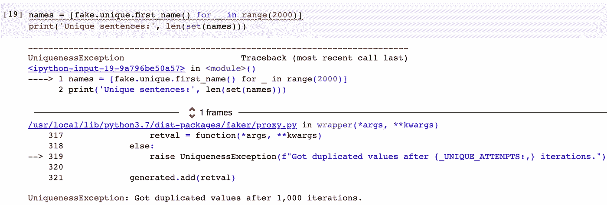

很明显，名字池在 1000 个名字之后就耗尽了。因此，Faker 也有其自身的局限性，但这是可以理解的，因为有意义的虚拟数据不可能是无限的。好的一面是，当它不能满足我们的要求时，它会抛出错误。

# 6.随机性中的确定性


图片来自 [Pixabay](https://pixabay.com/?utm_source=link-attribution&utm_medium=referral&utm_campaign=image&utm_content=2016797) 的 [anncapictures](https://pixabay.com/users/anncapictures-1564471/?utm_source=link-attribution&utm_medium=referral&utm_campaign=image&utm_content=2016797)

我们知道 Faker 会随机生成数据。这是否意味着我们可以复制一些演示？不，如果我们一开始就计划好，我们总是可以复制假数据的。那就是使用种子号。

现在，让我们实例化一个新的 faker 对象。我们可以如下指定它的种子号。种子数量可以是任何整数。我们就用 123 吧。

```
fake = Faker()
Faker.seed(123)
```

然后，让我们生成 5 个名字。

```
for _ in range(5):
    print(fake.name())
```

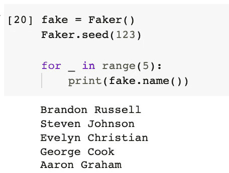

记住这些名字。现在，让我们在不分配种子号的情况下更新 faker 实例。然后，生成另外 5 个名字。

```
fake = Faker()for _ in range(5):
    print(fake.name())
```

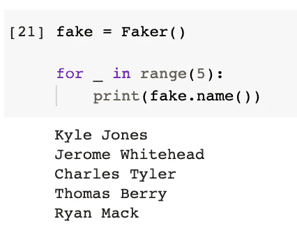

当然，它们会有所不同，因为它们是随机的。

让我们下次用同样的 123 号种子再做一次。


如果您将这 5 个名称与我们第一次使用相同的种子号时进行比较，它们是相同的。

所以，如果要重现同样的假数据生成，用种子号就行了。

# 摘要


图片来自 [Pixabay](https://pixabay.com/?utm_source=link-attribution&utm_medium=referral&utm_campaign=image&utm_content=2174258) 的[孙静](https://pixabay.com/users/jingsun-4581544/?utm_source=link-attribution&utm_medium=referral&utm_campaign=image&utm_content=2174258)

在本文中，我介绍了 Faker 库，它是 Python 社区中令人惊叹的反重力库之一。它确实非常容易使用，而且会非常有用。当你只需要一些哑数据，并且不关心数据的分布时，可以考虑先用 Faker。

<https://medium.com/@qiuyujx/membership>  

如果你觉得我的文章有帮助，请考虑加入 Medium 会员来支持我和成千上万的其他作者！(点击上面的链接)