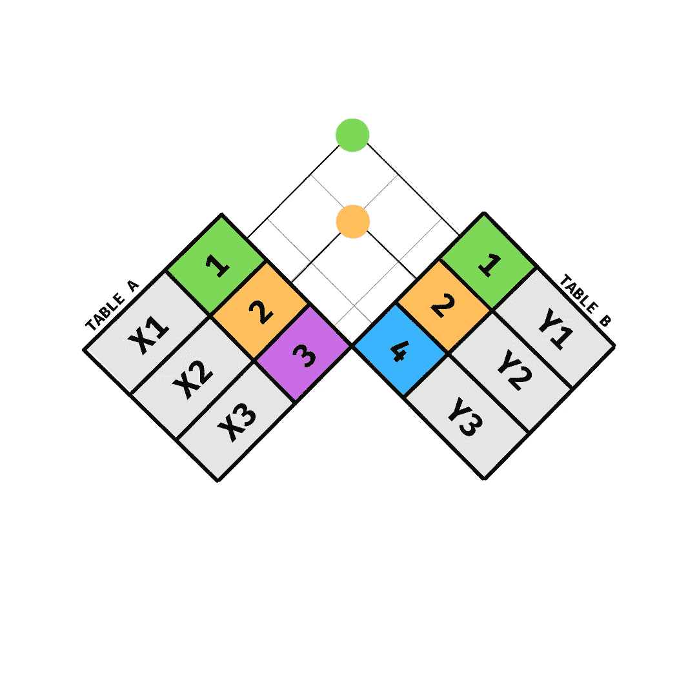
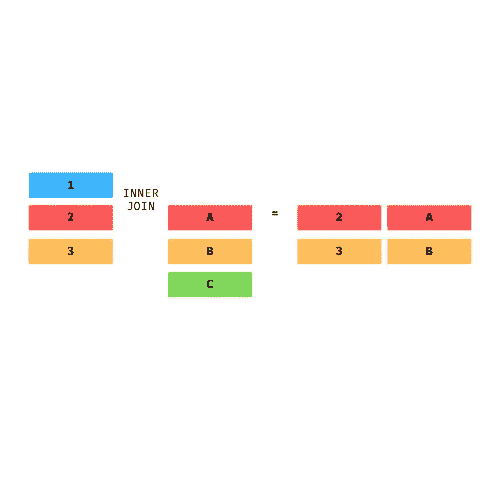
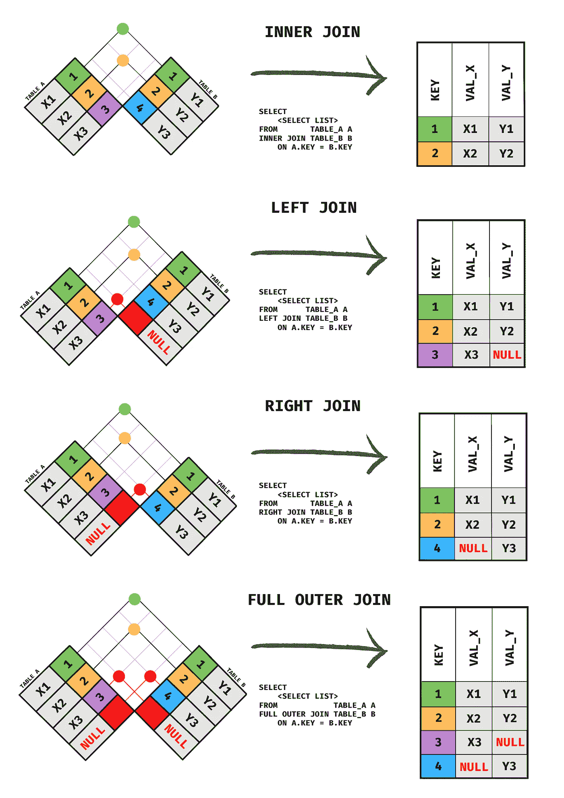
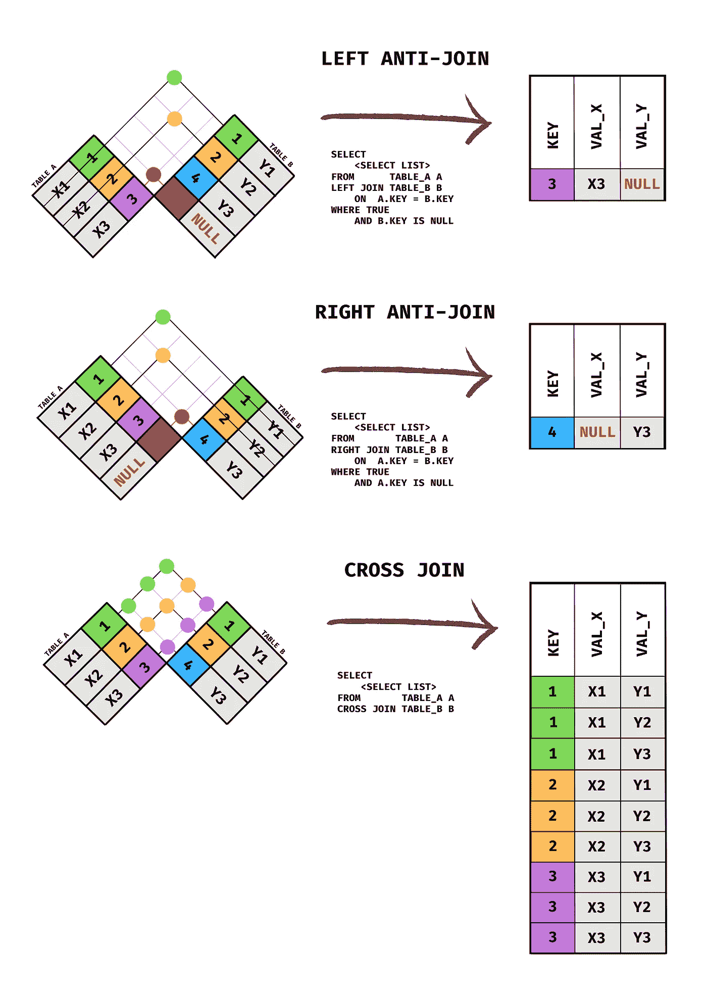

# 您应该使用它来可视化 SQL 连接，而不是维恩图

> 原文：<https://towardsdatascience.com/you-should-use-this-to-visualize-sql-joins-instead-of-venn-diagrams-ede15f9583fc>

## 数据科学

## *维恩图是去年才有的*

图片由作者提供，灵感来自数据科学领域的[R](https://r4ds.had.co.nz/relational-data.html)

几周前，我在 Reddit 上发表了一篇关于 [SQL 反连接](/why-is-nobody-talking-about-sql-anti-joins-f970a5f6cb54)的文章。分享没多久，就得到这样的回应:

作者图片

这激起了我的兴趣，因为到目前为止，我还没有读过或听说过任何人认为维恩图是可视化 SQL 连接的一种糟糕的方式，我已经坚持用 SQL 编码超过 3 年了。我个人认为维恩图有助于快速记住和可视化两个表之间的连接类型。这是我的回答:

作者图片

在那次评论之后，我得到了一些热情的回应，并意识到这已经被广泛讨论过了，而且背后有一些历史。当我读得更多的时候，我发现了一个很受欢迎的 Reddit 帖子，标题是[“在解释连接时对维恩图说不”](https://www.reddit.com/r/programming/comments/4rc9uu/say_no_to_venn_diagrams_when_explaining_joins/d50mxez/)。阅读别人对它的看法是很有趣的。我还发现了一个相关的流行帖子，发表在 2 年前的《走向数据科学》上，标题是[“我们能停止使用 SQL JOINs venn diagrams 吗？”](https://medium.com/towards-data-science/can-we-stop-with-the-sql-joins-venn-diagrams-insanity-16791d9250c3)。

这场争论让我想起了关于 SQL 如何发音的争论，或者我第一次听说[制表符与空格的争论](https://thenewstack.io/spaces-vs-tabs-a-20-year-debate-and-now-this-what-the-hell-is-wrong-with-go/)。在我考虑了双方的观点之后，我决定写这篇文章，然后发现了我认为被低估的 SQL 连接的可视化，我称之为方格旗图。🏁

*快速补充说明:关于 SQL 的发音，SQL 最初拼写为“SEQUEL ”,由于商标问题，仅改为“SQL”*[*。*](https://ieeexplore.ieee.org/stamp/stamp.jsp?reload=true&tp=&arnumber=6359709)

尽管我对这个主题有自己的看法，但我认为值得说明的是，我相信争论双方都有一些有效的观点，并且这些可视化都是表示 SQL 连接的有效方式。这种争论存在的原因是因为双方都从不同的学习方法中看到了好处，这是可以的。当然，对于大多数人来说，可能有一个最佳的学习路径，但是学习是一种定制的体验，所以我不想低估其他人通过使用不同的可视化发现的好处。但是请记住，真正理解 SQL 连接的最佳方式是进入代码和实践！[SQL Practice.com](https://www.sql-practice.com/)是我发现的练习 SQL 的好资源。

> 但是请记住，真正理解 SQL 连接的最佳方式是进入代码和实践！

也就是说，我希望解决“伟大的 SQL 维恩图辩论”中双方的关键点，并提出一个可能(仅仅是可能)安抚双方的解决方案。

## 争论中对立双方的要点

为了更好地理解双方，我读了 Reddit 上的一些观点和文章。以下是我发现人们不同意使用维恩图来可视化 SQL 连接的原因:

*   维恩图源于集合论，因此不应该用于可视化两个关系表之间的连接
*   一些人声称，当使用维恩图向学生介绍连接概念时，他们很难理解连接
*   维恩图从技术上来说并不能正确地表示一个连接实际上在做什么
*   维恩图有各种局限性:例如，不能很好地显示其他连接类型(如交叉连接)，不能显示重复出现时会发生什么，等等

这些是我从那些反对使用文氏图的人那里找到的主要批评。那些支持 SQL 文氏图的人给出了两个要点:

*   虽然维恩图在技术上可能不正确，但它们有助于人们记住连接的类型，并且更容易理解
*   根据所选的列，联接和集合操作可能会产生完全相同的结果

不管你更赞同哪一方，你现在已经对我决定写这篇文章的原因有所了解了。

## 维恩图的另一种解决方案

2016 年[有一篇流行文章](https://blog.jooq.org/say-no-to-venn-diagrams-when-explaining-joins/)也反对使用维恩图，作者提出了一种替代图，称为“连接图”。下面是一个内部联接的示例，它被可视化为一个联接图:

图片由作者提供，灵感来自 [Jooq 博客](https://blog.jooq.org/say-no-to-venn-diagrams-when-explaining-joins/)

此图非常有用，因为它比文氏图更准确地表示了 SQL 连接中使用的表格结构。这个图表的问题是，它将主键显示为颜色，但在这些颜色中也有数字或字母。矩形内的字母和数字应该表示除主键列(用颜色表示)之外的列，但这是可视化开始崩溃的地方。用一个矩形表示多个列可能会令人困惑和不直观(至少对我来说是这样)。无论如何，这种可视化似乎对那些难以理解使用 SQL 连接的人很有帮助。每一种可视化都有一定的局限性。

## 方格旗图🏁

当我回顾可视化 SQL 连接的不同方法时，我发现了我个人最喜欢的方法。我希望这个图能够弥合双方之间的差距，或者至少提供另一种选择来帮助人们理解 SQL 连接。

这个图表最初是由 Hadley Wickham 和 Garrett Grolemund 在他们的书[“数据科学的 R”](https://r4ds.had.co.nz/index.html)中创建的。图表可以在关于[【关系数据】](https://r4ds.had.co.nz/relational-data.html)的章节中找到。

我在一张备忘单上重新创建了这些图表，如下所示，但是我也创建了一个 Github 库，所以你可以在这里下载图片。

图片由作者提供，灵感来自数据科学的[R](https://r4ds.had.co.nz/relational-data.html)

图片由作者提供，灵感来自用于数据科学的[R](https://r4ds.had.co.nz/relational-data.html)

## 为什么我😍方格旗图

以下是我喜欢这张图的所有原因:

*   比联接图更准确地表示联接，因为它的主键具有相同的颜色和数字
*   为每个表显示 1 个额外的值列，以帮助直观显示除主键列之外的列中的数据发生了什么
*   连接线有助于简化视觉效果，便于看到连接的行
*   与连接图类似，连接产生的输出表显示在右侧
*   适用时显示空值，这正是在 SQL 中执行连接时发生的情况
*   可以显示交叉连接，这与文氏图相比是一个优势
*   显示 SQL 语法以供参考，类似于维恩图备忘单[这里的](https://www.codeproject.com/Articles/33052/Visual-Representation-of-SQL-Joins)

我仍然相信维恩图对于可视化 SQL 连接是有用的，但是它们在它们所能表示的范围和准确性方面是有限的。希望这些方格旗图可以成为你学习 SQL 的很好的参考。感谢阅读！

如果您喜欢阅读这篇文章，下面是我写的其他相关 SQL 文章:

*   [如何在你的数据科学生涯中使用 SQL 反连接](/why-is-nobody-talking-about-sql-anti-joins-f970a5f6cb54)
*   [5 个窗口函数示例，让你的 SQL 技能更上一层楼](/5-window-function-examples-to-take-your-sql-skills-to-the-next-level-2b3306650bb6)
*   [3 年来每天用 SQL 写作的 10 个快速 SQL 技巧](/10-quick-sql-tips-after-writing-daily-in-sql-for-3-years-37bdba0637d0)

在 LinkedIn 上关注我，了解我所有帖子的最新动态。如果你想知道我是如何进入数据科学的，我在我的简历[中写了这个](https://medium.com/about-me-stories/about-me-andreas-martinson-86f08fd85938)。

另外，如果你还没有加入 Medium，并且想无限制地阅读我的文章，请考虑通过我下面的推荐链接加入😃

<https://medium.com/@andreasmartinson/membership>  

## 参考

1.  A.Martinson，[如何在你的数据科学职业生涯中使用 SQL 反联接](/why-is-nobody-talking-about-sql-anti-joins-f970a5f6cb54) (2022)，走向数据科学
2.  A.Martinson，[初级/中级 SQL 文章](https://www.reddit.com/r/SQL/comments/tfhf4o/sql_articles_for_beginnersintermediate/i1f5woo/?context=3)，www.reddit.com
3.  D.Cassel，[Spaces vs . Tabs:Google 的 Golang](https://thenewstack.io/spaces-vs-tabs-a-20-year-debate-and-now-this-what-the-hell-is-wrong-with-go/) (2016)重新点燃了 20 年的争论
4.  米（meter 的缩写））Winand，[解释连接时对维恩图说不](https://www.reddit.com/r/programming/comments/4rc9uu/say_no_to_venn_diagrams_when_explaining_joins/d50mxez/) (2016)，[www.reddit.com](http://www.reddit.com)
5.  R.我们能停止使用 SQL JOINs venn diagrams 吗？ (2019)，走向数据科学
6.  [sql-practice.com](https://www.sql-practice.com/)，SQL Practice.com
7.  www.reddit.com[SQL](https://www.reddit.com/r/ProgrammerHumor/comments/7z0eoj/how_to_pronounce_sql/)怎么发音
8.  D.张伯伦，[SQL 的早期历史](https://ieeexplore.ieee.org/stamp/stamp.jsp?reload=true&tp=&arnumber=6359709) (2012)，IEEE 计算历史年鉴
9.  lukaseder，[在解释连接时对维恩图说不](https://blog.jooq.org/say-no-to-venn-diagrams-when-explaining-joins/) (2016)，Jooq 博客
10.  H.Wickham & G. Grolemund， [R for Data Science](https://r4ds.had.co.nz/index.html) (2017)，O'Reilly
11.  A.马丁森(2022)， [SQL 方格标志连接图](https://github.com/amartinson193/SQL_Checkered_Flag_Join_Diagrams)，[www.github.com](http://www.github.com)
12.  C.L. Moffat，[SQL 连接的可视化表示](https://www.codeproject.com/Articles/33052/Visual-Representation-of-SQL-Joins) (2009)，代码项目