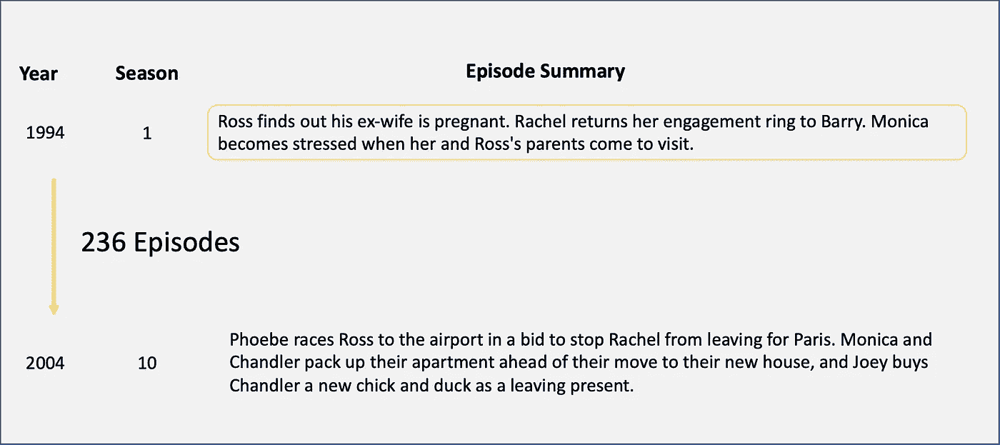
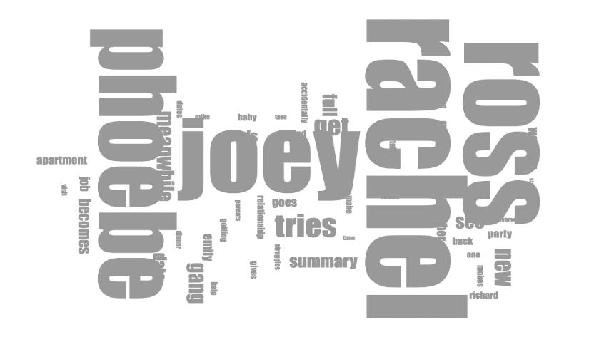
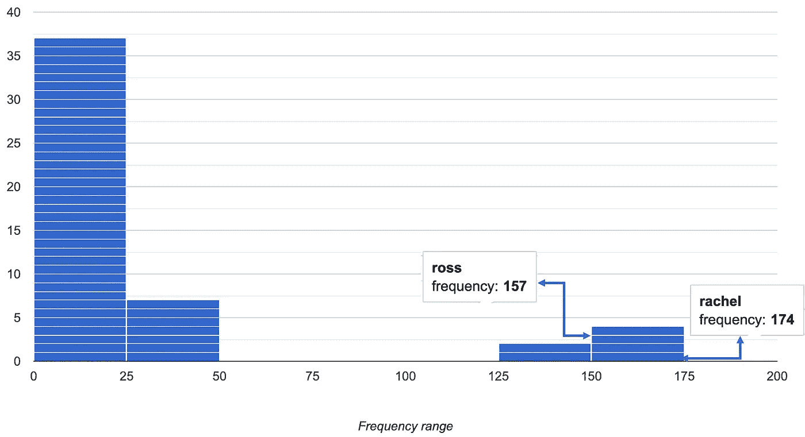
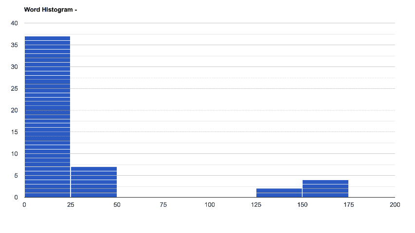
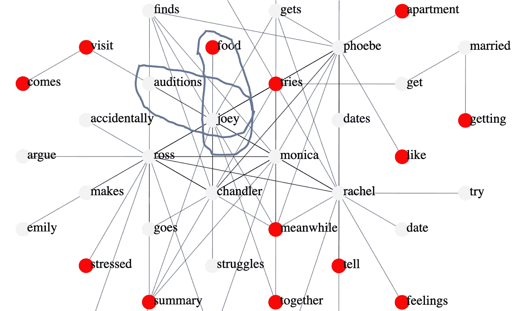
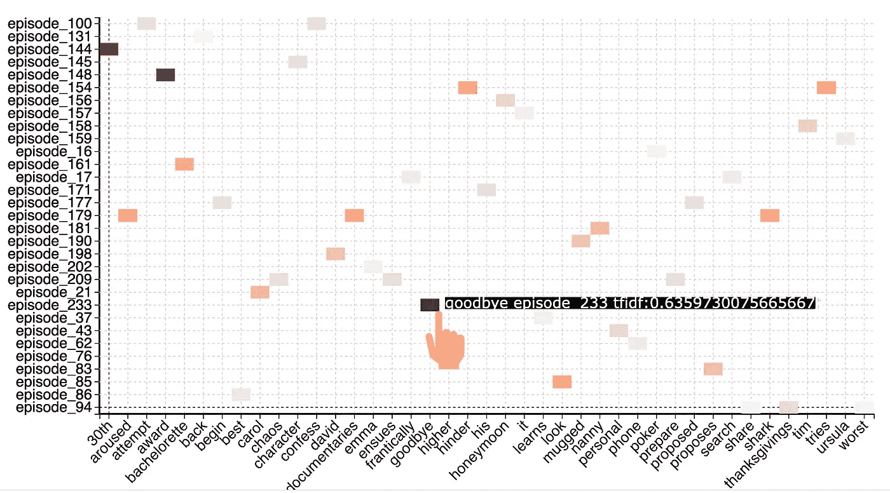

# 你需要的不仅仅是一个词——云

> 原文：<https://towardsdatascience.com/you-will-need-more-than-just-a-word-cloud-232658916abe>

## 分析单词的五大技巧

[真诚媒体](https://unsplash.com/@sincerelymedia?utm_source=unsplash&utm_medium=referral&utm_content=creditCopyText)在 [Unsplash](https://unsplash.com/s/photos/word?utm_source=unsplash&utm_medium=referral&utm_content=creditCopyText) 上拍摄的照片

> 不管任何人告诉你什么，语言和想法可以改变世界。”——约翰·基廷

单词是任何文本或文档的组成部分，分析这些组成部分可以让您深入了解文本。在这个故事中，我将展示热门词汇分析技术。我们将从最基本的词云开始，然后转向一些高级技术来掌握词分析。

# 资料组

我将使用受欢迎的电视节目《老友记》中的数据集。这些数据涉及从 1994 年到 2004 年的剧集。有 236 行，对应 236 集。每一行都有关于这一集的摘要文本，我们将使用文字分析来分析这一集的摘要文本。

朋友数据集(图片由作者提供)

数据集引用可在故事的结尾获得。

# 1.词云

最基本的，但必须具备的单词分析是单词云。它让你深入了解经常出现的单词。然而，你需要排除停用词，如 the，is，that，are 等，所以这是剧集摘要中的词云。不出所料，出现频率最高的词都与演员有关。

文字云(图片由作者提供)

Wordcloud 看起来很惊艳，你可以通过改变颜色来打动你的观众。

不同颜色的文字云(图片由作者提供)

# 2.单词直方图

单词云的缺点是，出现频率最高的单词非常突出，以至于我们不知道哪些单词比其他单词出现得更多。这个问题可以通过使用单词直方图来解决，如下所示。

单词直方图(图片由作者提供)

最右边的条表示出现次数最多的单词。我们看到出现次数最多的单词是 Rachel，出现了 174 次，Ross 出现了 157 次。虽然在单词云中，这两个单词看起来大小相似，但我们可以在单词直方图中看到差异。

这是单词直方图的动画视图。

单词直方图动画视图(图片由作者提供)

# 3.NGRAM 分析

现在让我们从分析单词开始，分析单词对，也称为 n 元语法分析，如下所示。

你可以观察到 Monica-Chandler 是最常见的单词对。这意味着很多剧集都是围绕莫妮卡和钱德展开的。

# 4.文字网络

让我们进入一个词汇网络，让我们的分析更上一层楼，如图所示。

文字网(图片由作者提供)

可视化显示了单词是如何相互连接的。它允许你详细地探索这个角色。例如，我们看到 Joey 与试镜和食物等词联系在一起。这意味着他的工作以及他对食物的偏好。

# 5.Word 文档热图

现在让我们来看看剧集词热图，它可以分析一集的内容。

Word 文档热图(图片由作者提供)

在 X 轴上，你可以看到特定于一集的词。Y 轴代表单词。你会发现角色的名字不在这里，因为他们是所有剧集的共同名字，而不是某一集的特定名字。

热图的颜色显示了某个单词是否对该集特别重要。它是基于 TF-IDF 对单词的评分。

我们看到“再见”这个词对第 233 集特别重要。查看第 233 集的摘要文本，我们看到这与一个告别聚会有关。

*第 233 集描述:“那伙人将瑞秋抛出一个* ***再见*** *的聚会，期间她向大家逐个说* ***再见****”*

热图这个词是快速理解一集内容的好方法，而不是阅读整个摘要。

# 结论

通过分析单词，我们可以非常深刻地了解文章的内容。多种技术，如单词云、单词直方图、单词网络和 word 文档热图，将帮助您深入探索文本。

# 数据源引用

数据来自[https://www . ka ggle . com/ruchi 798/friends-TV-show-all-seasons-and-episodes-data](https://www.kaggle.com/ruchi798/friends-tv-show-all-seasons-and-episodes-data)

数据集具有许可证 CC0 公共域。该数据集可用于非商业或商业目的，无需征得许可

.

请**订阅**,以便在我发布新故事时随时获得通知。

  

你也可以通过我的推荐链接**加入 Medium**

  

# 额外资源

# 网站(全球资讯网的主机站)

你可以访问我的网站进行零编码分析。[https://experiencedatascience.comT21](https://experiencedatascience.com/)

# Youtube 频道

这是我的 YouTube 频道
[https://www.youtube.com/c/DataScienceDemonstrated](https://www.youtube.com/c/DataScienceDemonstrated)的链接