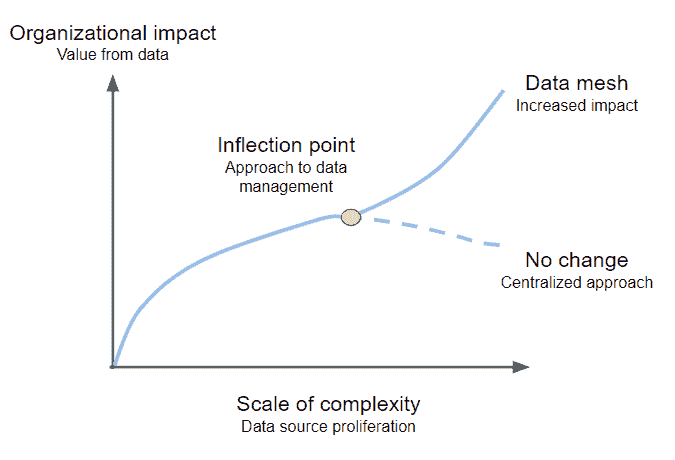

# 您的数据网格不能只为开发人员提供自助服务

> 原文：<https://towardsdatascience.com/your-data-mesh-cant-be-self-serve-just-for-developers-34bdeddc257e>

## 一个集中提供的平台必须支持编码人员和分析人员

图片来源: [Unsplash](https://unsplash.com/photos/5EhN4wbfvBc)

我遇到的许多数据组织的领导者都在考虑数据网格。这种方法在大型企业中越来越受欢迎，包括将数据和分析的控制权分散到各个业务团队或领域。一些功能仍然是集中管理的，包括数据网格社区所说的自助式数据平台。

我欣赏数据网格背后的动机，并认为它对一些组织来说是理想的。然而，我强烈地感觉到，如果组织过度转向去中心化，他们会冒着让领域团队得不到支持的风险，并最终形成一个功能失调的数据网格。在本文中，我将概述数据网格以及是什么导致组织考虑数据网格，并且我将论证数据网格的自助服务平台需要更加雄心勃勃。

# 数据网格去中心化:我们如何做到这一点？

我们应该感谢 Thoughtworks 的 Zhamak Dehghani 对数据网格的讨论。她 2019 年的演讲“[湖外](https://www.oreilly.com/library/view/oreilly-software-architecture/9781492050506/video323960.html)”阐述了这些想法，最近她将细节扩展到了长篇[数据网格书](https://www.oreilly.com/library/view/data-mesh/9781492092384/)。如果您正在使用数据网格，我强烈建议您阅读一下。

数据网格的第一个原则是分散的域所有权。根据 Dehgani 的说法:

> 数据网格的核心是将数据责任分散和分配给最接近数据的人。

为什么数据网格的分散化在数据领导者中引起了如此强烈的共鸣？尽管技术进步实现了无限的数据集中化，但大多数组织尚未将其付诸实施，以提供及时、有效的数据价值。

从历史上看，从原始数据到分析价值的路径要经过一个由 ETL 和数据仓库专家组成的中央团队。工具和专家都很昂贵，所以只有最大的组织才能进行组织范围的分析。那些采用了数据仓库的公司仍然必须明智地决定包括哪些数据，这样他们才能控制成本。

数据湖和云数据仓库极大地降低了处理和存储成本，现在可以聚合几乎无限量的数据。这与各种类型的数据量爆炸式增长相吻合，这个大数据时代让我们离向所有潜在用户提供组织的所有数据的承诺更近了一步。

然而，剩下的最大障碍是让这些数据实际可用，而不是以模糊的数据沼泽结束。中央团队可以将数据存储库扩展到 Pb 级，但是更难扩展的是将必要的上下文和专业知识与数据结合起来。这种知识共享一直是业务领域和中央数据团队之间不可或缺的伙伴关系。对于大多数组织来说，共享并没有跟上数据增长的步伐。

毫不奇怪，这些领域在去中心化的方法中看到了潜在的答案。Dehghani 描述了一个数据管理拐点。集中化对更大、更复杂的组织需求产生了越来越大的影响，但也只是在一定程度上。

作者图片

超过一定程度的复杂性、数据用例的多样性和无处不在的来源，组织继续集中数据及其控制将变得毫无意义。

# 去中心化让中央数据团队何去何从？

对于数据世界来说，关于集中和分散什么的决策既不是新的也不是独特的。每个集中化选择通常都有权衡，很少有一刀切的方法。

Dheghani 强调了将钟摆转向分权的两个直接风险:不兼容和低效。如果域开发独立的平台，我们将回到数据孤岛，并阻碍必要的跨域数据产品和分析。每个领域构建自己的数据环境和团队既昂贵又低效，牺牲了组织规模的优势。

Dehghani 在她剩下的原则中提到了这些风险。将数据视为产品可确保领域为更大的组织提供分析就绪的数据。联合治理平衡了域的独立性和网格的互操作性，详细说明了适用于所有域的策略。

自助式数据平台的原则也涉及到这两种风险，在中央平台中增加了一些效率，同时也确保了域之间的兼容性和集成。中央团队必须为一致性和互操作性的基线提供这个平台。

# 他们什么意思，自助？

中央数据平台旨在提供基本的基础设施，以便领域团队不会试图构建或购买每一个工具和功能来生成分析见解。Dehghani 鼓励那些提供自助式数据平台的人为“多面手多数”构建平台。

> 如今，许多组织都在努力寻找数据工程师等数据专家，同时也有大量渴望与数据打交道的通才开发人员。大数据技术的碎片化、围墙化和高度专业化的世界创造了高度专业化的数据技术专家的同样孤岛化的碎片。

Dehghani 正确地识别了数据工程师的市场短缺和在领域团队中为他们配备人员的不切实际的目标。相反，领域团队应该依靠“多面手开发人员”来消费集中式基础设施并在其上构建。

我相信一个需要领域开发者和编码的平台仍然是一个不必要的高成功壁垒。为了让数据网格取得成功，中央团队需要提高自助服务的标准，为域提供一条从源到分析的简单的端到端路径。

# 自助不能意味着 DIY:它必须更“服务”而不是“自己”

自助服务向不同的人传达不同的东西。对一些人来说，这是一顿现成的午餐，对另一些人来说，这是一个自己动手的宜家式组装项目。有些领域是高度技术性的，并着手构建匹配或超过中央团队可能构建的能力的数据基础设施。

但是对于一个组织来说，要想从数据网格中获得价值，它需要的不仅仅是几个雄心勃勃的领域。如果只有最了解数据的领域实现了飞跃，那么组织并没有超越集中化，他们只是移动了控制，或许还有人员。

因此，中心团队必须交付一个服务和基础设施，在这个基础设施中，不需要开发人员，领域就可以快速生产。下面我将详细介绍这种平台的基本要素，从底层计算扩展到源和目标的集成和转换，再到持续监控和管理。有了这些，这些领域可以专注于数据和分析，快速超越设置和管道管理。

**托管计算基础设施**

首先，中央团队应该从域中抽象出核心计算和存储基础架构的细节。应该集中配置框架和灵活调整计算资源。从数据管道的角度来看，域应该提供其延迟需求的参数，但在其他方面，希望平台能够无缝地适应不断变化的数据量。

**现成的数据源接收**

每个域都有自己的数据源，包括文件、数据库、SaaS 应用程序等等。中央团队必须提供一个平台，在不需要任何代码的情况下将数据从这些数据库中提取到分析基础架构中。即使对于唯一的、专有的数据源，也不应该让域自己编写这些集成的代码。

**无代码转换**

在将数据从操作层面转移到分析层面的过程中，提供转换功能至关重要。领域团队将拥有不同的技能，数据转换选项应该反映这一点。ETL 专家的集中团队一直在努力跟上业务领域的需求。答案不是分散地转移复杂性和专业编码。相反，域应该有一个用户友好的接口来连接数据源(提取)和分析目的地(加载)。无代码方法还应该包括转换，使用数据管理器来帮助分析师可视化地准备数据以供分析使用。工具也应该服务于用户能够用 SQL、Python、Scala 和其他语言编码的领域，但是这些技能不应该是必需的。

**可靠的管道管理**

尽管数据网格将许多控制推到域外，但中央团队仍必须确保数据管道的正常运行时间和性能。如果没有这样的支持，域将陷入检查管道结果、对模式更改做出反应和无休止地排除故障的困境。中央平台应尽可能包括自动问题检测、警报和解决。当需要领域输入时，中心团队应该有效地促进引导式解决方案。

**简单而彻底的可配置性**

虽然中央团队需要优先考虑易于使用、自动化优先的方法，但它也需要捕捉领域输入并相应地进行调整。用户必须能够为调度、依赖性管理、容错阈值等配置他们的管道。该平台应该具有集成特定领域流程(如数据质量)的灵活性。

有了这个真正的自助式数据平台，域可以轻松地选择它们的数据源，选择调度选项，可视化地定义必要的转换，并知道管道将在那里工作。在几个小时之内，他们应该超越数据移动，开始分析或发布他们的数据产品。如果中央团队能够提供这个平台，他们就可以为数据驱动的组织提供有效的数据网格。

# 自助式数据平台是中央团队+领域合作伙伴关系的关键

在削减工程负担的同时，为数据网格中的每个独特领域提供服务的能力是一个具有挑战性的平衡。有了真正的自助式数据平台，域可以轻松地选择它们的数据源，选择调度选项，可视化地定义必要的转换，并知道管道将在那里工作。在几个小时之内，他们应该超越数据移动，开始分析或发布他们的数据产品。如果中央团队能够提供这个平台，他们就可以为数据驱动的组织提供有效的数据网格。

数据网格应该加速数据从其来源到那些能够从中产生见解和价值的人的路径。我见过一些组织能够很好地整合数据。当中央团队和平台可以促进领域提供他们的专业知识时——而不是一个团队试图做所有的事情——这是一个令人鼓舞的组合！