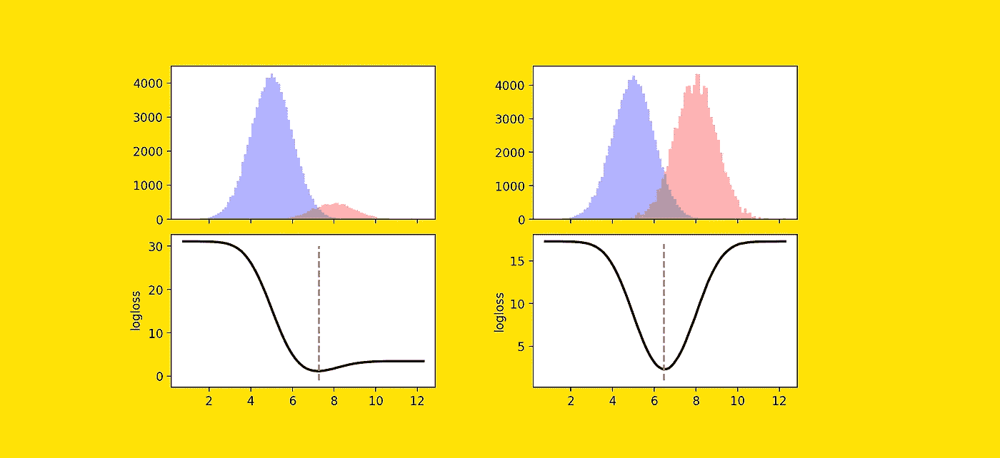
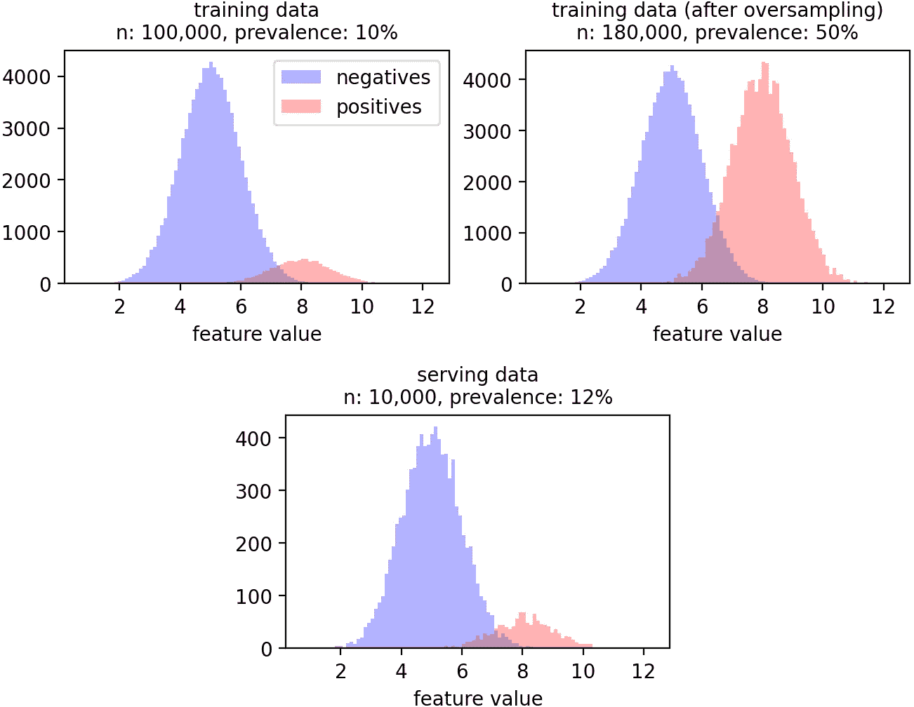
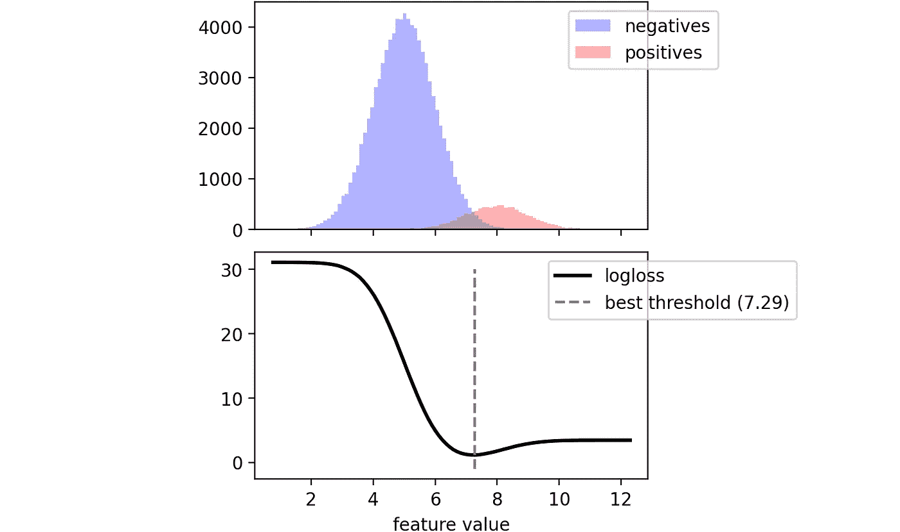
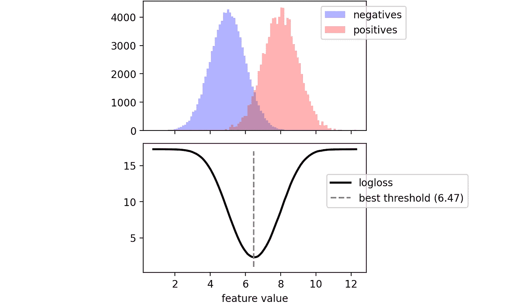
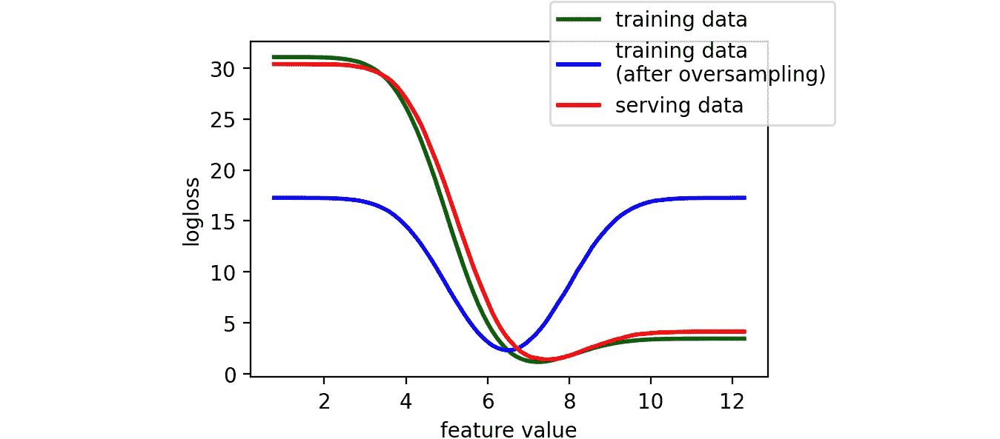

# 你的数据集不平衡？什么都不做！

> 原文：<https://towardsdatascience.com/your-dataset-is-imbalanced-do-nothing-abf6a0049813>

## 阶级不平衡不是问题。揭穿了一个最普遍的误解在 ML 社区。



[图片由作者提供]

我经常从数据科学家那里听到的一句话是:

> "我们有一个问题:这个数据集是不平衡的."

讲了这些之后，他们通常会开始提出一些平衡技术来“修复”数据集，比如欠采样、过采样、SMOTE 等等。

我认为这是机器学习社区中最普遍的误解之一。所以，我想明确声明:

> 阶层失衡不是问题！

在这篇文章中，我将向你解释为什么。

此外，借助一个简单的例子，我将让您直观地了解为什么在大多数情况下，用欠采样、过采样或 SMOTE 来平衡数据集会适得其反。

我希望这能帮助你避免做不必要的(或有害的)工作，而把注意力集中在重要的问题上。

# 重要的事情先来。什么是阶层失衡？

机器学习中最常见的任务之一是二进制分类。在这些任务中，目标是建立一个可以预测某个现象是否会发生的机器学习模型。现象可能是任何东西:客户是否会流失，是否会发生地震，用户是否会喜欢一部电影。

由于问题是二元的，我们的目标向量只由 1(也称为正)和 0(也称为负)组成。

当积极因素比消极因素少得多时，就会出现阶层失衡。阳性占总数的百分比也称为患病率。即使没有硬阈值，当患病率≤ 10%时，我们也会同意考虑数据集不平衡。

在实际应用中，类不平衡是最常见的情况。的确，**很多值得解决的问题本来就不平衡**。这是因为资源有限。由于您希望将资源投入到少数可能有积极结果的案例中，因此能够预测罕见事件(如客户呕吐、地震或用户喜欢电影)的模型是非常有价值的。

# 问题出在哪里？

那么，阶层失衡的问题出在哪里？

如果你谷歌一下“类不平衡机器学习”，你会发现一些类似这样的文章:

*   "[对抗你的机器学习数据集](https://machinelearningmastery.com/tactics-to-combat-imbalanced-classes-in-your-machine-learning-dataset/)中不平衡类的 8 个策略"。
*   [机器学习中处理不平衡类的 10 个技巧](https://www.analyticsvidhya.com/blog/2020/07/10-techniques-to-deal-with-class-imbalance-in-machine-learning/)。
*   [机器学习中处理不平衡数据的 5 种技术](/5-techniques-to-work-with-imbalanced-data-in-machine-learning-80836d45d30c)。

从这些标题中，你可以看出阶级不平衡是一个主要问题。但真的是这样吗？

我查阅了各种资源，发现了一篇有趣的文章，标题是“[代价敏感学习和类不平衡问题](https://www.researchgate.net/publication/268201268_Cost-Sensitive_Learning_and_the_Class_Imbalance_Problem)”，是“机器学习百科”的一部分。

在文章中，作者提到了在处理不平衡数据集时可能会遇到的 3 个问题:

1.  当你实际上想要以不同的方式衡量误差时，你**使用准确度作为度量标准**。
2.  你**假设训练数据集和服务数据集的类别分布是相同的，而不是**。
3.  你没有足够的正面实例来训练一个可靠的 ML 模型。

奇怪的是:

> 在所有这些情况下，问题都是阶级不平衡。

事实上，让我们分别来看它们:

1.  问题是你**选择了与你的目的**有关的错误指标:这与不平衡的数据无关。关键是您应该选择一个适合您的数据集的指标，而不是相反。
2.  问题是**训练/发球偏斜**:与不平衡数据无关。事实上，如果您有一个流行率为 50%的训练数据集，您的数据是完全平衡的，但是如果您的服务数据流行率为 10%，您的模型无论如何都会受到训练/服务偏斜的影响。
3.  问题在于**数据稀缺**:这与不平衡的数据无关。事实上，如果你有 5 个阳性和 5 个阴性，你的数据集是完全平衡的，但你没有足够的数据来建立一个 ML 模型。相反，如果你有 100 万个阳性和 10 亿个阴性，你的数据集严重不平衡，但你有足够多的数据。

**无论是否存在阶层失衡**，这 3 个问题都可能存在。

事实上，即使您的数据集完全平衡，您也应该经常问自己是否选择了正确的指标，是否可能存在训练/服务偏差，或者是否没有足够的数据来训练模型。

# 秀，不要说

在上一段，我们已经看到了为什么阶级不平衡不是问题的理论解释。但是您可能仍然认为使用欠采样、过采样或其他技术来平衡数据集不会有任何害处，对吗？

不对。

让我们借助一个玩具例子来看看为什么。

我们有一个 100，000 个观察值的训练数据集。数据集只有一个连续的要素。目标变量是二元的，有 10%的正变量。因此，数据集是不平衡的。

你的同事建议你对少数民族阶层进行过度采样，以“对抗阶层失衡”。所以你随机抽取正面的例子，直到你达到完美的平衡:50%的负面和 50%的正面。

此外，假设我们可以观察由 10，000 个观察值组成的服务数据集(即，您的模型在推理时将遇到的数据)，其中 12%是正面的。

我们可以通过下面的代码模拟这种情况:

```
**# generating toy datasets**import numpy as npnegatives_train = np.random.normal(5,1,90_000)
positives_train = np.random.normal(8,1,10_000)
x_train = np.concatenate([negatives_train, positives_train])
y_train = np.array([0] * len(negatives_train) + [1] * len(positives_train))positives_train_os = np.random.choice(positives_train, size=len(negatives_train))
x_train_os = np.concatenate([negatives_train, positives_train_os])
y_train_os = np.array([0] * len(negatives_train) + [1] * len(positives_train_os))negatives_serve = np.random.normal(5,1,8_800)
positives_serve = np.random.normal(8,1,1_200)
y_serve = np.array([0] * len(negatives_serve) + [1] * len(positives_serve))
x_serve = np.concatenate([negatives_serve, positives_serve])
```

这是数据的图形表示:



训练数据集、过采样训练数据集和服务数据集中的负分布和正分布。[图片由作者提供]

我们希望建立一个机器学习模型，帮助我们根据 x 的值预测 y 的值。我们将使用一个只有一个参数的模型:决策阈值。该模型的工作原理如下:

*   如果特征≥阈值，那么我们的预测是 1。
*   如果特征< threshold, then our prediction is 0.

During training, what binary classifiers do is try to reach the parameters that minimize the loss. In our case, we have just one parameter, so training the classifier will consist in trying many possible thresholds and picking the one that gives the smallest loss. The default loss used in binary classification is log-loss, so we will stick to that.

```
**# "training" our model on the original dataset**from sklearn.metrics import log_lossts = np.linspace(np.min(x_train), np.max(x_train), 100)log_loss_train = [log_loss(y_train, x_train >= t) for t in ts]best_thres_train = ts[np.argmin(log_loss_train)]
```

Let’s plot the log-loss as a function of the threshold:



Training dataset. Log-loss corresponding to any possible threshold. [Image by Author]

Using the original training data, we have that the best threshold (i.e. the one that produces the smallest log-loss) equals 7.29.

But what happens if we use the oversampled (i.e. balanced) dataset?

```
**# "training" our model on the original dataset**log_loss_train_os = [log_loss(y_train_os, x_train_os >= t) for t in ts]best_thres_train_os = ts[np.argmin(log_loss_train_os)]
```



Oversampled training dataset. Log-loss corresponding to any possible threshold. [Image by Author]

The log-loss curve is very different now, it is practically symmetrical, leading to choosing a threshold of 6.47.

The final aim of any model is to perform best on unseen data. So, let’s see the log-loss curve also on serving data:



Comparing log-loss curves on the different datasets. [Image by Author]

As it was easy to imagine, the log-loss curve of the serving data is much more similar to the one of original data than to the one of oversampled data. Indeed:

*   with threshold = 7.29 (best log-loss on **原始数据**，服务数据的对数损耗为 **1.28** 。
*   阈值= 6.47(对**过采样数据**的最佳对数损失)，对服务数据的对数损失为 **2.30** 。

换句话说，**如果您在过采样数据集上训练模型，那么与在原始(不平衡)数据集上训练相比，您在服务数据上获得的性能会更差**。

这是一个简单的解释，说明了为什么只有在您确切知道自己在做什么的情况下，才应该对数据集进行过采样/欠采样。不存在自动平衡不平衡数据集的首选方法。

# 综上

综上所述，阶级失衡本身从来都不是问题。

有时，它与不同的问题有关，如错误的指标、培训/服务偏差或数据匮乏。在这种情况下，你应该找到解决问题的方法，而不是解决阶级不平衡的问题。