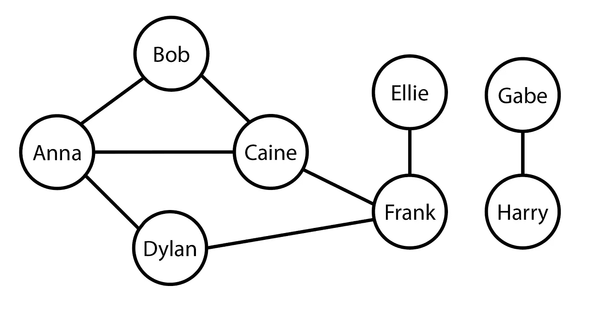
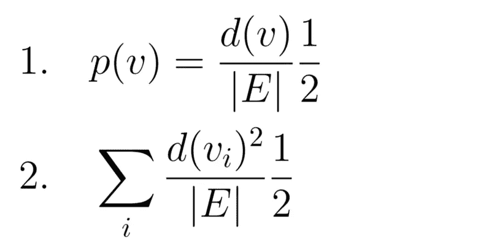
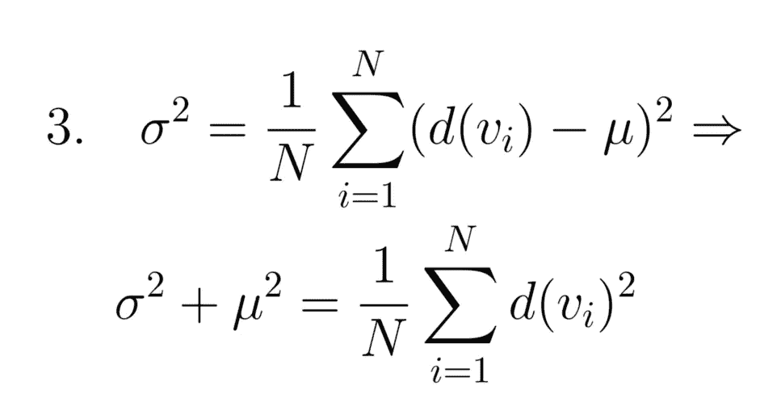
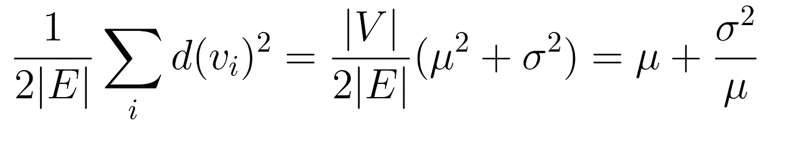

# 你的朋友(可能)比你的朋友多。

> 原文：<https://towardsdatascience.com/your-friends-probably-have-more-friends-than-you-b44ffcb5280>

## 这个悖论背后的数学可以帮助我们预测下一个疫情。

[张阳](https://unsplash.com/@iamchang?utm_source=unsplash&utm_medium=referral&utm_content=creditCopyText)在 [Unsplash](https://unsplash.com/s/photos/group-of-friends?utm_source=unsplash&utm_medium=referral&utm_content=creditCopyText) 上的照片

我们中的大多数人都认为自己对数字有很好的感觉，在日常生活中，这种感觉往往不会受到质疑。但有时，我们会遇到似乎违背逻辑的陈述。由于数千年的进化，我们的大脑采取捷径来处理我们遇到的刺激。

像蒙蒂·霍尔问题这样的脑筋急转弯利用了这个事实来表明世界并不总是像它看起来那样。我们觉得自己总是对的，直到我们错了:

**你的朋友(可能)比你有更多的朋友。**

这个难以下咽的药丸，是与营养背道而驰的数学真理。

## 外行的解释

通俗地说，这种现象背后的原因如下:

假设爱丽丝是个交际花，几乎和每个人都交朋友，而鲍勃只有几个朋友。

如果你遇到爱丽丝和鲍勃，你和爱丽丝成为朋友的可能性比和鲍勃成为朋友的可能性大得多。一般来说，你更有可能和有很多朋友的人成为朋友*。由此可见，你的普通朋友会比你有更多的朋友。*

和很多事情一样，这不是一般人想的那样。根据 NYU 的一项研究，大多数人认为他们的朋友比他们的朋友多。

## 数学直觉

尽管这在直觉上是有道理的，但背后的数学非常丰富，甚至可以用来比通常的方法更早地检测疾病的传播。不喜欢数学就跳到下一节:)

我们的目标是计算，对于一般人来说，他们的朋友有多少个。这最好被形象化为一个[图](https://en.wikipedia.org/wiki/Graph_(discrete_mathematics))，其中一个顶点代表一个人，一条边代表一段友谊。所有的友谊都是双向的——例如，如果爱丽丝是鲍勃的朋友，那么鲍勃也必须是爱丽丝的朋友。

一个样本图，其中每个顶点代表一个人，每条边代表一段友谊。

我们的目标是平均以下各项:

**给定一个人的朋友，那个人有多少个朋友。**

这可以建模为随机选择一个人，随机选择那个人的一个朋友，获得那个朋友拥有的朋友数量的期望值。这是一个难题。我们可以通过取一个随机的友谊(边)并在友谊的两端随机选择两个朋友(顶点)中的一个来简化它。对于给定顶点被选择的概率，参见等式 1。

d(v)是顶点 v 的度数。|E|是图中的边数。p(v)是选择随机朋友时，我们选择顶点 v 的概率。

现在，我们可以对所选顶点的朋友数量进行平均。我们通过遍历每个顶点，取其被选中的可能性 p(v)与该人拥有的朋友数量 d(v)的乘积，得出等式 2。

为了继续对这个系统建模，我们将不得不从我们的统计工具箱中做出一些假设。让我们假设一个人的朋友数量正态分布，有一个确定的方差和平均值。在统计学中，方差表示随机变量和总体均值之间的期望差的平方。等式 3 展示了这一事实的有趣特性。

设均值= mu，方差= sigma，N = |E|。前半部分显示方差是随机变量和总体均值之间的期望差的平方。后半部分仅仅是这种说法的简化。

利用等式 3，我们可以简化等式 2。我们发现，平均而言，给定朋友的朋友数量如下。

这是什么意思？嗯，这意味着朋友的朋友的平均数量几乎总是大于朋友的平均数量。简单来说:**你的朋友(可能)比你的朋友多。**这背后的数学原理超越了朋友的范畴，概括了许多现象，包括为什么你的伴侣可能比你拥有更多的伴侣，以及普通大学生认为班级的平均人数比实际人数多。

## 超越平均水平

我应该指出，这并不是全部的故事。我们不是从正态分布中选择朋友的机器人。相反，许多细微之处影响着我们与谁交朋友。

作为一名大学生，很明显，受欢迎的学生通常是受欢迎学生的朋友，而不受欢迎的学生通常是不受欢迎学生的朋友。

这改变了我们系统的动力。我们不能再假设我们朋友群体的规模是正态分布的。如果朋友很少的人是朋友很少的人的朋友(反之亦然)，那么我们最初的假设，即我们的朋友和我们有同样数量的朋友，实际上可能是准确的。

## 超越概率:及早发现疾病传播

友谊悖论可能不仅仅是一个让你感到不自在的脑筋急转弯。在社区中，一些人比其他人联系更紧密；这些关系良好的人与更多的人有互动，因为他们与普通人的分离度更小。由此可见，这些核心个体通常是传染病的第一携带者。

一些人建议监控这些中心个体，以早期发现疾病的传播。然而，这需要分析社区中的每一个社交圈，以便找到几个核心个体。这实际上是不可能的。

相反，我们可以随机选择社区中某个人的朋友。在大量人群中，这位朋友可能比一般人更受欢迎，人脉也更广。从理论上讲，这个人可能是疾病的早期携带者。

两位教授，克里斯塔基斯(哈佛)和福勒(加州大学圣地亚哥分校政治学)就是这么做的。他们对随机抽取的哈佛学生的朋友进行流感监测。他们随机选择了一名哈佛学生。然后，他们要求他们提名一个朋友也受到监控。他们的成果非常显著。

他们发现“**”疫情在朋友组的进展比随机选择的组提前了 14.7 天。**“科学家们能够比传统技术提前几周检测到流感传播的开始。

虽然这项研究是在 2009 年完成的，[的论文](https://arxiv.org/pdf/1004.4792.pdf)在过去的一年里被引用了 466 次，引用数十次。目前还不清楚这种看似矛盾的统计学怪癖是否在最近得到了应用——但对 COVID 变体传播的应用是显而易见的。

感谢阅读！我希望你能从中学到一些东西。你可能会喜欢我的其他一些文章。

## 进一步阅读

<https://medium.com/geekculture/dont-just-learn-to-code-learn-to-build-cool-stuff-instead-7d0783d51655>  

**来源**

是什么让你觉得自己如此受欢迎？自我评价维护和主观方面的“友谊悖论”

[2] [利用友谊悖论对社交网络进行采样](https://physicstoday.scitation.org/doi/10.1063/1.3518199?__cf_chl_managed_tk__=JyH7esbJUDPA.xPCYmkv1DHwYiheV1ORCumiJ7DF.zQ-1640238457-0-gaNycGzNB6U)

数学家们说,“友谊悖论”并不总能解释真正的友谊

[4] [用于传染病爆发早期检测的社交网络传感器](https://arxiv.org/pdf/1004.4792.pdf)