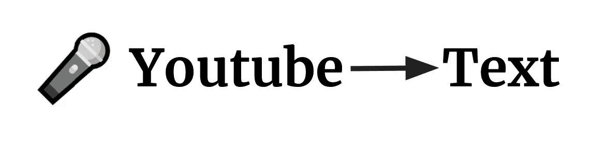
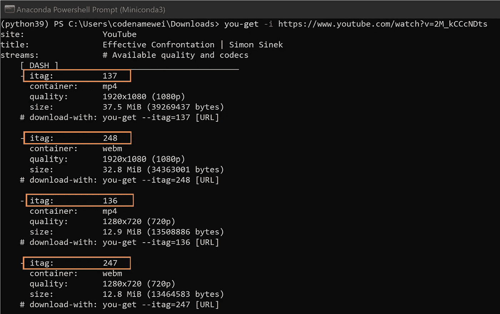
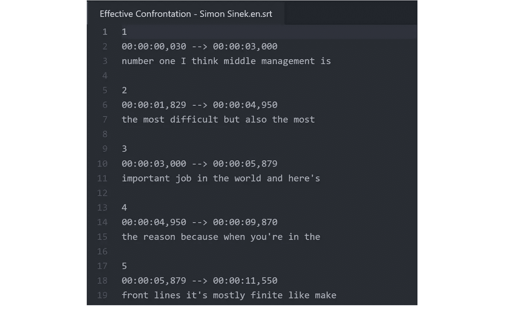
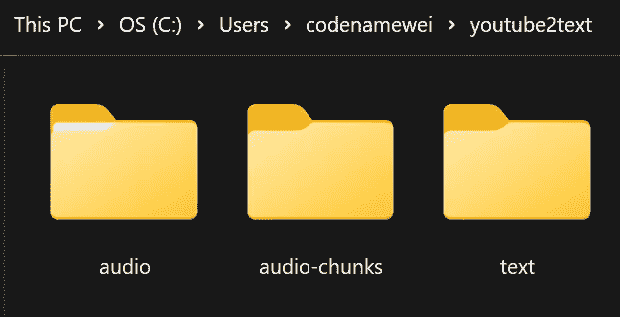
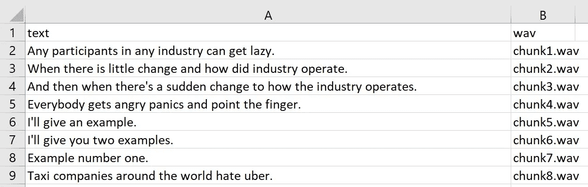
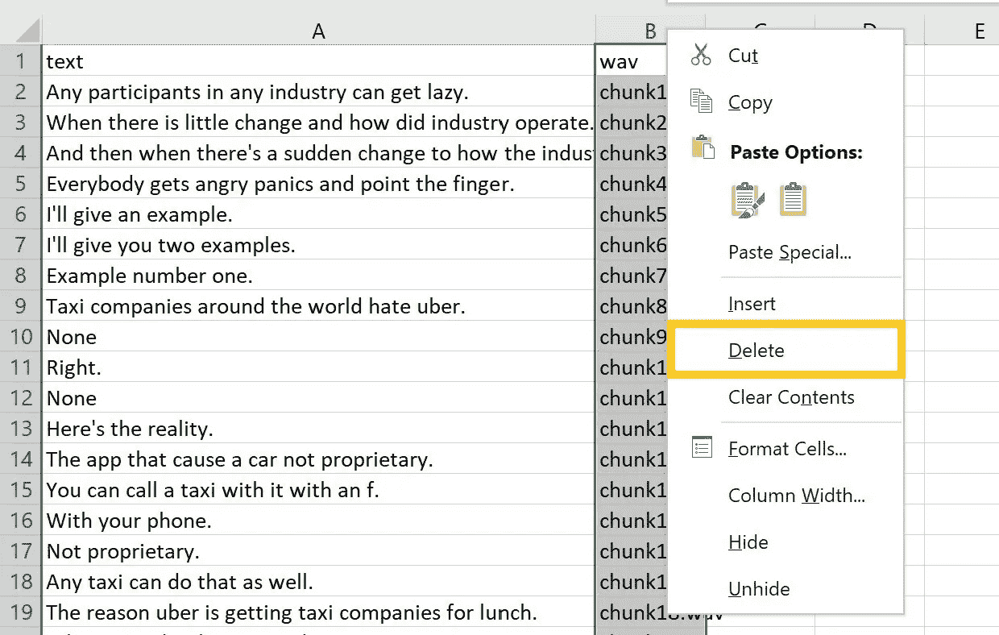

# 使用 Python 中的语音识别功能将 Youtube 转换为文本

> 原文：<https://towardsdatascience.com/youtube-to-text-with-speech-recognition-in-python-cd47d6d98b16>

## 基于 Python 的库，用于为 NLP 用例下载 Youtube 视频



作者照片

*最后更新时间:2022 年 4 月 5 日*

为了构建一个会话式的语音到文本的 NLP 模型，我开始研究从 Youtube 平台检索音频数据的方法。目标是将音频和文本片段之间的数据配对作为输入数据源。


作者照片

有两个库可以从 Youtube 平台检索音频和文本数据集。

*   [你-得到](https://github.com/soimort/you-get)图书馆
*   [youtube2text](https://github.com/codenamewei/youtube2text) 图书馆

## [你-得到](https://github.com/soimort/you-get)库

一个简单的方法是使用 [you-get](https://github.com/soimort/you-get) 库。基于 python 的库可以很容易地用 pip 安装。

```
pip install you-get
```

基于 python 的库使用终端命令进行操作。音频文件可以在各种输出(. mp4，.而文本呈现在子剪辑字幕输出文件(.srt)。

安装后使用这个库很简单。在终端中使用以下命令获取有关下载哪些源代码的信息。

```
you-get -i https://www.youtube.com/watch?v=2M_kCCcNDts
```



作者照片

使用下面的命令继续下载。将 itag 值更改为具有首选输出类型(. mp4，.webm)。

```
you-get --itag=137 https://www.youtube.com/watch?v=2M_kCCcNDts
```

或者，在不指定标记值的情况下运行命令将下载列表中的默认值。

```
you-get https://www.youtube.com/watch?v=2M_kCCcNDts
```

字幕文件的格式如下。



作者照片

注意文本都是小写的，没有用句末标点符号分开。因此，必须执行后续处理工作的连续步骤，以获得音频和文本的工作对。

## [Youtube2text](https://github.com/codenamewei/youtube2text) 库

Youtube2text library 旨在为音频<>文本配对获取合适的格式。在撰写本文时，该库支持三种功能。

*   检索 Youtube URL 作为音频和文本输出
*   下载音频文件格式的 Youtube 音频。wav，。flac)
*   将音频文件提取到文本输出

使用以下命令通过 pip 安装库。

```
pip install youtube2text
```

要检索作为音频和文本输出的 youtube URL，请在 python 环境中运行以下命令。

```
from youtube2text import Youtube2Text

converter = Youtube2Text()

converter.url2text("https://www.youtube.com/watch?v=Ad9Q8rM0Am0&t=114s")
```

该库目前支持 wav 或 flac 格式的音频和 csv 格式的文本，输出存储在指定路径或默认路径的子文件夹中( <homepath>\youtube2text)</homepath>



作者照片。

下面列出了目录的布局。 *Audio* 文件夹包含整个音频文件，而 *audio-chunks* 文件夹存储与文本文件中的元数据相匹配的音频文件片段。文本文件夹中的 Csv 文件是从音频到文本的翻译输出。

```
<Own Path> or <HOME_DIRECTORY>/youtube2text
│
├── audio/
│   └── 2022Jan02_011802.wav
|
├── audio-chunks/
│   └── 2022Jan02_011802
│       ├── chunk1.wav
│       ├── chunk2.wav
│       └── chunk3.wav
│   
└── text/
    └── 2022Jan02_011802.csv
```

我的目标是准备音频和翻译文本来训练自定义自动语音识别(ASR)模型。任何使用大型语言预训练模型的尝试都需要以期望的频率(例如:16 kHz)对新添加的音频数据进行采样。选定的采样速率应该与现有 NLP 模型的训练速率相匹配。在这种情况下，音频数据检索过程允许切换采样速率是很重要的。Youtube2text 的设计考虑到了[音频采样率](https://github.com/codenamewei/youtube2text/blob/main/src/youtube2text/youtube2text.py#L111)的切换。

```
converter.url2audio(urlpath = "https://www.youtube.com/watch?v=rFYcvrKkr90", audiosamplingrate = 22000)
```

让我们看一下文本文件。文本文件包含两列:text 和 wav。并排提供映射到文本句子的音频块的元数据。



作者照片

文本文件输出的排列方式允许在需要时纠正任何句子。

由于使用现有的语音识别模型将音频翻译成文本，因此生成的文本高度依赖于音频输出的质量。音频可能并不总是以精确的方式表达。把事情放在上下文中，想象一下，一个没有背景噪音的演讲者的 Ted 演讲比一个有背景音乐的多人主持的网络研讨会更容易理解。

通过几次尝试，很明显文本需要人工检查和校正，以产生高质量的翻译文本数据。希望在这个过程中花费时间和精力来获得高质量的翻译文本。

虽然有时可能会很乏味，但这有助于确保为后续的 NLP 模型训练准备好良好的原始数据源。沿着文本列重放音频块使得更容易找到与音频输出相对应的部分配对。

说明文件的列对于 ASR 用例之类的任务很重要。在训练模型的后一步骤中，数据准备步骤从特定音频路径读入音频文件并预处理矢量嵌入。否则，如果不需要 wav 信息的元数据，则可以通过在单个步骤中删除列来容易地消除说明文件的列。



作者照片

查看 python 笔记本获取更多使用 youtube2text 库的例子。

感谢阅读。

## 资源

*   [https://github.com/soimort/you-get](https://github.com/soimort/you-get)
*   [https://github.com/codenamewei/youtube2text](https://github.com/codenamewei/youtube2text)