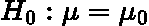
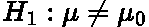
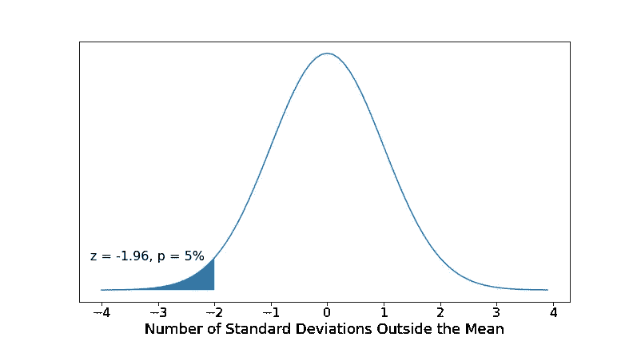
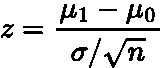
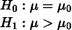
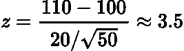

# 简单解释了 z 测试

> 原文：<https://towardsdatascience.com/z-test-simply-explained-80b346e0e239>

## 统计假设检验的 Z 检验的直观解释

克里斯·贾维斯在 [Unsplash](https://unsplash.com?utm_source=medium&utm_medium=referral) 上的照片

# 介绍

在本文中，我们将讨论和解释 Z 测试。这是一个**统计假设**测试，其中我们测量的统计分布，例如平均值，是正态分布的**部分。**

有多种类型的 Z 检验，然而在本文中，我们将考虑最简单和最广为人知的一种，即**单样本均值检验。**这用于确定样本的**平均值**和总体的**平均值**之间的差异是否具有统计显著性**。**

Z 测试的名称来自正态分布的 **Z 得分。**这是对原始分数或样本统计数据距离总体均值有多少标准差的度量。

z-检验是医学和数据科学等领域中最常见的统计检验，因此是理解的基本要素。

# 要求

*   **样本量大于 30。**这是因为我们想确保我们的样本均值来自正态分布。如**中心极限定理**所述，任何分布如果包含超过**30 个数据点，都可以近似为正态分布。**
*   **标准差**和**意味着总体的**是**已知的。**
*   样本数据**是随机收集/获取的。**

# 步伐

*   陈述**零假设，** ***H_0*** 。这就是你从总体上认为是真实的，这可能是总体的**的意思**， ***μ_0:***

作者在 LaTeX 中生成的方程。

*   陈述**候补假设，** ***H_1*** 。这是你从你的样本中观察到的。如果样本均值与总体均值不同，那么我们说均值不等于

作者在 LaTeX 中生成的方程。

*   选择你的临界值， ***α*** ，它决定了你**是接受还是拒绝零假设。**通常，对于 Z 检验，我们将使用**统计显著性 *5%*** ，即正态分布中总体均值的 ***z = +/- 1.96*** 标准差:

作者用 Python 生成的图。

> 这个临界值基于**置信区间**，你可以在我之前的文章中读到:

</confidence-intervals-simply-explained-58b0b11e985f>  

*   使用样本平均值、 ***μ_1*** 、总体平均值、 ***μ_0*** 、样本中的数据点数、 ***n*** 和总体的标准差、***【σ***计算 **Z 检验统计量:**

作者在 LaTeX 中生成的方程。

*   如果检验统计量大于(或小于)临界值，那么替代假设为**真**，因为样本的均值从总体均值来看**具有足够的统计显著性**。

> 一种粗略的思考方式是，样本均值距离总体均值如此之远，以至于它必须是真实的(或者样本是一个完全的 anamoly)。

# 例子

让我们通过一个例子来充分理解单样本均值 Z 检验。

一所学校说它的学生比其他学校的学生平均聪明。它以 50 名 学生为样本，这些学生的平均智商测量值为 ***110*** 。人口，其余学校，平均智商 ***100*** 标准差 ***20*** 。学校对学生的说法正确吗？

无效假设和替代假设是:

作者在 LaTeX 中生成的方程。

这里我们说的是我们的样本，学校，有着比人口平均值更高的平均智商。

现在，这就是所谓的**右侧** **单尾检验**因为我们的**样本均值大于总体均值。**因此，选择一个临界值***±5%***，它等于一个 Z 值 ***1.96*** ，如果我们的 Z 检验统计量**大于 *1.96，我们只能拒绝零假设。***

> 如果学校声称其学生的智商为 90，那么我们将使用如上图所示的**左尾测试**。如果我们的 Z 检验统计量小于-1.96，我们就拒绝零假设。

计算我们的 Z 检验统计量:

作者在 LaTeX 中生成的方程。

因此，我们**拒绝零假设**，学校的说法是正确的！

# 结论

希望你喜欢这篇关于 Z 测试的文章。在这篇文章中，我们只讨论了最简单的情况，单样本均值检验。然而，还有其他类型的测试，但它们都遵循相同的过程，只是有一些细微的差别。

# 和我联系！

*   [*要想在媒体上阅读无限的故事，请务必在这里注册！*](/@egorhowell/membership) 💜
*   [*在我发布注册邮件通知时获取更新！*T13*😀*](/subscribe/@egorhowell)
*   [*领英*](https://www.linkedin.com/in/egor-howell-092a721b3/) 👔
*   [*碎碎念*](https://twitter.com/EgorHowell) 🖊
*   [*github*](https://github.com/egorhowell)*🖥*
*   *<https://www.kaggle.com/egorphysics>**🏅***

> ***(所有表情符号由 [OpenMoji](https://openmoji.org/) 设计——开源表情符号和图标项目。许可证: [CC BY-SA 4.0](https://creativecommons.org/licenses/by-sa/4.0/#)***