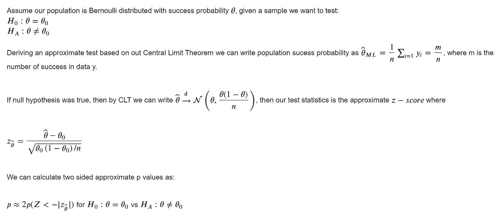
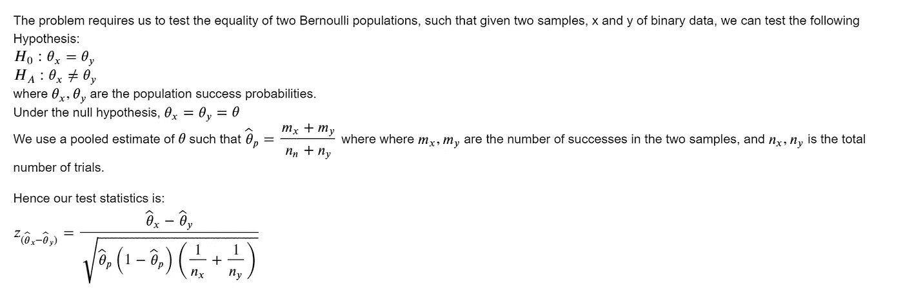
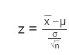
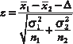
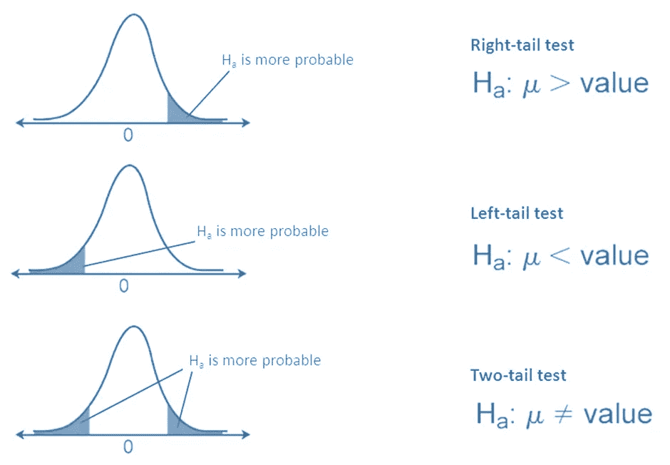
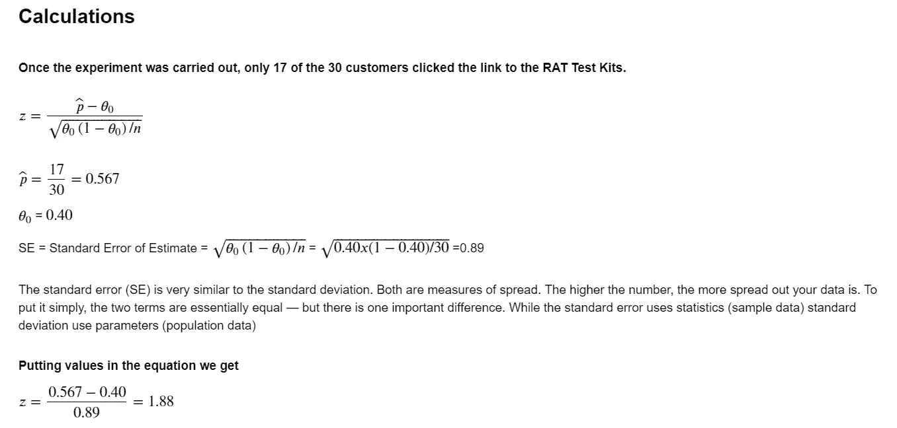
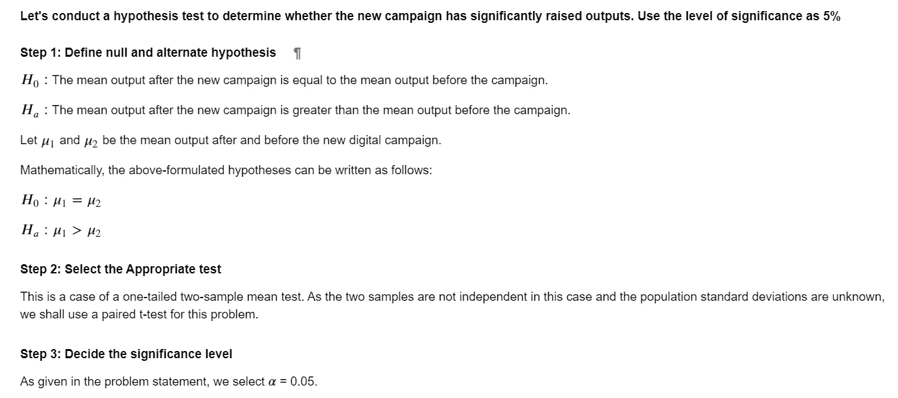
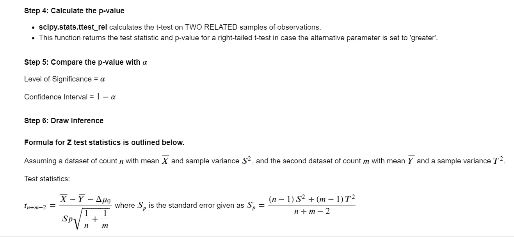

# z 测试统计公式& Python 实现

> 原文：<https://towardsdatascience.com/z-test-statistics-formula-python-implementation-3755d67ba0e7>

## 公式、定义、示例和 Python 实现


[Pop &斑马](https://unsplash.com/@popnzebra?utm_source=medium&utm_medium=referral)在 [Unsplash](https://unsplash.com?utm_source=medium&utm_medium=referral) 上拍照

# 1.目的

对大致符合正态分布的数据(即未偏斜的数据)进行称为 z 检验的统计检验。z 检验可用于检验两个样本甚至一个样本之间的比例差异，以评估假设。对于具有已知方差的总体，它确定两个广泛样本的平均值是否不同。根据我们对假设的选择，z 检验可以分为左尾、右尾和双尾假设检验。虽然 z-检验和 t-检验相对相似，但下一节将介绍几个差异。

## 1.1 定义 Z 检验

如果数据呈正态分布，并且您想检查两个总体的平均值是否不同，您可以应用 z 检验。为了验证上述说法，有必要制定零假设和替代假设，并计算 z 检验统计量的值。z 临界值是选择标准的基础。

# 2.范围

*   一种是对单个比例进行 z 检验，以检验涉及人口比例的假设。例如，我们记得 2010 年足球世界杯上的章鱼保罗。如果我们想测试保罗的成功率是否显著高于 50%(即保罗的预测不是偶然的)，该怎么办？



**图 1。**举例说明一个比例 Z 检验的 Z 统计量。作者使用 Jupyter 笔记本中的乳胶显影的图像。从上面的例子中，𝜃表示保罗在世界杯 n 场不同比赛中的成功预测，而𝜃o 是假设的成功率，例如，50%。

*   使用 Z 检验法对两个群体具有相同比例的观点进行了比例差异检验。比如说，假设保罗有一个哥哥叫安吉尔，全世界都想知道安吉尔是否有和保罗一样的能力。因此，我们想对安吉尔进行另一个类似的实验，并检验安吉尔和保罗有同样能力的假设。



**图 2。**说明两个比例 Z 检验的 Z 统计量。图像由作者在 Jupyter 笔记本中使用 Latex 开发。从上面的例子中，𝜃x 象征着保罗在世界杯不同比赛中的成功预测，而𝜃y 象征着安吉尔成功预测了多少场比赛。

*   如果要针对特定的总体平均值检验假设，请使用单个平均值的 z 检验。例如，在医疗保健行业，如果我们想要评估一段时间内产品的销售额，并检查一年的平均销售额是否与公司设定的目标有显著差异(更显著)，该怎么办？



**图 3。**说明了单样本 Z 检验的 Z 统计量。x 代表样本均值，而μ是假设的甚至是总体均值，σ是总体标准差，n 是样本大小。作者在 Jupyter 笔记本中使用 Latex 开发的图像。

*   当数据中每个样本的样本量为 30 或更大时，Z 检验可用于检验均值或方差的相等性，即检验两个总体均值相等的假设。例如，经常地，当在测试组和对照组上设计和运行活动时，我们希望了解测试组是否在特定结果变量上优于对照组。



**图四。**说明了双样本 Z 检验的 Z 统计量。其中 x1 和 x2 表示两个样本的均值(平均值)，或者在这种情况下，表示测试组和对照组的表现均值，δ是两个群体均值之间的假设差异(如果我们测试相等的均值，则为 0，即两个群体的表现没有差异)，σ1 和σ2 是两个群体标准差的统计注释，以及测试和对照组的 *n* 1 和 *n* 2 样本量。

# 3.假设

z 检验通常假设从中抽取样本的总体是正态分布的；然而，在样本量较大的情况下，人们可以忽略正态假设，尽管这样做是不可取的。理想情况下，对于涉及均值差异的检验，我们倾向于仅在样本量大于 30 时进行 z 检验。

# 4.t 检验与 Z 检验

z-检验比 t-检验更实用，t-检验对每个样本量有不同的临界值，而 z-检验对每个显著性水平有一个临界值(例如，5%双尾的临界值为 1.96)。因此，对于大样本量和已知的总体方差，许多统计检验可以很容易地作为近似 z 检验来进行。学生 t 检验可能更适合未知总体方差(必须使用样本本身进行近似计算)和样本量较小时。当样本量很小时，通常采用 t 检验；然而，当样本量很大或相当大时，在已知标准偏差的情况下，z 检验是优选的。

# 5.方法学

## 5.1 一个比例的 Z 检验

## 问题陈述

让我们考虑一下，公司 A 已经推出了一个新的网页布局，以支持在一个国家推出 RAT 测试套件。这是一个设计实验，随机向 30 名经常看流感产品的顾客展开。该网页是一个登录页面，目前包含购买不同 COVID 测试套件的链接。该倡议允许人们更多地了解 COVID 协议，并在访问测试中心之前获得必要的家庭测试支持。亚马逊希望检查新的布局是否可以将点击率提高 40%的特定幅度。

**零假设(h₀):**)𝐻𝑜=受访者样本比例(点击新登陆页面的用户)小于 40% 𝑃 < =0.40 (40%)

**替代假设(H₁):** 𝐻𝑎 =样本受访者比例(来自新登陆页面的用户点击量)大于 40% 𝑃 > 0.40 (40%)



**图 1:** 显示了单尾与双尾测试的剔除区域。假设我们的替代假设检查点击率大于 40%，我们将执行右尾测试。代替在这个用例中考虑μ，我们将检查𝜃 >是否是一个值。作者创造的形象。

## 5.1.2 计算

考虑到接触到新登录页面的 30 个客户中，有 17 个使用/点击了指向 RAT 测试套件的链接。使用下面列出的公式对一个比例进行 z 检验。



**图 5。**概述了比例的 Z 检验的计算。作者使用 Latex 和 Markdown (Jupyter Notebook)准备的图像。

## 5.1.3 结论

[](https://www.ztable.net/)  

使用上面链接中的 Z 得分表，让我们确定获得 Z 得分< =1.88 的概率，如图 1 所示。

𝑃(𝑧≤1.88)=0.96995.但是我们想要计算 Z 右侧的概率(因为我们感兴趣的是获得落在拒绝区域或临界区域的概率值)，即 1–0.96995 = 0.030051–0.96995 = 0.03005。

我们拒绝零假设，支持替代假设，即公司 A 通过更新登录页面，在 95%的置信度下，从 p<0.05 开始，设法将点击率提高了至少 40%。

## Python 实现

```
#-------------import required library from statsmodel**from** statsmodels.stats.proportion **import** proportions_ztest#--------perform a one proportion z-test using the invoked function
#----count = number of successful click through rates (17)
#-----nobs = number of observation (customer exposed to the new landing page)#-----value: Hypothesized difference (in this atleast 40% click through rate)proportions_ztest(count**=17**, nobs**=30**, value**=**0.40)(1.8421903154590296, 0.03272365827054635)
```

请注意，由于四舍五入的原因，Z 统计值可能不同于实际操作示例。

## 5.2 均值差异的 Z 检验

## 问题陈述

让我们考虑一下，一家制药公司对一群医生开展了一项数字活动，以推广一种针对不同适应症的新上市药物。该团队为这项实验设计(推广活动)确定了一组医生，并跟踪了这些医生在活动前后的表现。医生的表现取决于开了这种新药的病人数量。我们想核实这场运动是否促使医生让更多的病人服用这种新药。

## 计算和方法



**图 6。**概述了均值差异的 Z 检验的计算。作者使用 Latex 和 Markdown (Jupyter Notebook)准备的图像。

## Python 实现

```
from scipy import statstest_stat, p_value  = stats.ttest_rel(data['New Patient Count'], df['Old Patient Count'], alternative = 'greater')  #Performing a paired t-testprint('The p-value is', p_value)
```

# 6.结论

问题陈述主要驱动假设检验技术的选择。当进行基于试验控制的分析时，我们会看到一个连续的结果(例如，推广活动前后的患者人数)，均值差异的 Z 检验允许我们验证差异。我们可以在影响前和影响后进行测量，甚至在测试组和控制组之间进行测量，以精确地确定计划对测试组的影响，以及该计划是否能在不受其他变量影响的情况下做出更好的响应。后 COVID 时代，公司正专注于理解数字渠道相对于其他目标渠道的影响。对于我们的结果变量是二元的情况，我们可以使用比例检验的 Z 检验来查看结果的差异。

*关于作者:高级分析专家和管理顾问，帮助公司通过对组织数据的商业、技术和数学的组合找到各种问题的解决方案。一个数据科学爱好者，在这里分享、学习、贡献；你可以和我在* [*上联系*](https://www.linkedin.com/in/angel-das-9532bb12a/) *和* [*上推特*](https://twitter.com/dasangel07_andy)*；*