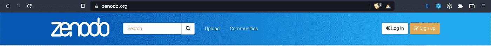
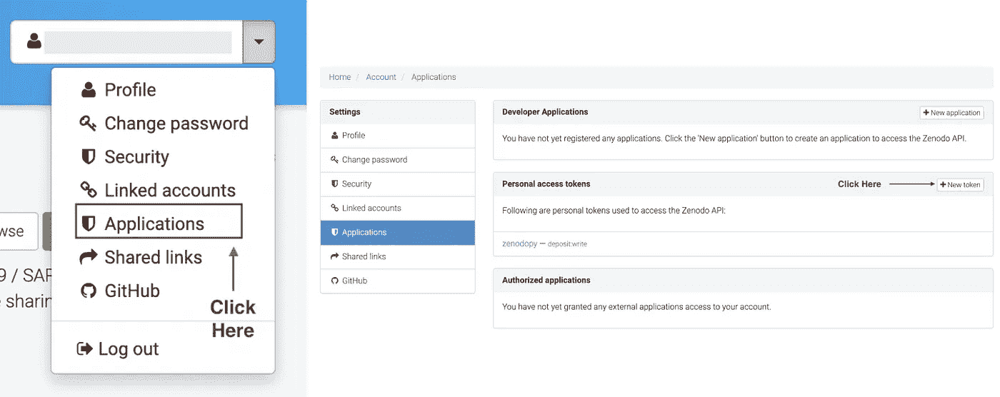
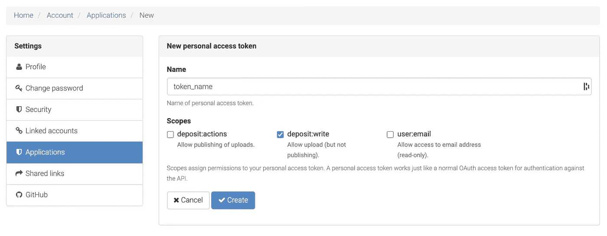
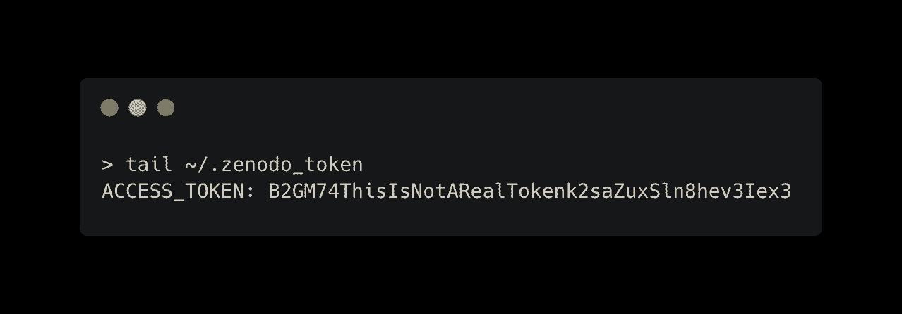
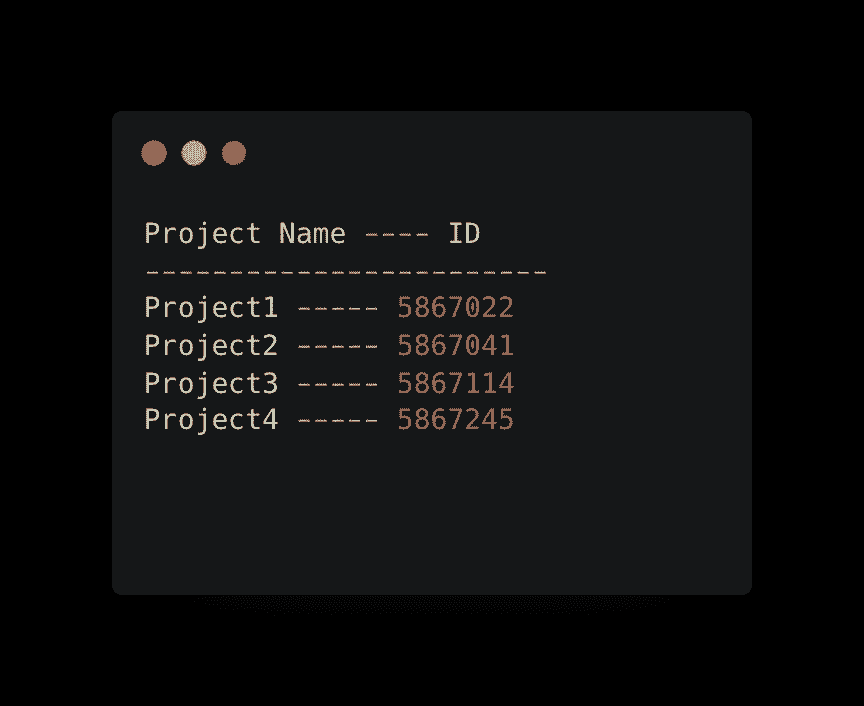
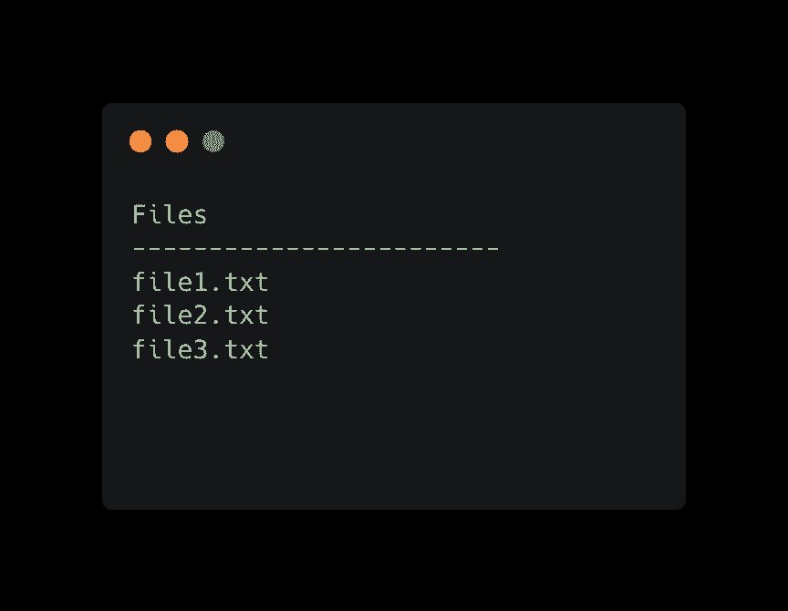

# Zenodopy——从 Python 管理 Zeno do 项目

> 原文：<https://towardsdatascience.com/zenodopy-manage-zenodo-projects-from-python-aa7c36634c1d>

# Zenodopy——从 Python 管理 Zeno do 项目

## 用这个包创建项目和上传/下载文件


卡尔·安德森在 [Unsplash](https://unsplash.com?utm_source=medium&utm_medium=referral) 上的照片

Zenodo 是一个由 CERN 运营的通用开放存取知识库。研究人员可以存放任何与研究相关的数字制品，包括数据集、研究软件、报告等。

Zenodo 是目前最好的数据管理服务之一。团队相信[公平原则](https://about.zenodo.org/principles/)，即数据应该是**可访问的、**可访问的、**不可操作的、 **R** 可用的。此外，它们符合[计划 S](https://about.zenodo.org/principles/)。******

该 web 应用程序简单、直观，非常适合存放个人电脑上的小型数据集。然而，上传大型远程数据集需要使用 [Zenodo API](https://developers.zenodo.org/) ，我之前在本文的[中讨论过。](/make-your-science-fair-with-zenodo-b209fc74400c)

`Zenodopy`是该 API 的包装器，通过提供高级功能来简化使用:

*   `.create_project()`
*   `.upload_file()`
*   `.download_file()`
*   `.delete_file()`

在这篇文章中，我将带你经历开始使用这个包所需要的所有步骤。请注意，他的包裹不属于芝诺多，也不被芝诺多认可。项目代码可通过 GitHub 获得

[](https://github.com/lgloege/zenodopy) [## GitHub - lgloege/zenodopy

### 在 GitHub 上创建一个帐户，为 lgloege/zenodopy 的开发做出贡献。

github.com](https://github.com/lgloege/zenodopy) 

# 先决条件

在我们开始上传数据之前，有几件事情需要核对。

## 创建一个帐户

如果您还没有帐户，请前往[https://zenodo.org/](https://zenodo.org/)并点击右上角的**注册**来创建一个帐户



作者图片

## 创建个人访问令牌

登录后，单击右上角的下拉菜单，导航至“应用程序”。从那里，在“个人访问令牌”部分点击“新令牌”



作者图片

下一个屏幕是您命名令牌和设置范围的地方。我更喜欢将范围设置为`deposit:write`，允许上传但不允许发布。



作者图片

点击“创建”后，您的密钥将会出现。暂时不要关闭这个窗口，我们将把这个密钥存储在一个点文件中。你只能看到你的令牌一次。

## 将密钥存储到点文件中

将以下命令复制并粘贴到您的终端中，用上一步中的密钥替换`your_key` 。

```
{ echo 'ACCESS_TOKEN: your_key' } > ~/.zenodo_token
```

这将在您的主目录中创建一个名为`.zenodo_token`的文件，其中包含您的访问令牌。确保您的令牌存储在 dot 文件中。

```
tail ~/.zenodo_token
```

这个点文件很重要。Python 包将在这个文件中查找您的令牌。格式也很重要，必须是`ACCESS_TOKEN: your-token`。您的`~/.zenodo_token`文件应该类似如下:



的例子。zenodo_token 文件。注意，这不是真实的令牌(图片由作者提供)

## 安装 python 包

通过 pip 安装软件包

```
pip install zenodopy
```

请注意，该包依赖于以下内容:

```
requests==2.26.0
types-requests==2.27.7
wget==3.2
```

## 确保您可以导入它

现在在终端中打开 Python，确保可以导入`zenodopy`

```
import zenodopy
```

如果你没有任何错误，那么让我们开始使用它！

# 创建新项目

以下步骤将引导您创建一个新项目并上传/下载数据，所有这些都在 Python 中完成。

## 1.创建客户端对象

我们首先创建一个`Client()`对象

```
import zenodopy
zeno = zenodopy.Client()
```

这个创建的对象通过存储在`~/.zenodo_token`中的`ACCESS_TOKEN`知道你的 Zenodo 账户。但是，它还没有指向您的任何项目。

## 1.1 测试 zenodopy 是否正在读取您的令牌

要确保正确读取您的令牌，请运行以下命令。如果一切正常，你的钥匙会被提示。

```
zeno._get_key()
```

## 1.2 找不到您的令牌？

如果`zenodopy`不能读取你的令牌，首先检查以确保你的`~/.zenodo_token`文件设置正确。

使用`~/.zenodo_token`的另一种方法是用访问令牌简单地启动`Client()` 。

```
import zenodopy
zeno = zenodopy.Client(ACCESS_TOKEN=your_token_goes_here)
```

这种方法的缺点是您的令牌现在暴露了。不太好。总是尝试使用到`.zenodo_token`文件，这样你的令牌就被隐藏了。

## 2.创建项目

```
params = {'title': 'project_title,
          'upload_type': 'dataset',
          'description': 'what this repository is about'
          'creators': [{'name': 'Joe Low'
                        'affiliation': 'nasa'}]}zeno.create_project(*params)
```

最起码，您需要提供一个`title`。但是，这样做会将`upload_type`和`description`设置为默认值。您可以随时使用`change_metadata()`更改这些设置

对于创建者，传递一个以`name`和`affiliation`为关键字的字典列表。这是可选的，以后可以用`change_metadata()`更改

创建项目后，您的对象现在指向该项目，这意味着您开始向其上传数据。

您可以使用`str()`方法验证您当前指向的项目

```
str(zeno)
```

## 3.上传数据

如果你正在上传一个目录，确保首先压缩它。芝诺多只允许您上传文件。

使用`.upload_file()`方法，您提供想要上传的文件的路径。

```
zeno.upload_file(/path/to/file.zip)
```

如果文件上传成功，系统会提示您。

## 4.删除项目

我觉得最好是从 web 界面删除一个项目。说到这里，可以从`zenodopy`中删除一个项目。有意隐藏此功能，以最大限度地减少意外删除。您只需将项目 ID 提供给`_delete_project()`

```
zeno._delete_project('project_id')
```

使用这种方法时要小心。它没有内置自动防故障装置。项目一旦被删除，就无法恢复。

# 从现有项目开始

现在，让我们浏览一下扩充现有项目的步骤。

## 1.创建一个客户端()对象

使用 Zenodoapi 总是从创建一个`Client()`对象开始

```
import zenodopy
zeno = zenodopy.Client()
```

## 2.列出当前项目

我们首先需要列出我们所有的项目及其相关的项目 ID。

```
zeno.list_projects
```

如果您有与您的帐户相关的项目，它们将显示在此处。您的输出将如下所示:



作者图片

在我的账户里有四个项目。属性显示项目名称及其关联的 ID 号。

## 3.设置项目

`set_project()`将把你的对象连接到与所提供的 ID 相关联的项目。

```
zeno.set_project('5867022')
```

这将使您的对象指向项目 ID 5867022。注意此 ID 仅适用于您的帐户。你可以用`str()`来验证你指向的是哪个项目。

```
str(zeno)
```

## 4.列出文件

现在让我们列出与这个项目相关的所有文件

```
zeno.list_files
```

如果您的项目中有文件，您的输出将如下所示:



作者图片

## 5.上传文件

上传文件和以前一样。简单证明文件路径到`.upload_file()`

```
zeno.upload_file('/path/to/file.zip')
```

## 6.下载数据

现在让我们下载一个文件。目前，`zenodopy`只能下载与您的项目相关的文件。

使用`.list_files`显示项目中的所有文件，然后向`.download_file()`提供想要下载的文件的名称

```
zeno.download_file(filename)
```

未来的版本将能够通过提供 DOI 从任何公共项目下载文件。

# 最后的想法

ZenodoPy 的主要目的是简化 Zenodo 项目的大文件上传/下载，我希望它最终可以用于从 Python 全面管理 Zenodo。

团队比个人更擅长解决问题。因此，任何发现这个项目有用的人都被鼓励为这个项目做出贡献。

[](https://github.com/lgloege/zenodopy) [## GitHub - lgloege/zenodopy

### 在 GitHub 上创建一个帐户，为 lgloege/zenodopy 的开发做出贡献。

github.com](https://github.com/lgloege/zenodopy) 

如果你在代码中发现任何错误，请在 GitHub 上打开一个问题。

*本文将作为一个动态文档，并在*发生重大变化时进行更新

# 相关文章

[](/make-your-science-fair-with-zenodo-b209fc74400c) [## 让你的科学与芝诺多公平

towardsdatascience.com](/make-your-science-fair-with-zenodo-b209fc74400c) [](https://blog.jupyter.org/binder-with-zenodo-af68ed6648a6) [## 带有芝诺多的粘合剂

### 由 Zenodo 和 Binder 支持的交互式和可复制的存储库。

blog.jupyter.org](https://blog.jupyter.org/binder-with-zenodo-af68ed6648a6) [](https://medium.com/@manishaagarwal_1980/zenodo-integration-a-care-for-users-privacy-as-well-as-their-experiences-ba2f5b35e5de) [## 芝诺多集成——对用户隐私和体验的关怀

### “隐私保护是客户信心的关键因素，也是可持续数字业务发展的支柱。”…

medium.com](https://medium.com/@manishaagarwal_1980/zenodo-integration-a-care-for-users-privacy-as-well-as-their-experiences-ba2f5b35e5de)