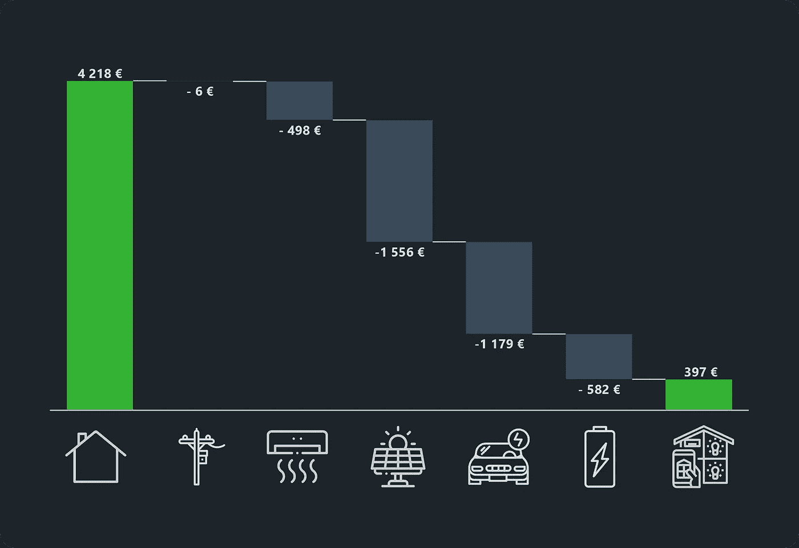
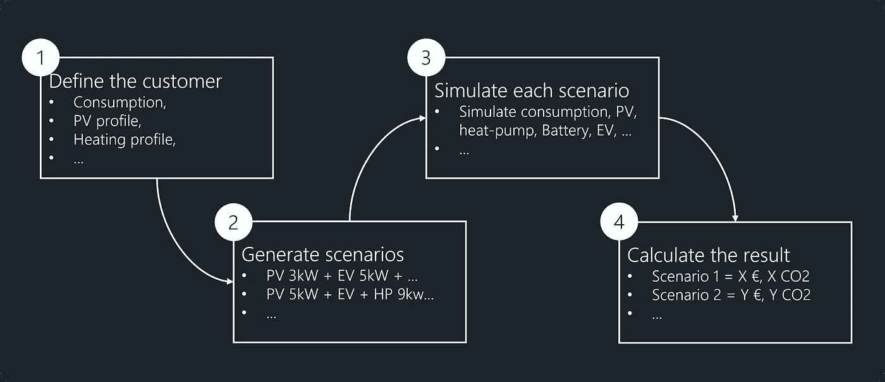
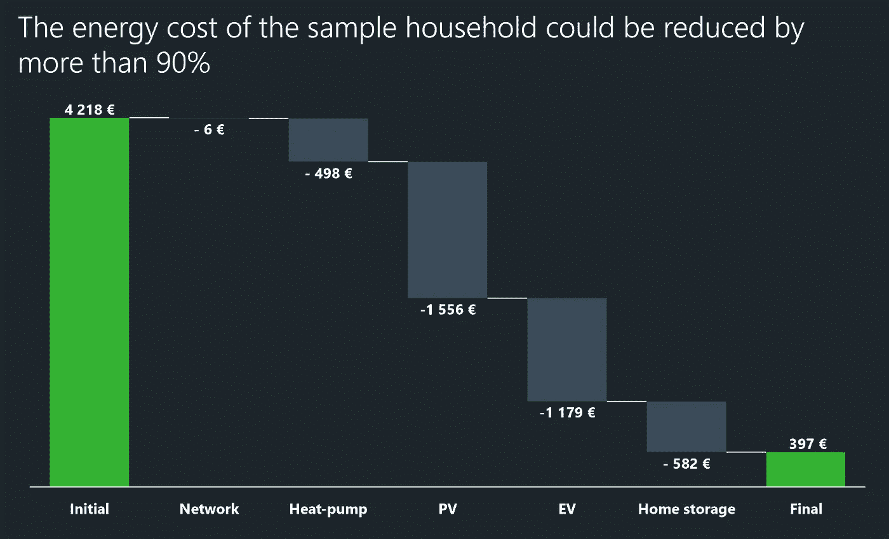
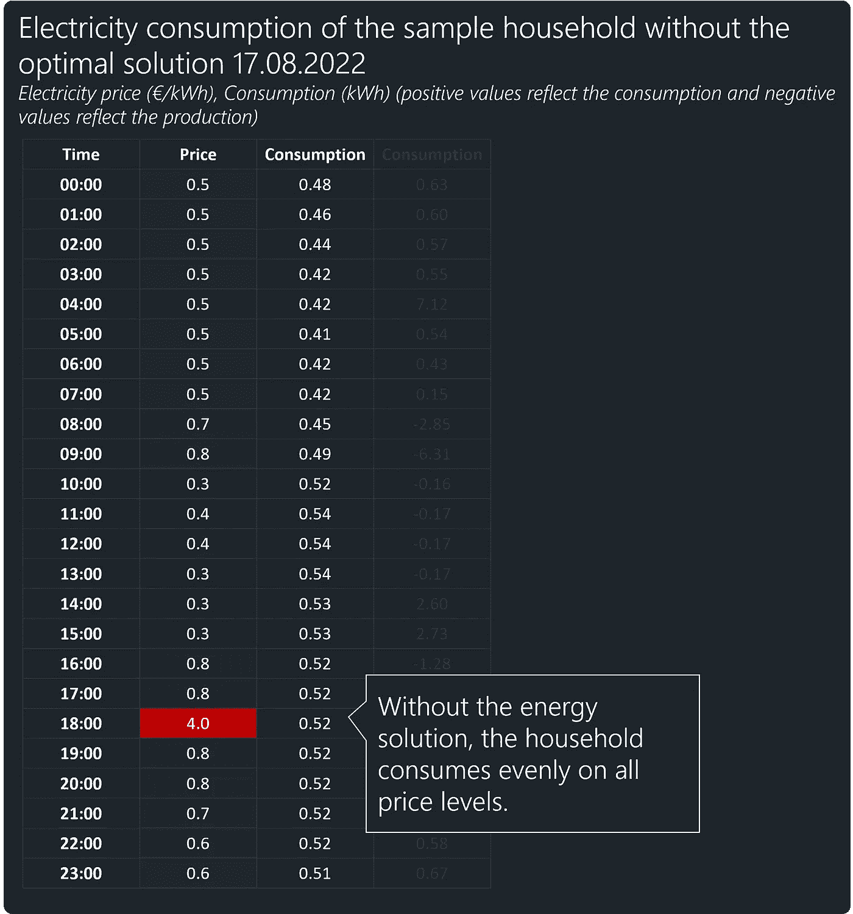
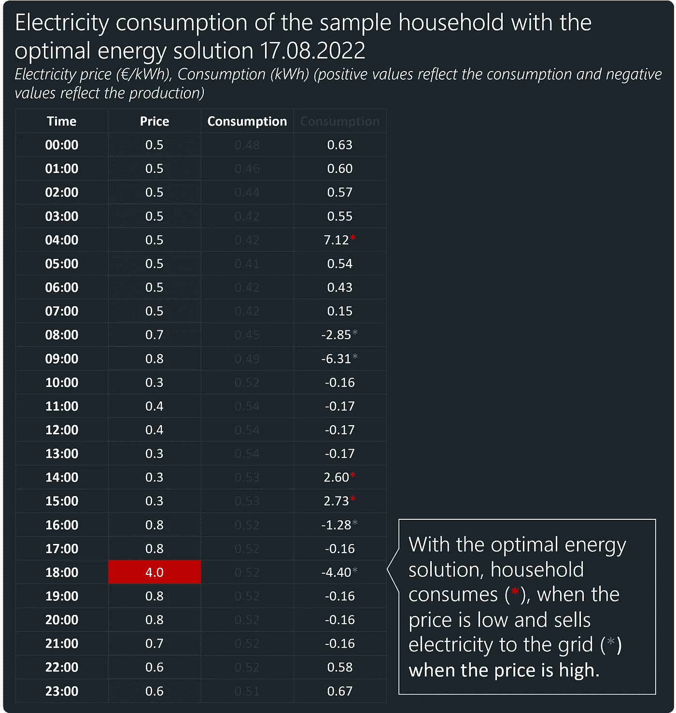
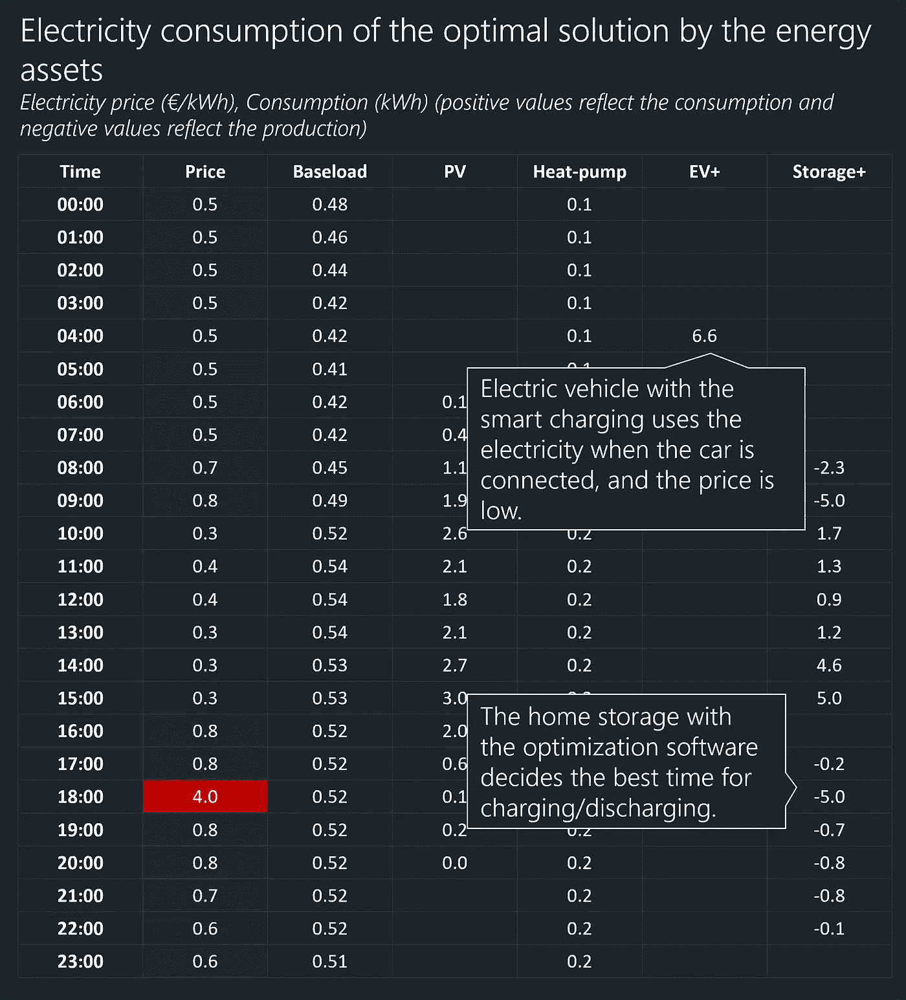

# 零能源成本——我们离零还有多远？

> 原文：<https://towardsdatascience.com/zero-energy-cost-how-close-to-zero-can-we-get-b58a6c2a3ac7>

*降低样本家庭每种产品/服务的能源成本。图表中显示的节约只能通过所有产品和服务的组合来实现。电动汽车+代表电动汽车的智能充电(考虑股票交易价格)。家用电池+代表一个带能源优化软件的家用电池(作者编写)。*

## 一项分析表明，在技术的帮助下，普通家庭可以降低多少能源成本

市场上有一系列的电力包、热泵、太阳能电池板、家用电池组和电动汽车。目前，这些资产的提供商在对这些资产的成本效益进行估计时，并没有考虑您的消费习惯或现有合同。此外，没有考虑资产的相互依赖性。例如，太阳能电池板的盈利能力取决于我们自己能消耗多少能源，而电池组的成本节约取决于太阳能电池板的存在和家庭用电量。此外，所有这些解决方案的价值取决于你的电力和网络合同以及房子的特点(屋顶面积、角度和方向、供暖面积等)。).

> 电器的盈利能力取决于家庭的消费模式、现有合同、房子的特点以及其他电器设备的存在。

在本文中，我将展示数据科学如何通过模拟所有可能变化的行为和成本，让我们找到能源产品和服务的最佳组合。

# 方法学

到目前为止，还没有解决方案允许我们以高粒度分析上述所有元素的组合效果。在 E-Lab(ene fit 的 R&D 分公司)中，我们创建了能源解决方案计算器，通过以下步骤解决了这个问题:

能源解决方案计算器的高级步骤(图片由作者提供)。

首先，正在创建客户档案，其中包括电力消耗模式和一些关于家庭的基本数据，如自由屋顶面积、加热面积、当前加热系统和汽车燃料消耗。

其次，能源求解器创建场景，每个场景代表一种服务和产品的组合。想象一下，你有 3 个不同的电力包，4 个太阳能解决方案，3 个不同的储能设备，5 个电动汽车充电器，6 个不同的热泵和 5 个不同的网络包适合特定的客户。这意味着可能的场景总数为 3 * 4 * 3 * 5 * 6 * 5 = 5400。

第三，能源解决方案计算器在长达一年的时间内每小时模拟每个场景中所有资产的行为。

最后，根据利益指标(成本节约、盈利能力或二氧化碳节约)对结果进行汇总和排名。

在未来，我将更详细地介绍能源解决方案的工作原理，但本文的目的是展示一个样本家庭的结果。

# 样本家庭的概况

本分析中使用的样本家庭具有以下特征:

*   **电力消耗**:每年 5000 千瓦时，每小时消耗模式符合爱沙尼亚家庭消费者的平均模式。
*   **电包**:兑换( [*链接电包*](https://www.energia.ee/et/era/elekter/elektrileping-ja-paketid?customers=home-customer&packages=fix) )。
*   **网络包**:网络 5 ( [*链接 Elektrilevi 包*](https://www.elektrilevi.ee/et/abiinfo/hinnakirjad) )。
*   **加热面积** : 120 平方米。
*   **加热源**:柴炉加热。
*   **安装地热集热器的免费用地面积** : 600 m2。
*   **太阳能解决方案:**没有，但屋顶有 60 平方米的自由空间，40 度角，朝南。
*   **汽车**:汽油动力汽车，平均油耗 6.5 l/100 km，年行驶里程 1.2 万 km。

在分析时(2022 年 8 月)，该家庭的年能源成本为 4，218€，包括木柴、汽车燃料和电费(使用爱沙尼亚过去 12 个月的电价)。

# 寻找最佳能源解决方案

在这个分析中，我的目标是找到最小化样本家庭年能源成本的能源解决方案。每小时总共模拟了 5400 种不同的产品和服务组合(场景),得出的最佳解决方案如下:

*   **电包**:交换(保持不变)。
*   **网络(DSO)包**:网络 4(原网络 5)。
*   **热泵** : 9 kW 地源热泵(原木材加热)。
*   **太阳能解决方案** : 7.5 kW(原本无)。
*   **电池**:华为 luna 2000–15-S0，带优化软件(原本无)。
*   **电动汽车:**对，带智能充电(原本是汽油动力车)。

借助该解决方案，**样本家庭每年的能源成本可降低 90%以上**。

*降低样本家庭每种产品/服务的能源成本。图表中显示的节约只能通过所有产品和服务的组合来实现。电动汽车+代表电动汽车的智能充电(考虑股票交易价格)。家用电池+代表一个带能源优化软件的家用电池(作者编写)。*

首先，能源解算员建议将样本家庭的网络包从“网络 5”切换到“网络 4”(*这些网络包特定于爱沙尼亚市场*)，这将每年节省€6 英镑。

> 能源求解器的所有结果对于给定的家庭都是独特的，因为“最佳”解决方案和获得的节约取决于特定家庭的消费模式和其他输入参数。

其次，求解者建议用热泵代替木材加热，这样每年可以为家庭节约€498。

第三，计算器显示，该家庭可以添加一个容量约为 7.5 千瓦(基于自由屋顶面积)的太阳能电池板解决方案，这将每年节省额外的 1，556€。

第四，求解者建议将目前的汽油发动机汽车更换为电动汽车，这将每年减少 1179€的能源成本，前提是用户还购买了电动汽车充电器，从而可以根据交换价格安排充电时间。

最后，计算器显示，通过购买一个带有优化软件的 15 千瓦时家用电池，可以节省€582，从而使样本家庭的总成本降低约 90%。

值得注意的是，这些**节省是上述所有设备协同作用的结果。如果我们排除其中一个设备，其他设备带来的节约也会改变**。

> 能源解决方案将家庭作为一个整体进行评估，这意味着添加或移除一个设备会影响其他设备的节省。

# 最佳解决方案的电力消耗示例

17.2022 年 8 月是爱沙尼亚电力市场上不同寻常的一天，因为 18:00-19:00 之间的电价为 4000€/兆瓦时或 4€/千瓦时。让我们来看看有和没有最佳能源解决方案的示例家庭的电力消耗。

下图显示了电价(€/千瓦时)和家庭每小时的用电量。使用原始的消费配置文件，我们的示例家庭在一天中会有相对恒定的消费，而不管电价如何。

*2022 年 8 月 17 日爱沙尼亚市场上样本家庭的电力消耗，无最佳解决方案(由作者编制)。*

使用最佳解决方案(如下图)，耗电量会有显著变化。从表中可以看出，电价较低的时段(如 10:00-11:00、14:00-16:00)用电量最高，电价较高的时段(08:00-09:00、18:00-19:00)家庭向电网送电。太阳能电池板、电动汽车的智能充电和家用电池的优化使用使这一切成为可能。

*模拟样本家庭 2022 年 8 月 17 日在最优情景下的用电量(作者准备)。*

如果我们看看最佳情况下每台设备的耗电量(下图)，我们首先会注意到太阳能电池板产生的电力(表中的负值代表发电量)。我们还看到，电动汽车的智能充电可以确保电池在最实惠的时间充电。然而，由优化软件驱动的家用电池具有最复杂的行为模式。它监控股票交易价格、家庭环境的消耗以及太阳能的产生，并使用充电和放电时间表来最小化家庭成本。

*最优情景下 2022 年 8 月 17 日样本家庭每台设备的模拟用电量(作者准备)。*

总体而言，分析表明，现代电气设备和智能软件可以显著降低家庭的能源成本。但是，应该注意的是，节约能源成本并不等于盈利。盈利能力被有意排除在本分析的范围之外，因为它取决于用户购买设备的确切价格。